<div align="center">


<br clear="all"/>

<h1><strong>Escuela Politécnica Nacional</strong></h1>

### Facultad de Ingeniería de Sistemas

**Business Intelligence (ISWD743) · GR2SW_2026-1**

**Informe Naive Bayes y Predecir valores**

---

**Fecha:** <br/>
30 de Junio, 2026

**Integrantes:** <br/>
Andrea Chicaiza <br/>
Andreina Pallo <br/>
Jose Arias <br/>
Juan Mateo Quisilema <br/>
Juan Suarez

</div>

---

> [!NOTE]
>
> Este repositorio contiene el desarrollo del trabajo grupal de la práctica de Naive Bayes y predecir valores, cuyo objetivo es construir y evaluar modelos de clasificación supervisada en Weka mediante los algoritmos J48 (árbol de decisión) y Naive Bayes, predecir nuevas instancias a partir de los modelos entrenados y aplicar ambas técnicas a un caso de estudio de evaluación de riesgo crediticio.

---

> [!NOTE]
>
> Objetivos específicos:
> * Construir y evaluar un árbol de decisión mediante el algoritmo J48 sobre el dataset `iris`, analizando el modelo generado y sus métricas de desempeño.
> * Construir y evaluar un clasificador Naive Bayes sobre el dataset `weather.nominal`, analizando las probabilidades condicionales calculadas y sus métricas de desempeño.
> * Implementar en Python las reglas de decisión obtenidas en Weka para ambos clasificadores, permitiendo predecir nuevas instancias fuera del entorno de Weka.
> * Aplicar los algoritmos J48 y Naive Bayes a un caso de estudio de evaluación de riesgo crediticio (`loan_risk_dataset`), determinando si otorgar o no un crédito a partir de variables como historial crediticio, nivel de ingreso y edad.

---

<h2><strong>Índice</strong></h2>

- [Desarrollo](#desarrollo)
- [1. Introducción](#1-introducción)
  - [1.1 Aprendizaje Supervisado: Clasificación y Predicción](#11-aprendizaje-supervisado-clasificación-y-predicción)
  - [1.2 Árboles de Decisión y Algoritmo J48 (C4.5)](#12-árboles-de-decisión-y-algoritmo-j48-c45)
  - [1.3 Clasificador Naive Bayes (Teorema de Bayes)](#13-clasificador-naive-bayes-teorema-de-bayes)
- [2. Desarrollo de la Práctica](#2-desarrollo-de-la-práctica)
  - [2.1 Preparación de Datos](#21-preparación-de-datos)
  - [2.2 Clasificación con Árbol de Decisión J48](#22-clasificación-con-árbol-de-decisión-j48)
    - [2.2.1 Construcción y Evaluación del Modelo en Weka](#221-construcción-y-evaluación-del-modelo-en-weka)
    - [2.2.2 Predicción de Nuevas Instancias con Código Python](#222-predicción-de-nuevas-instancias-con-código-python)
  - [2.3 Clasificación con Naive Bayes](#23-clasificación-con-naive-bayes)
    - [2.3.1 Construcción y Evaluación del Modelo en Weka](#231-construcción-y-evaluación-del-modelo-en-weka)
    - [2.3.2 Predicción de Nuevas Instancias con Código Python](#232-predicción-de-nuevas-instancias-con-código-python)
  - [2.4 Caso de Estudio Aplicado: Evaluación de Riesgo Crediticio](#24-caso-de-estudio-aplicado-evaluación-de-riesgo-crediticio)
    - [2.4.1 Construcción del Árbol de Decisión en Weka](#241-construcción-del-árbol-de-decisión-en-weka)
    - [2.4.2 Predicción de Riesgo con Código Python](#242-predicción-de-riesgo-con-código-python)
  - [2.5 Comparación y Análisis de Resultados](#25-comparación-y-análisis-de-resultados)
  - [2.6 Predicción de Nuevas Instancias en Weka (ArffViewer)](#26-predicción-de-nuevas-instancias-en-weka-arffviewer)
    - [2.6.1 Preparación del Conjunto de Prueba con ArffViewer](#261-preparación-del-conjunto-de-prueba-con-arffviewer)
    - [2.6.2 Predicción con Naive Bayes](#262-predicción-con-naive-bayes)
    - [2.6.3 Predicción con J48](#263-predicción-con-j48)
- [3. Conclusiones](#3-conclusiones)
- [Referencias Bibliográficas](#referencias-bibliográficas)
- [Declaración de Porcentaje de Uso de IA](#declaración-de-porcentaje-de-uso-de-ia)

---

## Desarrollo

---

## 1. Introducción

### 1.1 Aprendizaje Supervisado: Clasificación y Predicción

El aprendizaje supervisado es una rama del aprendizaje automático en la que un modelo aprende a partir de un conjunto de datos etiquetados, es decir, datos donde la respuesta correcta ya es conocida para cada instancia. El modelo analiza estos ejemplos previos para identificar patrones entre los atributos de entrada y la clase de salida, con el objetivo de generalizar ese conocimiento y responder correctamente ante datos que no ha visto antes [[5]](#referencias).

Dentro del aprendizaje supervisado, la clasificación es la tarea que consiste en asignar una etiqueta o categoría a una nueva instancia a partir de lo aprendido durante el entrenamiento. El clasificador no calcula un valor continuo sino que determina a cuál de las clases predefinidas pertenece el dato de entrada. Asimismo, los algoritmos de clasificación pueden representar ese conocimiento de formas distintas: como un árbol de reglas de decisión, como un conjunto de probabilidades condicionales, entre otras, lo que da origen a los diferentes clasificadores que existen [[6]](#referencias).

La predicción, en el contexto de esta práctica, complementa la clasificación: una vez que el modelo ha sido construido y evaluado sobre datos históricos, se aplica sobre nuevas instancias cuya clase se desconoce para obtener una respuesta concreta. Es decir, la predicción no implica construir un modelo nuevo sino utilizar uno ya entrenado para responder ante datos reales, lo que representa la aplicación práctica del proceso de clasificación.


### 1.2 Árboles de Decisión y Algoritmo J48 (C4.5)

Un **árbol de decisión** es una estructura jerárquica que representa el conocimiento aprendido a partir de un conjunto de instancias de entrenamiento en forma de reglas de clasificación. Cada nodo interno del árbol evalúa un atributo, cada rama representa el resultado de esa evaluación (un valor nominal o un umbral, en el caso de atributos numéricos) y cada hoja asigna una clase. Para clasificar una nueva instancia basta con recorrer el árbol desde la raíz, siguiendo en cada nodo la rama correspondiente al valor del atributo evaluado, hasta alcanzar una hoja [[5]](#referencias).

La construcción del árbol es un proceso recursivo de tipo *divide y vencerás*: en cada nodo se selecciona el atributo que mejor separa las instancias según su clase, se particiona el conjunto de datos según los valores de ese atributo, y el procedimiento se repite sobre cada subconjunto hasta que las hojas resultantes sean puras (o casi puras) [[6]](#referencias). El criterio para elegir el atributo de partición en cada nodo se basa en la **entropía**, una medida de la impureza o desorden de un conjunto de instancias:

$$Entropía(S) = -\sum_{i=1}^{n} p_i \log_2(p_i)$$

Donde $p_i$ es la proporción de instancias de la clase $i$ dentro del conjunto $S$. A partir de la entropía se calcula la **ganancia de información** que aporta dividir el conjunto según un atributo $A$:

$$Ganancia(S,A) = Entropía(S) - \sum_{v \in Valores(A)} \frac{|S_v|}{|S|} \cdot Entropía(S_v)$$

El algoritmo **C4.5**, propuesto por Quinlan [[7]](#referencias) como sucesor de ID3, introduce mejoras sobre este esquema básico: en lugar de maximizar directamente la ganancia de información —que favorece injustamente a atributos con muchos valores distintos—, utiliza la **razón de ganancia** ($GainRatio = Ganancia(S,A) / SplitInfo(S,A)$), que normaliza la ganancia respecto a la cantidad de particiones que genera cada atributo. Además, C4.5 permite trabajar con atributos numéricos determinando dinámicamente un umbral de corte óptimo en cada nodo, maneja valores perdidos, y aplica una fase de **poda posterior** (post-pruning) sobre el árbol completamente desarrollado para reducir el sobreajuste, reemplazando subárboles poco confiables por hojas cuando esto no incrementa significativamente el error estimado.

**J48** es la implementación que ofrece Weka del algoritmo C4.5. Sus parámetros más relevantes son `-C` (factor de confianza usado en la poda; valores menores generan más poda) y `-M` (número mínimo de instancias por hoja), cuyos valores por defecto son 0.25 y 2 respectivamente. En las secciones siguientes se construye un árbol J48 sobre el dataset `iris.arff`, aprovechando que sus cuatro atributos son numéricos para ilustrar cómo el algoritmo determina los umbrales de corte en cada nodo.

---

### 1.3 Clasificador Naive Bayes (Teorema de Bayes)

El **Teorema de Bayes** calcula la probabilidad de un evento $A_i$ dado que se observó otro evento $B$, a partir de la relación:
 
$$P(A_i|B) = \frac{P(A_i) \cdot P(B|A_i)}{P(B)}$$
 
Donde $P(A_i)$ es la probabilidad *a priori* (la probabilidad del evento antes de considerar la evidencia), $P(B|A_i)$ es la verosimilitud (qué tan probable es la evidencia $B$ si $A_i$ es cierto), y $P(A_i|B)$ es la probabilidad *a posteriori*, es decir, la probabilidad actualizada de $A_i$ una vez incorporada la evidencia [[1]](#referencias)[[2]](#referencias).
 
En clasificación, $A_i$ representa una clase (por ejemplo, "jugar" o "no jugar") y $B$ representa los atributos observados (clima, temperatura, etc.). Calcular la verosimilitud conjunta de todos los atributos resulta costoso, por lo que el clasificador **Naive Bayes** incorpora el **supuesto de independencia condicional**: asume que, fijada la clase, cada atributo aporta información de forma independiente respecto a los demás ($P(A \cap B) = P(A) \cdot P(B)$) [[3]](#referencias). Esto permite descomponer la verosimilitud conjunta en el producto de las probabilidades individuales de cada atributo, simplificando notablemente el cálculo. Aunque este supuesto rara vez se cumple estrictamente en datos reales, el clasificador conserva un buen rendimiento predictivo con bajo costo computacional.

 
| 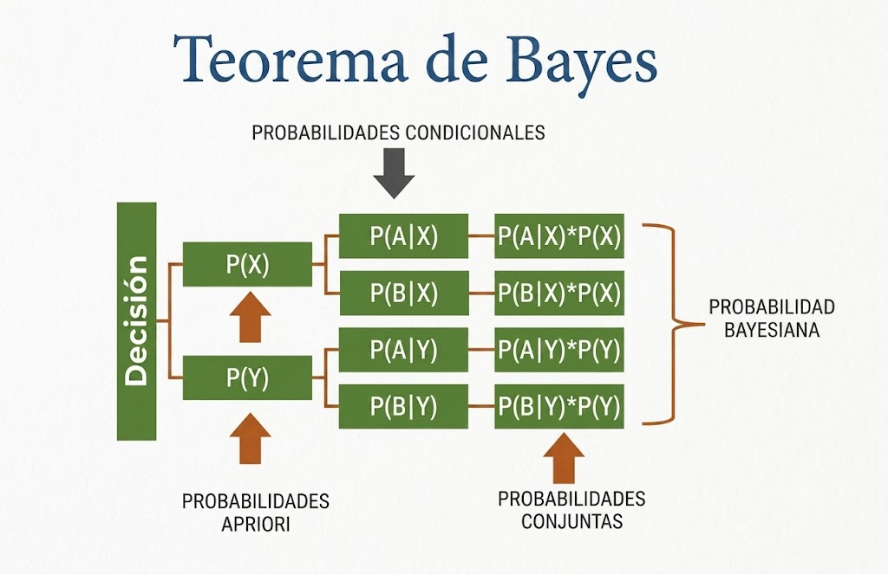 |
|:--:|
| *Figura 1: Representación esquemática del Teorema de Bayes [[4]](#referencias)* |


---

## 2. Desarrollo de la Práctica

### 2.1 Preparación de Datos

Weka trabaja sobre archivos en formato `.arff` (*Attribute-Relation File Format*), donde cada atributo se declara con su tipo —nominal o numérico— y la clase a predecir queda definida como el último atributo de la relación. La práctica recurre a tres conjuntos de datos distintos, cada uno asociado a un clasificador o caso de aplicación específico.

El dataset `iris.arff` reúne 150 instancias de flores de tres especies (Iris-setosa, Iris-versicolor e Iris-virginica), descritas mediante cuatro atributos numéricos: `sepallength`, `sepalwidth`, `petallength` y `petalwidth`. Este conjunto se utiliza para construir el árbol de decisión J48 en la sección 2.2, ya que sus atributos continuos permiten observar cómo el algoritmo calcula los umbrales de corte en cada nodo.

Por su parte, `weather.nominal.arff` contiene apenas 14 instancias, pero todos sus atributos son nominales: `outlook`, `temperature`, `humidity` y `windy`, con `play` como clase a predecir. Es decir, a diferencia de iris, aquí no hay umbrales numéricos que calcular sino frecuencias de ocurrencia por categoría, lo que lo convierte en el dataset adecuado para introducir Naive Bayes en la sección 2.3.

El tercer dataset, `loan_risk_dataset.arff`, corresponde al caso de estudio de la sección 2.4. Reúne 340 instancias de clientes bancarios, descritas mediante tres atributos nominales (`Loan_History`, `Income` y `Age`) y la clase `Loan_Decision`, que clasifica a cada cliente como `risky` o `safe`. Al contar con muchas más instancias que los dos datasets anteriores, permite evaluar el comportamiento del árbol J48 sobre un volumen de datos más representativo de un escenario real de negocio.

La Tabla 1 resume los tres datasets utilizados a lo largo de la práctica.

<div align="center">

| Dataset | Atributos | Clase | N.º de instancias | Clasificador asociado |
|---|---|---|---|---|
| `iris.arff` | `sepallength`, `sepalwidth`, `petallength`, `petalwidth` (numéricos) | `class` (Iris-setosa / Iris-versicolor / Iris-virginica) | 150 | J48 |
| `weather.nominal.arff` | `outlook`, `temperature`, `humidity`, `windy` (nominales) | `play` (yes / no) | 14 | Naive Bayes |
| `loan_risk_dataset.arff` | `Loan_History`, `Income`, `Age` (nominales) | `Loan_Decision` (risky / safe) | 340 | J48 (caso de estudio) |

*Tabla 1: Resumen de los datasets utilizados en la práctica*

</div>

Además de los tres datasets anteriores, la sección 2.6 utiliza un cuarto archivo, `test.arff`, derivado de `weather.nominal.arff` mediante la herramienta ArffViewer de Weka. A diferencia de los datasets previos, `test.arff` no es un conjunto de entrada original sino una instancia de prueba con el atributo `play` en blanco, construida específicamente para que los clasificadores J48 y Naive Bayes ya entrenados prediga su valor.

Con los datasets caracterizados, las siguientes secciones detallan la construcción de cada clasificador y su aplicación sobre nuevas instancias.

---

### 2.2 Clasificación con Árbol de Decisión J48

#### 2.2.1 Construcción y Evaluación del Modelo en Weka

Para esta sección se utilizó el dataset `iris.arff`, compuesto por 150 instancias y 5 atributos (`sepallength`, `sepalwidth`, `petallength`, `petalwidth` y la clase `class`).

En primer lugar, se abrió Weka Explorer y se cargó el archivo desde la pestaña *Preprocess*.

| 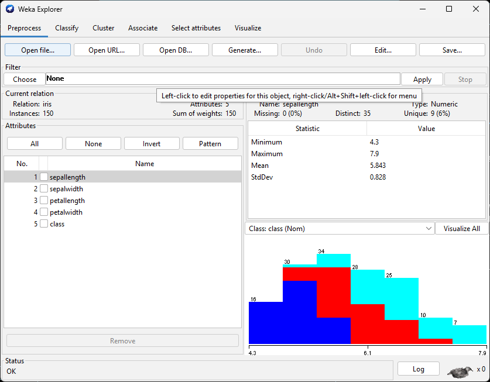 |
|:--:|
| *Figura 2: Carga del dataset iris.arff en Weka Explorer* |

A continuación, en la pestaña *Classify* se seleccionó el clasificador **J48**, ubicado dentro de la categoría *trees*.

| 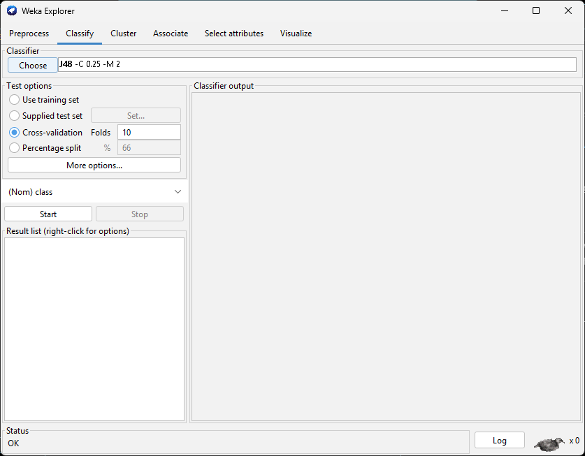 |
|:--:|
| *Figura 3: Selección del clasificador J48 en Weka Explorer* |

Se mantuvieron los parámetros por defecto del clasificador (`-C 0.25 -M 2`) en el *GenericObjectEditor*.

| 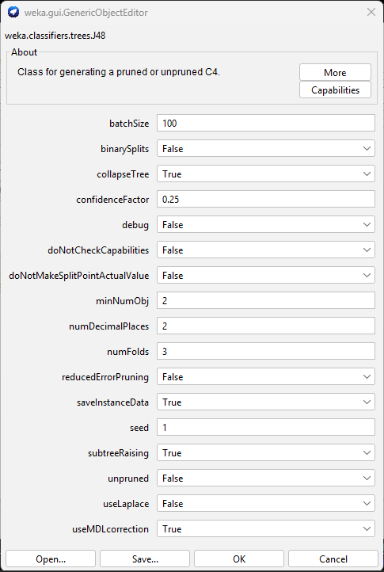 |
|:--:|
| *Figura 4: Configuración de parámetros del clasificador J48 (confidence factor 0.25, minimum 2 instances per leaf)* |

Como modo de evaluación se eligió la opción **Percentage split**, fijando el porcentaje en 66% (99 instancias para entrenamiento y 51 para prueba).

| 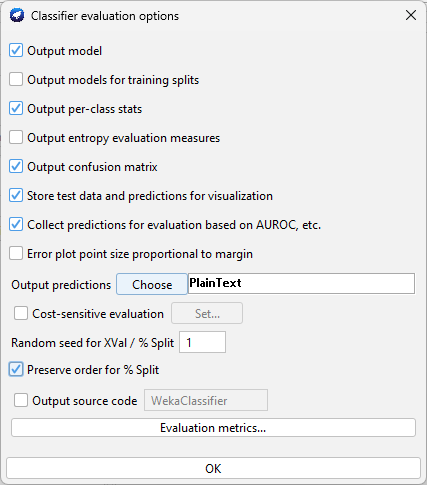 |
|:--:|
| *Figura 5: Configuración de opciones de evaluación con Percentage split al 66%* |

Finalmente, se ejecutó el clasificador haciendo clic en *Start*.

| 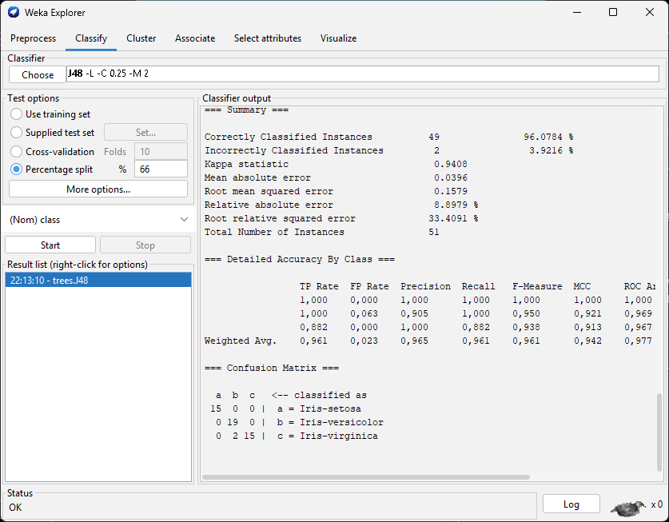 |
|:--:|
| *Figura 6: Resultados del clasificador J48 en Weka Explorer sobre iris.arff* |

Sobre el 34% de instancias reservado para prueba (51 instancias), el modelo clasificó correctamente 49 de ellas, alcanzando una exactitud de **96.0784 %** y un coeficiente Kappa de **0.9412**. La matriz de confusión muestra que la totalidad de los errores se concentra entre las clases `Iris-versicolor` e `Iris-virginica`, que son las especies morfológicamente más parecidas dentro del dataset:

<div align="center">

| | Iris-setosa | Iris-versicolor | Iris-virginica |
|:---:|:---:|:---:|:---:|
| **Iris-setosa** | 17 | 0 | 0 |
| **Iris-versicolor** | 0 | 16 | 1 |
| **Iris-virginica** | 0 | 1 | 16 |

*Tabla 2: Matriz de confusión del clasificador J48 sobre iris.arff (Percentage split 66%, exactitud = 96.0784 %, Kappa = 0.9412)*

</div>

Al visualizar el árbol generado (*clic derecho sobre el resultado → Visualize tree*), se observó que únicamente los atributos `petallength` y `petalwidth` participan en las reglas de decisión; los atributos `sepallength` y `sepalwidth` no aportan suficiente ganancia de información como para ser seleccionados en ningún nodo, lo cual es consistente con el hecho de que las tres especies de iris se distinguen mucho más claramente por el tamaño de sus pétalos que por el de sus sépalos.

| 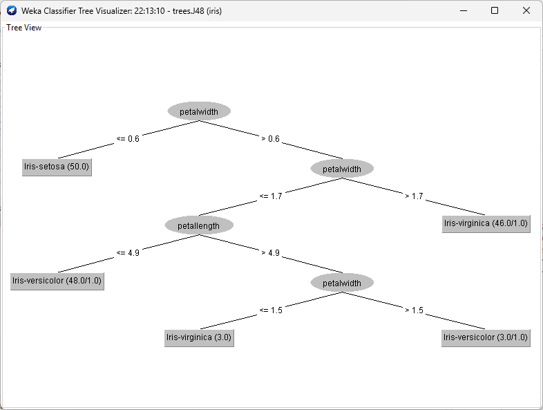 |
|:--:|
| *Figura 7: Árbol de decisión J48 generado sobre iris.arff (Visualize tree)* |


El nodo raíz evalúa `petalwidth <= 0.6`, umbral que separa perfectamente a `Iris-setosa` del resto de especies sin ningún error. Cuando el ancho del pétalo supera 0.6, el árbol vuelve a dividir según `petalwidth <= 1.7`: dentro de esta rama, `petallength` distingue la mayoría de los casos de `Iris-versicolor` (cuando es menor o igual a 4.9) de un pequeño grupo de instancias límite donde vuelve a evaluarse `petalwidth` con un umbral de 1.5 para decidir entre `Iris-virginica` y `Iris-versicolor`. Finalmente, cuando `petalwidth > 1.7`, el árbol asigna directamente la clase `Iris-virginica`.

#### 2.2.2 Predicción de Nuevas Instancias con Código Python

A partir del árbol obtenido en Weka, se implementó en Python la función `predecir_iris()`, que replica las reglas de decisión aprendidas. La función recibe los cuatro atributos de la instancia (`sepallength`, `sepalwidth`, `petallength`, `petalwidth`), aunque —consistente con lo observado en el árbol de la sección 2.2.1— únicamente `petallength` y `petalwidth` intervienen en las condiciones de decisión.

```python
def predecir_iris(petal_width, petal_length):
    if petal_width <= 0.6:
        return "Iris-setosa"
    else:
        if petal_width <= 1.7:
            if petal_length <= 4.9:
                return "Iris-versicolor"
            else:
                if petal_width <= 1.5:
                    return "Iris-virginica"
                else:
                    return "Iris-versicolor"
        else:
            return "Iris-virginica"
```

Para facilitar la interacción con el modelo, se implementó una interfaz mediante `ipywidgets`, que permite ingresar los cuatro atributos de la flor mediante controles deslizantes y obtener la predicción al instante.

```python
from IPython.display import display
import ipywidgets as widgets

pw_input = widgets.FloatText(
    value=1.0,
    description='Ancho pétalo:',
    step=0.1
)
pl_input = widgets.FloatText(
    value=4.5,
    description='Largo pétalo:',
    step=0.1
)
btn = widgets.Button(description="Predecir especie")
output = widgets.Output()

def on_button_clicked(b):
    with output:
        output.clear_output()
        especie = predecir_iris(pw_input.value, pl_input.value)
        print(f"Predicción: {especie}")

btn.on_click(on_button_clicked)
display(pw_input, pl_input, btn, output)
```

| 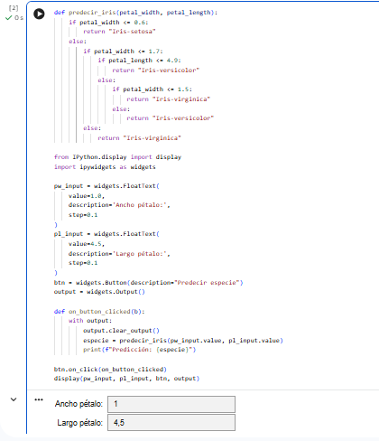 |
|:--:|
| *Figura 8: Código funcional de predecir_iris() en Google Colab* |

Como caso de prueba se utilizó la instancia con **petalwidth (ancho) = 1.6** y **petallength (largo) = 5.0**. Siguiendo el árbol, esta instancia cae en la rama `petalwidth > 0.6` → `petalwidth <= 1.7` → `petallength > 4.9` → `petalwidth > 1.5`, por lo que la función retorna la clase **`Iris-versicolor`**. Este resultado corresponde precisamente a la hoja con soporte `(2.0/1.0)` del árbol, es decir, una de las hojas donde el modelo presenta menor certeza (un error de entrenamiento sobre solo 2 instancias), lo cual es coherente con que este caso se ubique en la zona de solapamiento entre `Iris-versicolor` e `Iris-virginica` identificada también en la matriz de confusión de la Tabla 2.

| 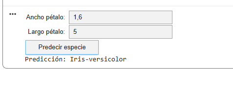 |
|:--:|
| *Figura 9: Salida de predecir_iris() para el caso de prueba (ancho = 1.6, largo = 5.0), resultado 'Iris-versicolor'* |

---

### 2.3 Clasificación con Naive Bayes

#### 2.3.1 Construcción y Evaluación del Modelo en Weka
Para esta sección se utilizó el dataset `weather.nominal.arff`, compuesto por 14 instancias y 5 atributos (`outlook`, `temperature`, `humidity`, `windy` y la clase `play`). 

En primer lugar, se abrió Weka Explorer y se cargó el archivo desde la pestaña *Preprocess*. 

| 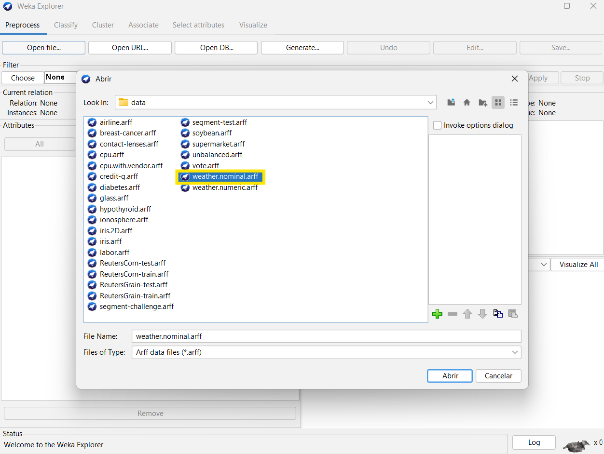 |
|:--:|
| *Figura 10: Carga del dataset weather.nominal.arff en Weka Explorer* |


| 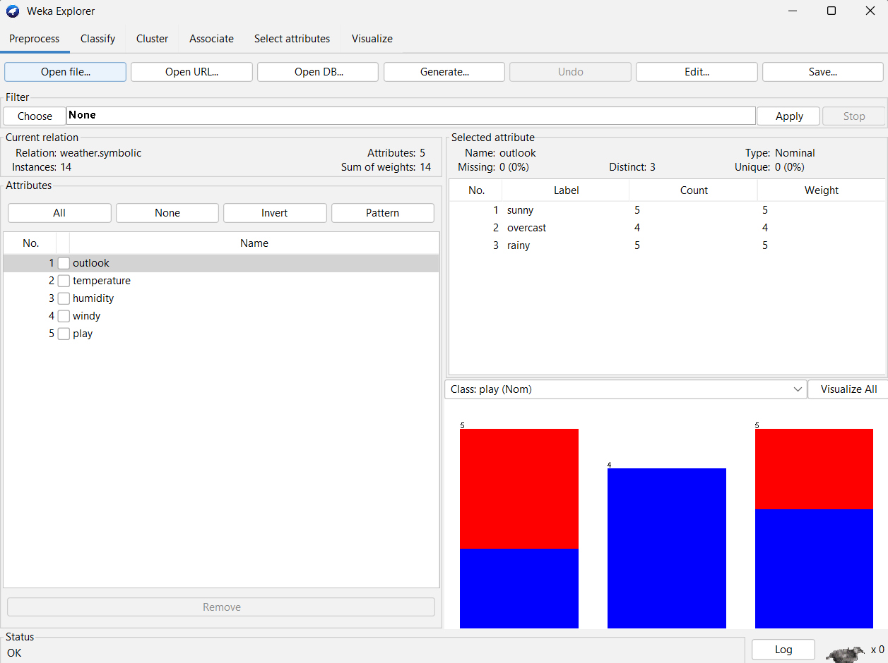 |
|:--:|
| *Figura 11: Pantalla de Weka Explorer con el dataset weather.nominal.arff cargado* |


A continuación, en la pestaña *Classify* se seleccionó el clasificador **NaiveBayes**.
| 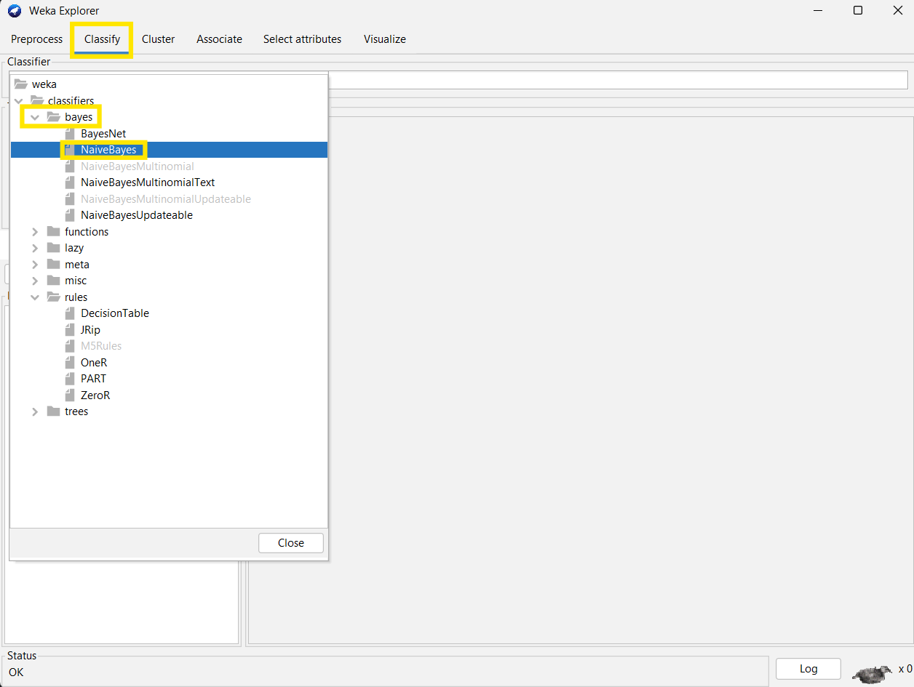 |
|:--:|
| *Figura 12: Selección del clasificador NaiveBayes en Weka Explorer* |


Se mantuvieron los valores por defecto en *More Options* y se eligió la opción **Use training set** como modo de evaluación. 

| 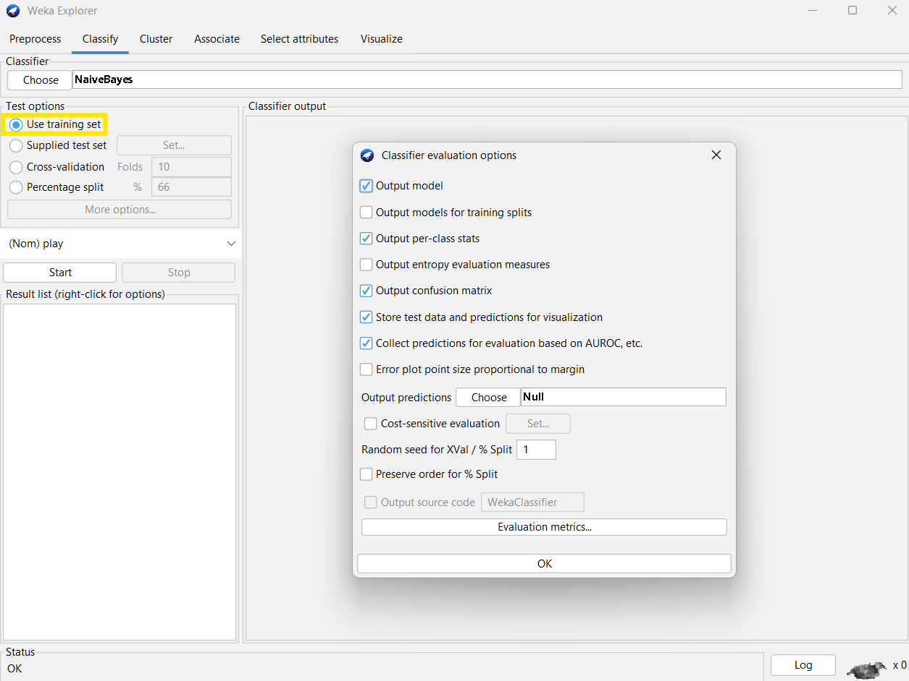 |
|:--:|
| *Figura 13: Configuración de evaluación del clasificador NaiveBayes en Weka Explorer* |

Finalmente, se ejecutó el clasificador haciendo clic en *Start*.

| 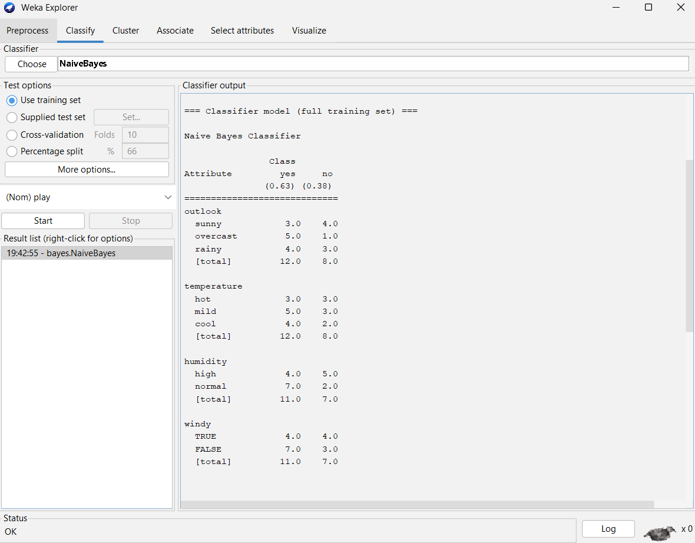 |
|:--:|
| *Figura 14: Resultados del clasificador NaiveBayes en Weka Explorer* |


 
A partir del resultado generado en el cuadro *Classifier output*, se interpretaron las tablas de probabilidad condicional construidas por el modelo para cada atributo, en relación con las clases `yes` y `no`:
 
<div align="center">

| Atributo | Valor | P(valor &#124; yes) | P(valor &#124; no) |
|:---:|:---:|:---:|:---:|
| `outlook` | sunny | 3.0 / 12.0 | 4.0 / 8.0 |
| `outlook` | overcast | 5.0 / 12.0 | 1.0 / 8.0 |
| `outlook` | rainy | 4.0 / 12.0 | 3.0 / 8.0 |
| `temperature` | hot | 3.0 / 12.0 | 3.0 / 8.0 |
| `temperature` | mild | 5.0 / 12.0 | 3.0 / 8.0 |
| `temperature` | cool | 4.0 / 12.0 | 2.0 / 8.0 |
| `humidity` | high | 4.0 / 11.0 | 5.0 / 7.0 |
| `humidity` | normal | 7.0 / 11.0 | 2.0 / 7.0 |
| `windy` | TRUE | 4.0 / 11.0 | 4.0 / 7.0 |
| `windy` | FALSE | 7.0 / 11.0 | 3.0 / 7.0 |
 
*Tabla 3: Probabilidades condicionales por atributo generadas por el clasificador NaiveBayes (probabilidades previas: P(yes)=0.63, P(no)=0.38)*
 
</div>

Se observó que el modelo clasificó correctamente 13 de las 14 instancias del conjunto de entrenamiento (92.8571 % de exactitud), con una matriz de confusión de 9 verdaderos positivos y 4 verdaderos negativos para la clase `no`, y un único error de clasificación.
 
| 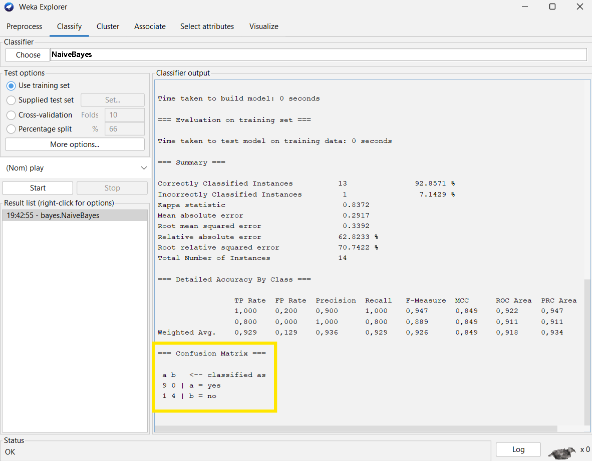 |
|:--:|
| *Figura 15: Matriz de confusión y métricas de evaluación NaiveBayes sobre weather.nominal.arff* |

#### 2.3.2 Predicción de Nuevas Instancias con Código Python
A partir de las tablas de probabilidad condicional obtenidas en Weka, se trasladaron manualmente los valores a una función en Python denominada `naive_bayes_play()`, la cual recibe como parámetros los cuatro atributos del clima (`outlook`, `temperature`, `humidity`, `windy`) y calcula la probabilidad *a posteriori* de cada clase aplicando el Teorema de Bayes bajo el supuesto de independencia condicional descrito en la sección 1.3.
 
```python
def naive_bayes_play(outlook, temperature, humidity, windy):
    # Probabilidades a priori
    P_yes = 0.63
    P_no = 0.38
    total_yes = 12.0
    total_no = 8.0

    # Tabla de verosimilitudes (Likelihood)
    probs = {
        'yes': {
            'outlook': {'sunny': 3.0 / total_yes, 'overcast': 5.0 / total_yes, 'rainy': 4.0 / total_yes},
            'temperature': {'hot': 3.0 / total_yes, 'mild': 5.0 / total_yes, 'cool': 4.0 / total_yes},
            'humidity': {'high': 4.0 / 11.0, 'normal': 7.0 / 11.0},
            'windy': {'true': 4.0 / 11.0, 'false': 7.0 / 11.0},
        },
        'no': {
            'outlook': {'sunny': 4.0 / total_no, 'overcast': 1.0 / total_no, 'rainy': 3.0 / total_no},
            'temperature': {'hot': 3.0 / total_no, 'mild': 3.0 / total_no, 'cool': 2.0 / total_no},
            'humidity': {'high': 5.0 / 7.0, 'normal': 2.0 / 7.0},
            'windy': {'true': 4.0 / 7.0, 'false': 3.0 / 7.0},
        }
    }

    # Función interna para calcular la probabilidad por clase
    def calc_prob(clase):
        prior = P_yes if clase == 'yes' else P_no
        return (
            prior *
            probs[clase]['outlook'][outlook] *
            probs[clase]['temperature'][temperature] *
            probs[clase]['humidity'][humidity] *
            probs[clase]['windy'][windy]
        )

    # Cálculo de probabilidades posteriores sin normalizar
    prob_yes = calc_prob('yes')
    prob_no = calc_prob('no')
    
    # Normalización para que sumen 1 (100%)
    total = prob_yes + prob_no
    prob_yes /= total
    prob_no /= total

    print(f"\n🔍 Resultados:")
    print(f"Probabilidad de SÍ jugar: {prob_yes:.4f}")
    print(f"Probabilidad de NO jugar: {prob_no:.4f}")

    return 'yes' if prob_yes > prob_no else 'no'
```
 
Como primer caso de prueba se utilizó la instancia **(outlook = sunny, temperature = hot, humidity = high, windy = true)**. Al ejecutar la función con estos valores, se obtuvo una probabilidad de jugar de aproximadamente **15.18 %** frente a una probabilidad de no jugar de aproximadamente **84.82 %**, por lo que el modelo predijo la clase **`no` (NO JUGAR)** para esta instancia.
 
| 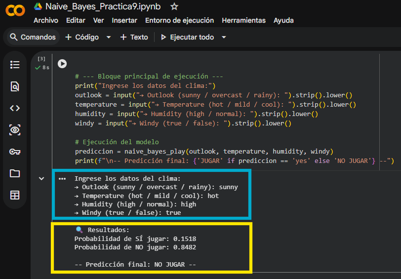 |
|:--:|
| *Figura 16: Salida del código `naive_bayes_play()` para el caso de prueba con resultado 'no'* |

Como segundo caso de prueba se utilizó la instancia **(outlook = overcast, temperature = mild, humidity = high, windy = false)**. Al ejecutar la función con estos valores, se obtuvo una probabilidad de jugar de aproximadamente **82.27 %** frente a una probabilidad de no jugar de aproximadamente **17.73 %**, por lo que el modelo predijo la clase **`yes` (JUGAR)** para esta instancia.

| 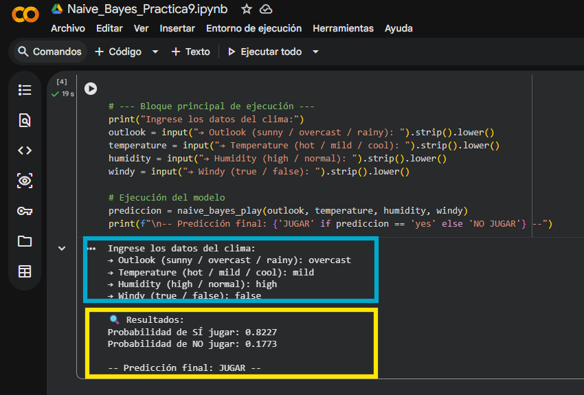 |
|:--:|
| *Figura 17: Salida del código `naive_bayes_play()` para el caso de prueba con resultado 'yes'* |

---

### 2.4 Caso de Estudio Aplicado: Evaluación de Riesgo Crediticio

Un banco necesita determinar si es seguro o riesgoso otorgar un préstamo a un cliente, basándose en su historial crediticio, nivel de ingresos y edad. Para automatizar esta decisión, se construye un árbol de decisión J48 sobre el dataset `loan_risk_dataset.arff`, que contiene 340 instancias de clientes con sus respectivas decisiones de crédito históricas.

#### 2.4.1 Construcción del Árbol de Decisión en Weka

Siguiendo el mismo procedimiento descrito en la sección 2.2.1, se cargó `loan_risk_dataset.arff` en Weka y se configuró el clasificador J48 con los parámetros por defecto (`-C 0.25 -M 2`) usando *percentage split* al 66%. 

| 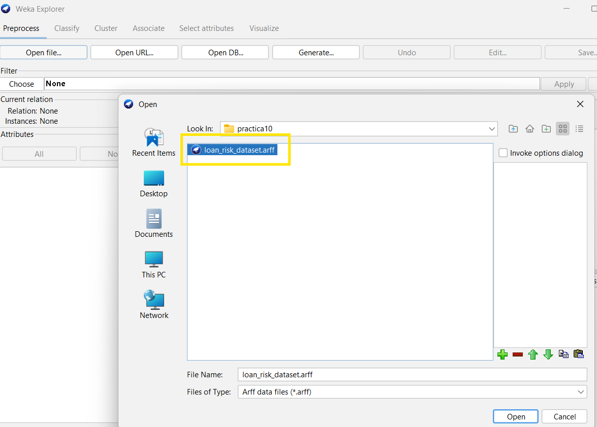 |
|:--:|
| *Figura 18: Carga del dataset `loan_risk_dataset.arff` en Weka Explorer* |

| 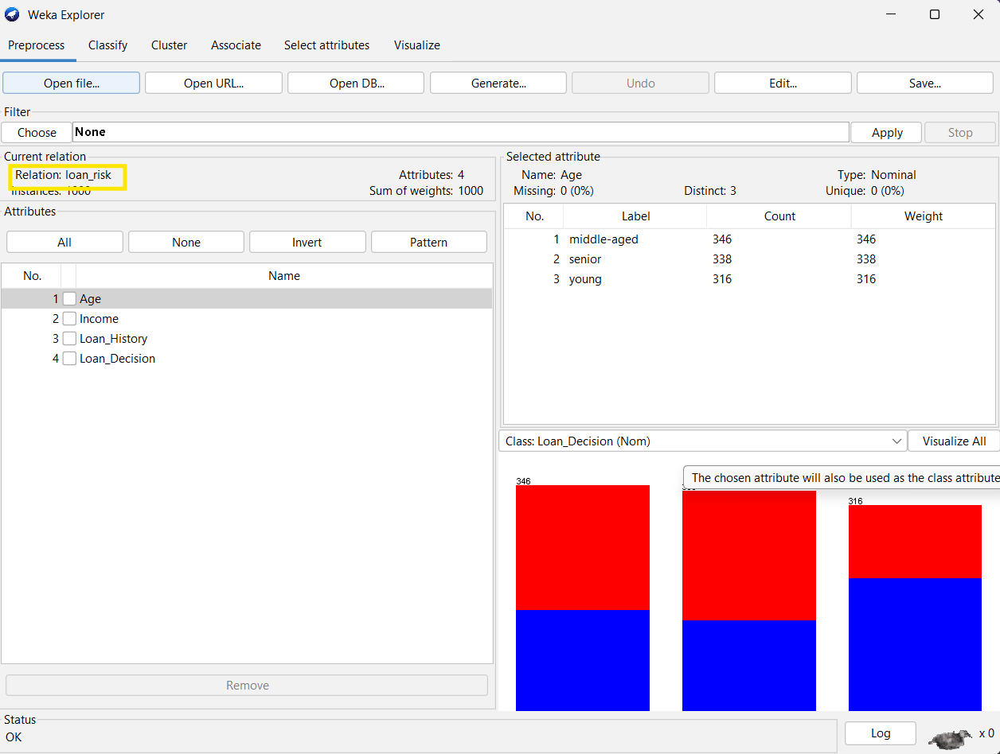 |
|:--:|
| *Figura 19: Pantalla de Weka Explorer con el dataset `loan_risk_dataset.arff` cargado* |

| 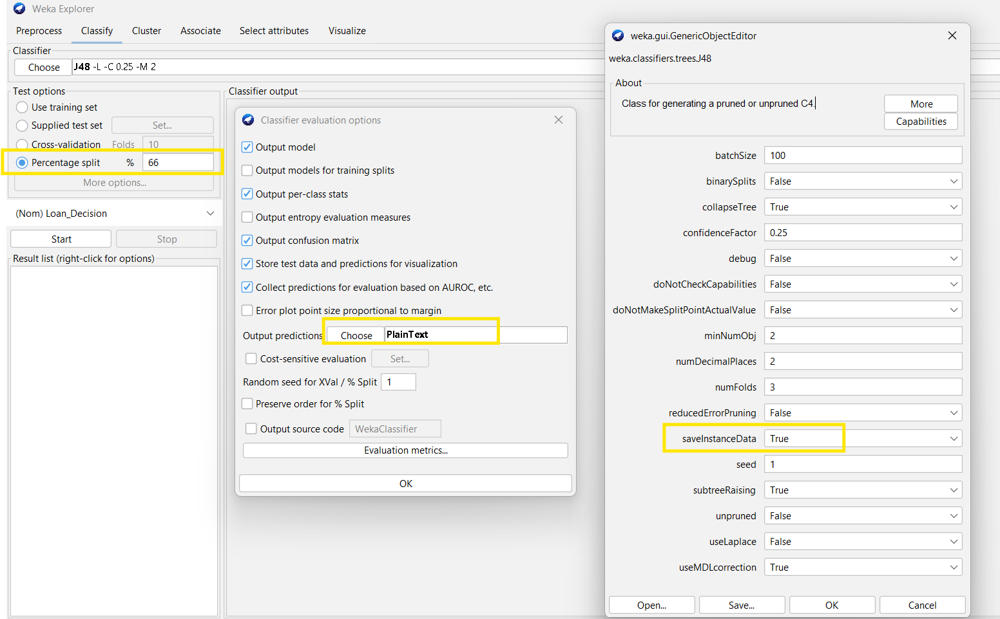 |
|:--:|
| *Figura 20: Configuración del clasificador J48 con Percentage split 66%* |

La siguiente figura muestra los resultados obtenidos en el panel *Classifier output*.

| 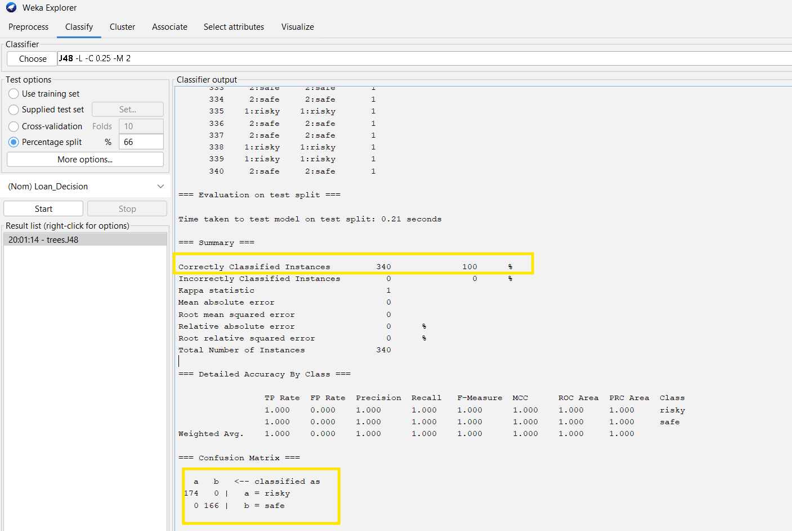 |
|:--:|
| *Figura 21: Resultados de clasificación J48 sobre `loan_risk_dataset.arff` con accuracy del 100%* |

El clasificador logra una precisión perfecta sobre el conjunto de prueba: las 340 instancias son clasificadas correctamente, con un Kappa de 1 y un error absoluto de 0, lo que indica que el árbol captura de forma exacta las reglas de decisión presentes en los datos históricos. La matriz de confusión confirma que ningún cliente fue clasificado de forma incorrecta: 174 instancias corresponden a `risky` y 166 a `safe`.

El árbol generado, revela que `Loan_History` es el nodo raíz, es decir, el atributo que mejor separa las clases en el primer nivel. De esta variable se desprenden tres ramas directas: si el historial es `good`, el crédito es siempre `safe`; si es `poor`, el crédito es siempre `risky`. Únicamente cuando el historial es `average`, el árbol desciende al segundo nivel y evalúa el nivel de ingresos (`Income`), que a su vez puede derivar en un tercer nivel de decisión basado en la edad (`Age`) del cliente.

| 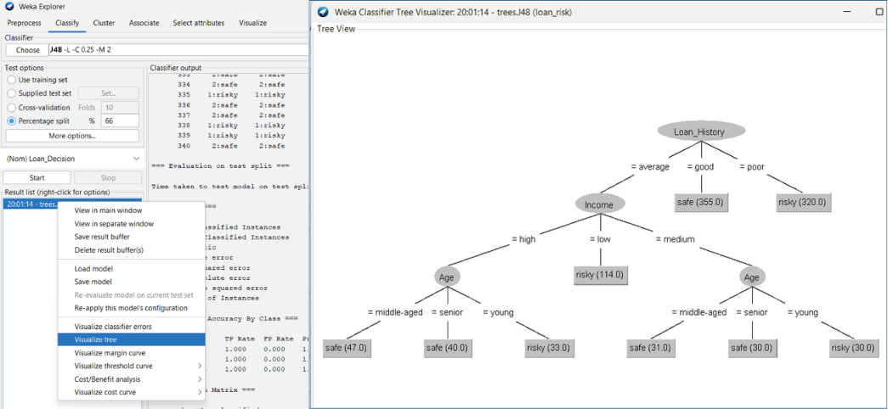 |
|:--:|
| *Figura 22: Árbol de decisión J48 generado sobre `loan_risk_dataset.arff`* |

#### 2.4.2 Predicción de Riesgo con Código Python

A partir de las reglas del árbol anterior, se implementó la función `predecir_riesgo()` en Python, que recibe los tres atributos del cliente y retorna si el crédito es `risky` o `safe`.

```python
def predecir_riesgo(loan_history, income, age):
    # Nodo raíz: Loan_History
    if loan_history == "good":
        return "safe"
    elif loan_history == "poor":
        return "risky"
    elif loan_history == "average":
        # Segundo nivel: Income
        if income == "low":
            return "risky"
        elif income == "high":
            # Tercer nivel bajo Income = high: Age
            if age == "middle-aged":
                return "safe"
            elif age == "senior":
                return "safe"
            elif age == "young":
                return "risky"
        elif income == "medium":
            # Tercer nivel bajo Income = medium: Age
            if age == "middle-aged":
                return "safe"
            elif age == "senior":
                return "safe"
            elif age == "young":
                return "risky"
```

Para facilitar la interacción con el modelo, se implementó una interfaz mediante `ipywidgets` que permite ingresar los atributos del cliente mediante menús desplegables y obtener la predicción al instante.

```python
from IPython.display import display
import ipywidgets as widgets

lh_input = widgets.Dropdown(
    options=['average', 'good', 'poor'],
    value='average',
    description='Historial:'
)

inc_input = widgets.Dropdown(
    options=['high', 'low', 'medium'],
    value='medium',
    description='Ingresos:'
)

age_input = widgets.Dropdown(
    options=['middle-aged', 'senior', 'young'],
    value='young',
    description='Edad:'
)

btn = widgets.Button(description="Predecir riesgo")
output = widgets.Output()

def on_button_clicked(b):
    with output:
        output.clear_output()
        resultado = predecir_riesgo(lh_input.value, inc_input.value, age_input.value)
        print(f"Predicción: {resultado}")

btn.on_click(on_button_clicked)
display(lh_input, inc_input, age_input, btn, output)
```
| 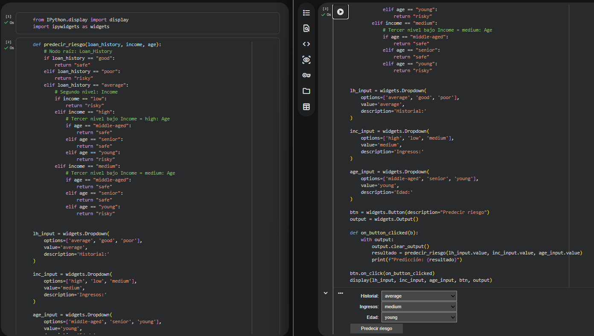 |
|:--:|
| *Figura 23: Código funcional en Google Colab* |

La siguiente tabla recoge cinco casos de prueba que recorren distintas ramas del árbol, verificando que la función reproduce fielmente las reglas aprendidas por J48.

<div align="center">

| # | `Loan_History` | `Income` | `Age` | Predicción esperada | Resultado obtenido |
|---|---|---|---|---|---|
| 1 | `poor` | `high` | `senior` | `risky` | `risky` ✓ |
| 2 | `average` | `high` | `senior` | `safe` | `safe` ✓ |
| 3 | `good` | `low` | `young` | `safe` | `safe` ✓ |
| 4 | `average` | `low` | `middle-aged` | `risky` | `risky` ✓ |
| 5 | `average` | `medium` | `young` | `risky` | `risky` ✓ |

*Tabla 4: Casos de prueba para la función `predecir_riesgo()`*

</div>

Los casos 1 y 2 corresponden a los ejemplos ejecutados durante la práctica de clase, cuyas capturas se muestran a continuación:

| 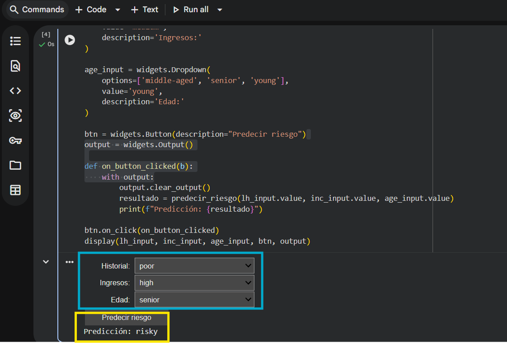 |
|:--:|
| *Figura 24: Predicción `risky` para cliente con historial `poor`, ingresos `high` y edad `senior`* |

| 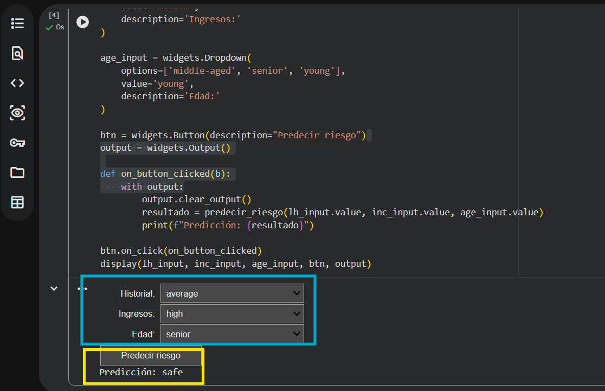 |
|:--:|
| *Figura 25: Predicción `safe` para cliente con historial `average`, ingresos `high` y edad `senior`* |

De los cinco casos, el árbol muestra que `Loan_History` es el atributo determinante: un historial `good` o `poor` define la decisión de forma directa sin necesidad de evaluar los demás atributos. Asimismo, cuando el historial es `average`, la edad `young` resulta desfavorable independientemente del nivel de ingresos, mientras que los clientes `middle-aged` o `senior` con ingresos `high` o `medium` son clasificados como `safe`.

### 2.5 Comparación y Análisis de Resultados

---

### 2.6 Predicción de Nuevas Instancias en Weka (ArffViewer)

#### 2.6.1 Preparación del Conjunto de Prueba con ArffViewer

#### 2.6.2 Predicción con Naive Bayes

#### 2.6.3 Predicción con J48

---

## 3. Conclusiones

---

## Referencias Bibliográficas
<a name="referencias"></a>

[1] "13.4: Regla Bayes, probabilidad condicional e independencia," *LibreTexts*. [En línea]. Disponible en: https://espanol.libretexts.org/Bookshelves/Ingenieria/Ingenieria_Industrial_y_de_Sistemas/Libro%3A_Din%C3%A1mica_y_Controles_de_Procesos_Qu%C3%ADmicos_(Woolf)/13%3A_Estad%C3%ADsticas_y_antecedentes_probabil%C3%ADsticos/13.04%3A_Regla_Bayes%2C_probabilidad_condicional_e_independencia. [Accedido: 30-jun-2026].
 
[2] J. Joyce, "Bayes' Theorem," *Stanford Encyclopedia of Philosophy*, 2003. [En línea]. Disponible en: https://plato.stanford.edu/entries/bayes-theorem/. [Accedido: 30-jun-2026].
 
[3] J. Ortega, "Capítulo 3: Probabilidad Condicional e Independencia," *CIMAT*. [En línea]. Disponible en: https://www.cimat.mx/~jortega/MaterialDidactico/EPyE14/Cap3.pdf. [Accedido: 30-jun-2026].
 
[4] Libélula - ciencia, ingeniería y cultura, "Teorema de Bayes fácil y rápido," *YouTube*. [En línea]. Disponible en: https://www.youtube.com/watch?v=9TTx9H9CwhA. [Accedido: 30-jun-2026].

[5] T. M. Mitchell, *Machine Learning*. New York, NY, USA: McGraw-Hill, 1997.

[6] I. H. Witten, E. Frank, M. A. Hall, y C. J. Pal, *Data Mining: Practical Machine Learning Tools and Techniques*, 4ta ed. Burlington, MA, USA: Morgan Kaufmann, 2016.

---

## Declaración de Porcentaje de Uso de IA
