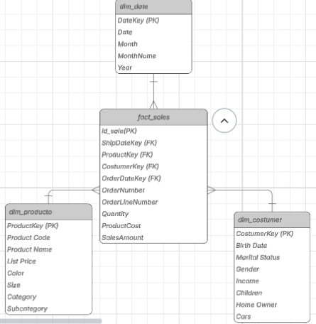

# 2026A-ISWD743-practica3
### Fecha: 08/05/2026
### Práctica Modelo estrella
  

  
  
  
  
  

>[!NOTE]
>
> Este repositorio contiene el desarrollo del trabajo grupal de la Práctica 3 de Business Intelligence, en la que se implementa un modelo de datos tipo esquema estrella utilizando Microsoft Excel y Power Pivot. A partir de tablas de hechos y dimensiones relacionadas, se construyen tablas dinámicas que permiten responder preguntas comerciales clave sobre el rendimiento de ventas por producto, cliente, fecha y categoría.

---

>[!NOTE]
>
> Objetivos específicos:
> * Diseñar el esquema estrella identificando la tabla de hechos y las dimensiones del modelo de ventas.
> * Configurar Power Pivot en Excel para gestionar el modelo de datos relacional.
> * Establecer relaciones entre tablas mediante claves primarias y foráneas en Power Pivot.
> * Construir tablas dinámicas que respondan las preguntas comerciales clave de la empresa.
> * Interpretar los resultados obtenidos para apoyar la toma de decisiones sobre ventas y clientes.

---

---

## 1. Esquema estrella — identificación de tabla de hechos y dimensiones

### Diagrama del esquema estrella 

|  |
| :---: |
| *Figura 1: Esquema estrella* |

### Tabla de hechos — `fact_sales`

La tabla de hechos es `fact_sales`. Se identificó como tabla de hechos porque:

- Contiene las **métricas cuantitativas** que el negocio desea analizar: `Quantity`,
  `UnitPrice`, `ProductCost` y `SalesAmount`.
- Almacena las **claves foráneas (FK)** que la conectan con cada dimensión.
- Cada fila representa **un evento de venta** ocurrido en un momento específico,
  para un producto y cliente determinados.
- No describe "quién es" o "qué es" algo, sino **cuánto, cuándo y cuánto costó**.

---

### Dimensiones identificadas
---
#### `dim_product` — ¿Qué se vendió? 

Agrupa los atributos descriptivos del producto. Es una dimensión porque sus datos **no cambian con cada venta**. El nombre, color, categoría y precio de lista de un producto son constantes independientemente de cuántas veces se venda.

---

#### `dim_customer` — ¿Quién compró?

Contiene el perfil demográfico de cada cliente. Es una dimensión porque los datos
del cliente (género, edad, estado civil) son **atributos que describen a una
persona**, no métricas de una transacción.

---

#### `dim_date` — ¿Cuándo ocurrió la venta o el envío?

Agrupa los atributos temporales necesarios para analizar las ventas según fechas. 
Incluye información como día, mes, nombre del mes y año, lo que permite realizar análisis temporales sobre las transacciones.

Es una dimensión porque la fecha representa un contexto de tiempo y no una métrica de negocio. En este modelo, `dim_date` representa tanto la fecha en que se realizó el pedido como la fecha en que fue enviado.
---
