# 2026A-ISWD743-practica5
### Fecha: 14/05/2026
### Práctica Creación Data warehouse - Desnutrición Infantil
  
</div>

[](https://github.com/andrea-m11)<br><br>
[](https://github.com/Andreina-P)<br><br>
[](https://github.com/JoseDA0721)<br><br>
[](https://github.com/JuanMateoQ)<br><br>
[](https://github.com/juansuarezb)<br><br>

>[!NOTE]
>
> Este repositorio contiene el desarrollo del trabajo grupal de la Práctica 5 de Business Intelligence, correspondiente a la creación de un datawarehouse para el análisis la desnutrición infantil en distintas regiones del país. 
Respondiendo las siguientes preguntas:
> * ¿Cuál es el tipo de desnutrición más común por región?
> * ¿Cómo varía la desnutrición por edad y género?
> * ¿Qué instituciones atienden más casos? <br>
---

>[!NOTE]
>
> Objetivos específicos:
> * Diseñar el diagrama del modelo estrella en Power Pivot
> * Crear tabla de hechos y dimensionales en PostgreSQL
> * Realizar el proceso de ETL en Pentaho
> * Generar consultas SQL para responder las preguntas.

---

## 1. Modelo Estrella: Diseño e creación de tablas en PostgreSQL

Para la practica se desarrollo el siguiente concepto de modelo estrella que permita responder las preguntas solicitas.

|  |
| :---: |
| *Figura 1: Diagrama del modelo estrella* |

---
### Tabla de Hechos — `fact_cases_desnutrition`

La tabla de hechos es el núcleo del modelo. Almacena **un registro por cada evaluación nutricional** realizada a un niño/niña, con las métricas cuantitativas del evento y las claves foráneas que conectan con cada dimensión.

Se eligió como tabla de hechos porque concentra los eventos medibles del problema: el peso, la talla y el diagnóstico nutricional son métricas que varían por caso y que se deben analizar desde múltiples ángulos (tiempo, niño, institución). Las claves foráneas `date_id`, `child_id` e `institution_id` son los ejes de análisis; `weight_kg`, `height_cm` y `nutritional_status` son las métricas del evento.

---

### Dimensión — `dim_date`

Contiene los atributos de tiempo descompuestos desde la fecha de evaluación. Se crea como dimensión independiente porque permite analizar los casos en distintas granularidades temporales (día, mes, año) sin recalcular esos valores en cada consulta. Separar el tiempo en una dimensión es una práctica estándar en cualquier Data Warehouse ya que los atributos de fecha son reutilizables por múltiples tablas de hechos.

---

### Dimensión — `dim_child`

Describe las características del niño o niña evaluado. Se crea como dimensión porque el perfil del paciente (sexo y edad) es un eje de análisis fundamental para el problema de desnutrición infantil. Se añade el atributo `age_group` calculado a partir de `age_months` usando los **tramos estándar de la OMS** para menores de 5 años (0-11, 12-23, 24-35, 36-47, 48-59 meses), lo que permite segmentar directamente sin aplicar lógica condicional en cada consulta.

---

### Dimensión — `dim_institution`

Describe el centro de atención médica donde se realizó la evaluación.

---

### Dimensión — `dim_region`

Describe la región geográfica donde fue atendido cada caso.

---

### Implementación en PostgreSQL
Para la implementacion se creara una base de datos con el nombre "Datawarehouse"
#### Tabla RAW — datos originales

Se crea primero una tabla que replica exactamente la estructura del CSV fuente. Su propósito es preservar los datos sin transformación como punto de entrada del proceso ETL.

```sql
CREATE TABLE desnutricion_infantil (
    child_id            VARCHAR(10),
    gender              CHAR(1),
    age_months          SMALLINT,
    weight_kg           NUMERIC(5,2),
    height_cm           NUMERIC(5,1),
    nutritional_status  VARCHAR(20),
    region              VARCHAR(50),
    institution         VARCHAR(50),
    date_measured       DATE
);
```
---

#### Dimensiones y tabla de hechos

```sql
CREATE TABLE dim_date (
    date_id       SERIAL     PRIMARY KEY,
    date_measured DATE       NOT NULL UNIQUE,
    year          SMALLINT   NOT NULL,
    month         SMALLINT   NOT NULL CHECK (month BETWEEN 1 AND 12),
    day           SMALLINT   NOT NULL CHECK (day   BETWEEN 1 AND 31)
);

CREATE TABLE dim_child (
    child_id    VARCHAR(10) PRIMARY KEY,
    gender      CHAR(1)     NOT NULL CHECK (gender IN ('M','F')),
    age_months  SMALLINT    NOT NULL CHECK (age_months BETWEEN 0 AND 59),
    age_group   VARCHAR(10) NOT NULL
                CHECK (age_group IN ('0-11','12-23','24-35','36-47','48-59'))
);

CREATE TABLE dim_institution (
    institution_id  SERIAL        PRIMARY KEY,
    institution     VARCHAR(100)  NOT NULL UNIQUE
);

CREATE TABLE dim_region (
    region_id  SERIAL       PRIMARY KEY,
    region     VARCHAR(50)  NOT NULL UNIQUE
);

CREATE TABLE fact_cases_desnutrition (
    id_case            SERIAL         PRIMARY KEY,
    date_id            INT            NOT NULL
                                      REFERENCES dim_date(date_id),
    child_id           VARCHAR(10)    NOT NULL
                                      REFERENCES dim_child(child_id),
    region_id		   INT            NOT NULL 
    								  REFERENCES dim_region(region_id),
    institution_id     INT            NOT NULL
                                      REFERENCES dim_institution(institution_id),
    weight_kg          NUMERIC(5,2)   NOT NULL  CHECK (weight_kg > 0),
    height_cm          NUMERIC(5,1)   NOT NULL  CHECK (height_cm > 0),
    nutritional_status VARCHAR(20)    NOT NULL
                                      CHECK (nutritional_status IN (
                                          'Aguda','Cronica','Global'
                                      ))
);
```

| 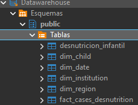 |
| :---: |
| *Figura 2: Tablas creadas en PostgreSQL* |

---
## 2. Proceso ETL en Pentaho

El proceso ETL (*Extract, Transform, Load*) se implementó siguiendo una arquitectura de transformaciones independientes que luego son ejecutadas en un job maestro. El orden de ejecución es crítico: primero se carga el staging, luego las dimensiones, y finalmente la tabla de hechos, ya que esta última depende de las claves generadas por las dimensiones.

### Configuración de la conexión a PostgreSQL

Antes de construir las transformaciones se configuró una conexión a la base de datos que fue reutilizada en todos los steps de tipo `Table Input` y `Table Output` a lo largo del proceso ETL.

| Campo | Valor |
|---|---|
| **Connection name** | `ConnectionDB` |
| **Connection type** | `PostgreSQL` |
| **Host Name** | `localhost` |
| **Database Name** | `Datawarehouse` |
| **Port Number** | `5432` |
| **Username** | `postgres` |

| 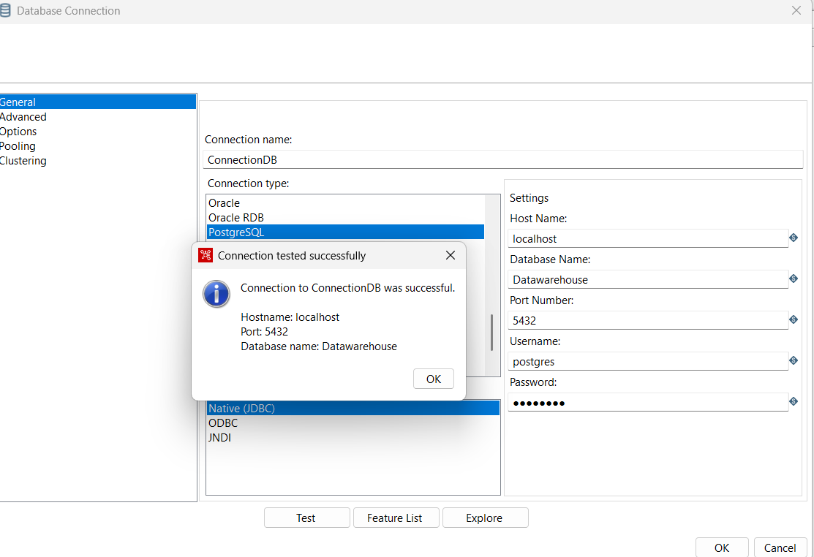 |
| :---: |
| *Figura 3: Conexión a PostgreSQL verificada exitosamente* |

---

### Transformación 1 — `load_csv_desnutricion.ktr` (Carga al Staging)

Lee el archivo CSV fuente y lo carga sin transformación a la tabla `desnutricion_infantil`. Esta tabla actúa como zona de staging: preserva los datos originales y sirve como única fuente para todas las transformaciones posteriores.

**Steps utilizados:**  `CSV File Input` → `Table Output`

- **CSV File Input** → Lee el archivo `desnutricion_infantil.csv` detectando automáticamente los campos y tipos de datos.
- **Table Output** → Inserta las 500 filas en la tabla `desnutricion_infantil` de PostgreSQL.

| 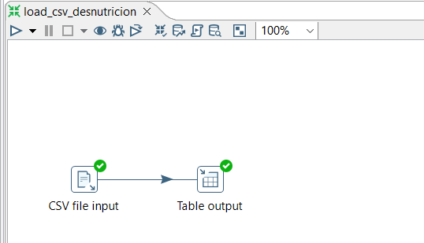 |
| :---: |
| *Figura 4: Transformación de carga al staging* |

| 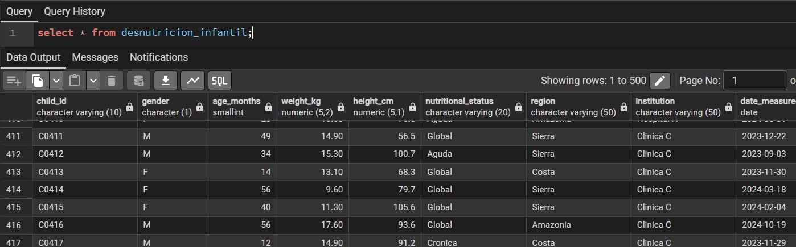 |
| :---: |
| *Figura 5: Resultado en PostgreSQL de Transformación ejecutada* |

---

### Transformación 2 — `dim_date_desnutricion.ktr`

Extrae las fechas únicas del staging y las descompone en sus atributos temporales mediante el step **Calculator**, que permite derivar año, mes y día directamente desde un campo de tipo fecha.

**Steps:** `Table Input` → `Calculator` → `Select values` → `Table Output`

- **Table Input** → Lee fechas únicas del staging:
  ```sql
  SELECT DISTINCT date_measured 
  FROM desnutricion_infantil 
  ORDER BY date_measured;
  ```
- **Calculator** → Deriva los atributos `year`, `month` y `day` a partir de `date_measured` usando las funciones *Year of date A*, *Month of date A* y *Day of month of date A*.
- **Select values** → Selecciona únicamente los campos necesarios: `date_measured`, `year`, `month`, `day`.
- **Table Output** → Inserta en `dim_date`. El campo `date_id` es generado automáticamente por PostgreSQL (`SERIAL`).

| 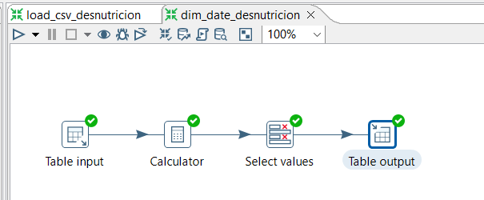 |
| :---: |
| *Figura 6: Transformación dim_date — 353 fechas únicas cargadas* |

| 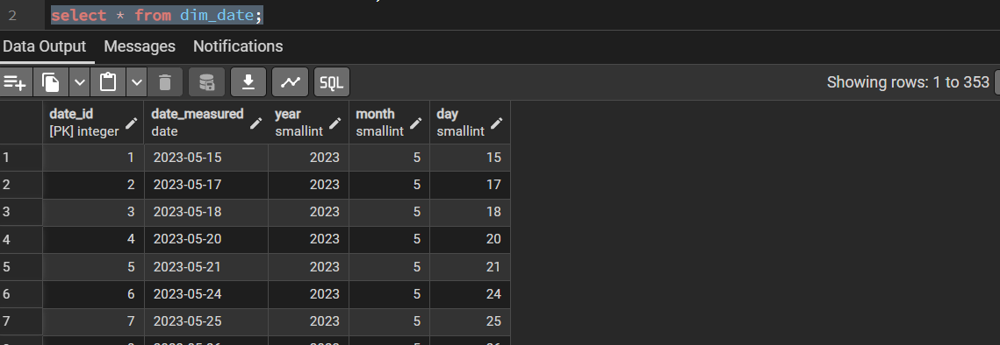 |
| :---: |
| *Figura 7: Resultado en PostgreSQL de Transformación ejecutada* |

---

### Transformación 3 — `dim_child_desnutricion.ktr`

Es la transformación más relevante del proceso. Además de cargar los datos del niño, deriva el atributo `age_group` mediante el step **Modified JavaScript Value**, que no fue visto en clase pero permite aplicar lógica condicional directamente sobre el stream de datos, algo que el Calculator estándar no soporta.

**Steps utilizados:** `Table Input` → `Agregar age_group` → `Select values` → `Table Output`

- **Table Input** → Lee niños únicos del staging:
  ```sql
  SELECT DISTINCT child_id, gender, age_months
  FROM desnutricion_infantil;
  ```
- **Modified JavaScript Value** — Permite escribir código JavaScript que se ejecuta fila por fila sobre el stream. Se declara la variable `age_group` en la tabla **Fields** del step (tipo String, longitud 10) para que Pentaho la agregue al stream como campo nuevo:

```javascript
var age_group;
if      (age_months <= 11) { age_group = "0-11";  }
else if (age_months <= 23) { age_group = "12-23"; }
else if (age_months <= 35) { age_group = "24-35"; }
else if (age_months <= 47) { age_group = "36-47"; }
else                       { age_group = "48-59"; }
```

| 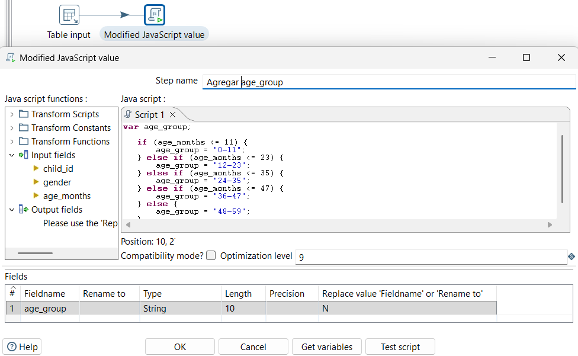 |
| :---: |
| *Figura 8: Configuración del Modified JavaScript Value con la lógica de age_group* |

- **Select values** → Selecciona: `child_id`, `gender`, `age_months`, `age_group`.
- **Table Output** → Inserta en `dim_child`.

| 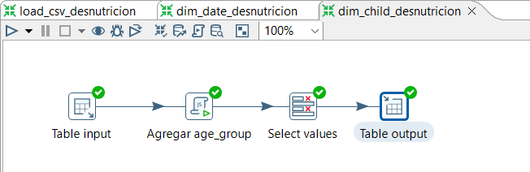 |
| :---: |
| *Figura 9: Transformación dim_child — 500 niños con age_group derivado* |

| 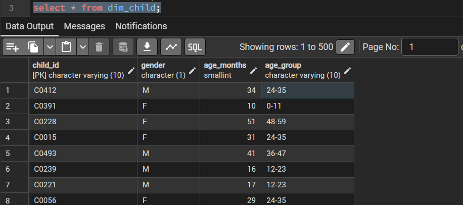 |
| :---: |
| *Figura 10: Resultado en PostgreSQL de Transformación ejecutada* |
---

### Transformación 4 — `dim_institution_desnutricion.ktr`

Extrae los valores únicos de institución del staging y los carga en `dim_institution`.

**Steps utilizados:** `Table Input` → `Unique rows` → `Table Output`

- **Table Input** :
```sql
SELECT DISTINCT institution FROM desnutricion_infantil;
```

- **Unique rows** → Elimina posibles duplicados comparando por `institution`.
- **Table Output** → Inserta en `dim_institution`. El campo `institution_id` es generado por PostgreSQL (`SERIAL`).

| 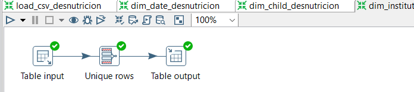 |
| :---: |
| *Figura 11: Transformación dim_institution — 3 instituciones cargadas* |

| 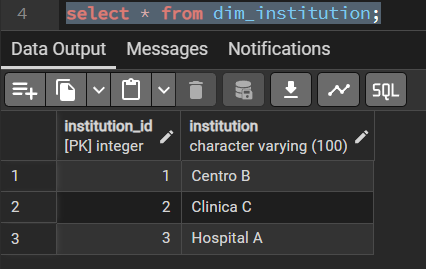 |
| :---: |
| *Figura 12: Resultado en PostgreSQL de Transformación ejecutada* |

---

### Transformación 5 — `dim_region_desnutricion.ktr`

Mismo patrón que `dim_institution`, aplicado a las regiones geográficas.

**Steps utilizados:** `Table Input` → `Unique rows` → `Table Output`
- **Table Input** → 
```sql
SELECT DISTINCT region FROM desnutricion_infantil;
```

- **Unique rows** → Compara por `region`.
- **Table Output** → Inserta en `dim_region`.

| 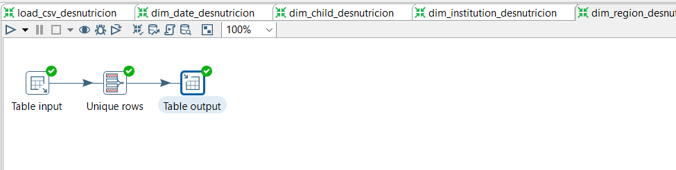 |
| :---: |
| *Figura 13: Transformación dim_region — 3 regiones cargadas* |

| 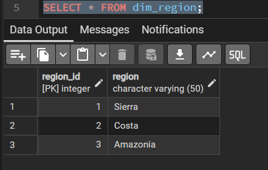 |
| :---: |
| *Figura 14: Resultado en PostgreSQL de Transformación ejecutada* |
---

### Transformación 6 — `fact_cases_desnutrition.ktr`

Es la transformación más compleja. Lee todos los campos necesarios del staging y resuelve las tres claves foráneas (`date_id`, `region_id`, `institution_id`) mediante **Stream Lookup**.

**Steps utilizados:**  `Table Input` → `Stream Lookup date_id` → `Stream Lookup region_id` → `Stream Lookup institution_id` → `Select values` → `Table Output`

- **Table Input (principal)** → Lee todos los campos necesarios del staging:
  ```sql
  SELECT child_id, date_measured, region, institution,
         weight_kg, height_cm, nutritional_status
  FROM desnutricion_infantil;
  ```

Cada Stream Lookup requiere su propio `Table Input` lateral que alimenta la dimensión de referencia:

| Lookup | Table Input lateral | Campo del stream | Campo dimensión | FK resuelta |
|---|---|---|---|---|
| #1 | `SELECT date_id, date_measured FROM dim_date` | `date_measured` | `date_measured` | `date_id` |
| #2 | `SELECT region_id, region FROM dim_region` | `region` | `region` | `region_id` |
| #3 | `SELECT institution_id, institution FROM dim_institution` | `institution` | `institution` | `institution_id` |

- **Stream Lookup #1** → Resuelve `date_id` cruzando `date_measured` con `dim_date`.
- **Stream Lookup #2** → Resuelve `region_id` cruzando `region` con `dim_region`.
- **Stream Lookup #3** → Resuelve `institution_id` cruzando `institution` con `dim_institution`.
- **Select values** → Conserva únicamente los 7 campos que recibe la fact: `date_id`, `child_id`, `region_id`, `institution_id`, `weight_kg`, `height_cm`, `nutritional_status`.
- **Table Output** → Inserta en `fact_cases_desnutrition`.

| 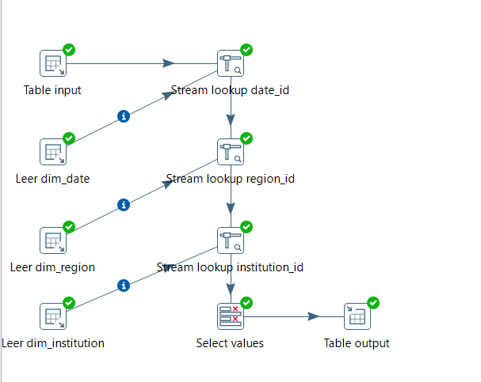 |
| :---: |
| *Figura 15: Transformación de la tabla de hechos con Stream Lookups* |

| 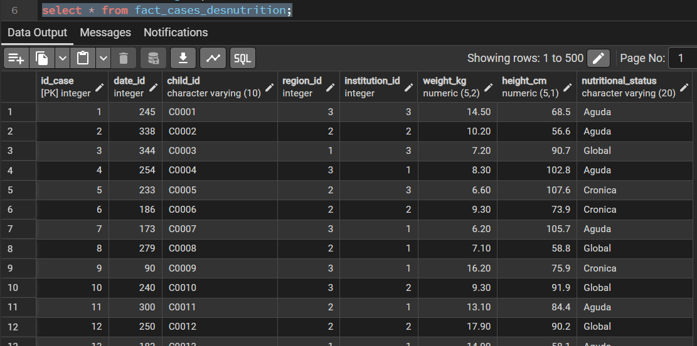 |
| :---: |
| *Figura 16: Resultado en PostgreSQL de Transformación ejecutada* |

---

### Job maestro — `p5_job_desnutrition.kjb`

El job orquesta la ejecución de las 6 transformaciones en el orden correcto, garantizando que las dimensiones estén pobladas antes de cargar la tabla de hechos.

```
load_csv → load dim_date → load dim_child 
      → load dim_institution → load dim_region → load fact_cases_desnutrition
```

| 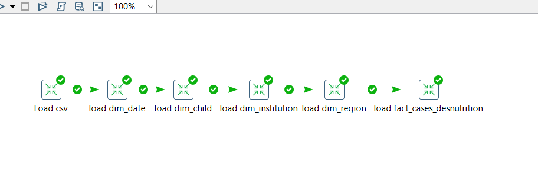 |
| :---: |
| *Figura 17: Job maestro con todas las transformaciones ejecutadas exitosamente* |

---

### Verificación final del ETL

Tras la ejecución completa del job se verificó la integridad de la carga con la siguiente consulta:

```sql
SELECT 'dim_date'              AS tabla, COUNT(*) FROM dim_date
UNION ALL SELECT 'dim_child',           COUNT(*) FROM dim_child
UNION ALL SELECT 'dim_institution',     COUNT(*) FROM dim_institution
UNION ALL SELECT 'dim_region',          COUNT(*) FROM dim_region
UNION ALL SELECT 'fact_cases_desnutrition', COUNT(*) FROM fact_cases_desnutrition;
```

| Tabla | Registros |
|---|---|
| `dim_date` | 353 |
| `dim_child` | 500 |
| `dim_institution` | 3 |
| `dim_region` | 3 |
| `fact_cases_desnutrition` | 500 |

| 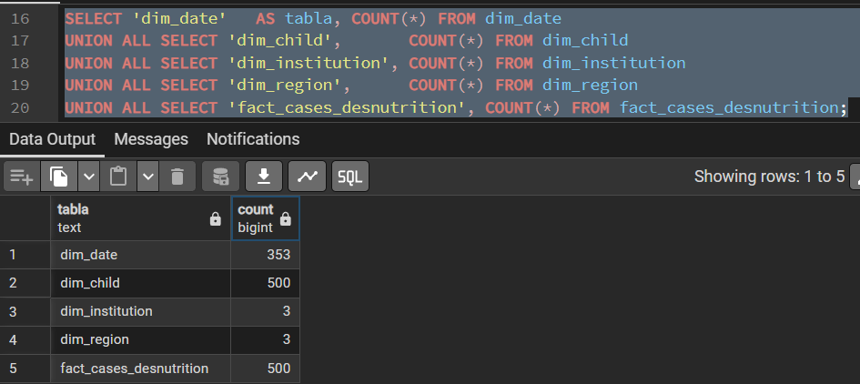 |
| :---: |
| *Figura 18: Verificación final — conteo de registros por tabla* |


---
## 3. Preparación del Modelo de Datos en Excel y Power Pivot

### 3.1 Creación del libro Excel y pegado de datos

Se abrió un libro nuevo en **Microsoft Excel** y se crearon cinco hojas, renombrando cada 
pestaña con el nombre de la tabla correspondiente: `dim_date`, `dim_child`, `dim_institution`, 
`dim_region` y `fact_cases_desnutrition`.

| 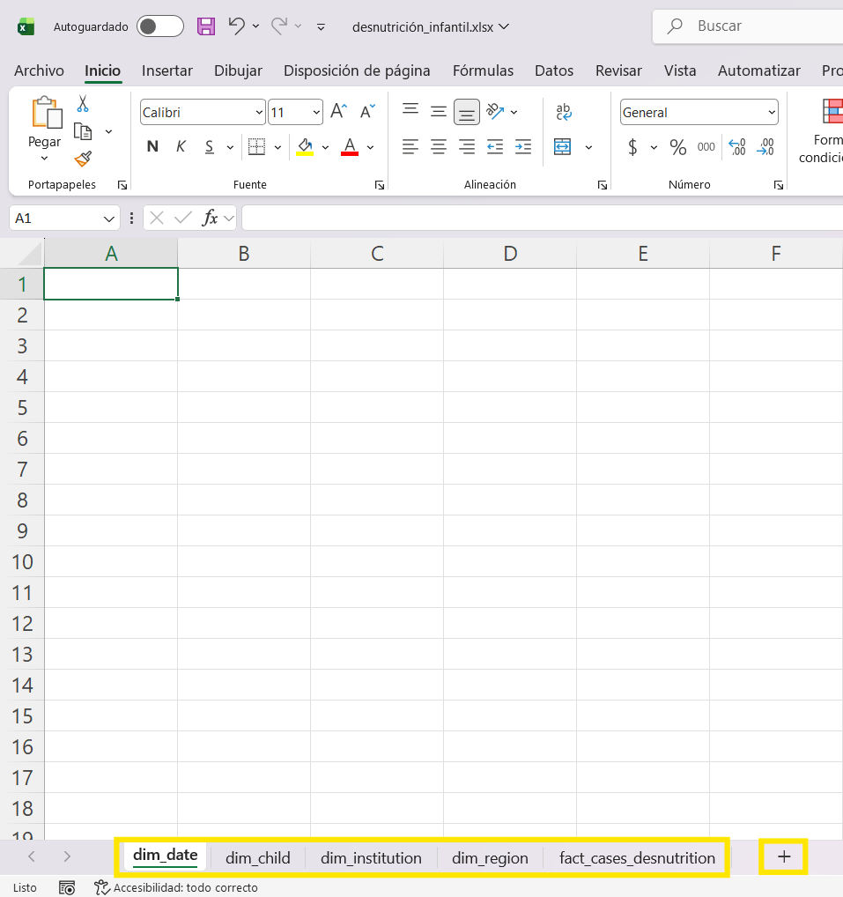 |
| :---: |
| *Figura 19: Creación de hojas en Excel* |

---
### 3.2 Exportación de datos desde PostgreSQL

Para obtener los datos de cada tabla, se ejecutó en pgAdmin la consulta `SELECT *` 
sobre cada tabla del DataWarehouse. Luego se seleccionaron todos los resultados, se hizo 
clic derecho y se eligió la opción **"Copy with Headers"** (Copiar con encabezados).

Las consultas ejecutadas fueron las siguientes:

```sql
SELECT * FROM dim_date;
SELECT * FROM dim_child;
SELECT * FROM dim_institution;
SELECT * FROM dim_region;
SELECT * FROM fact_cases_desnutrition;
```
| 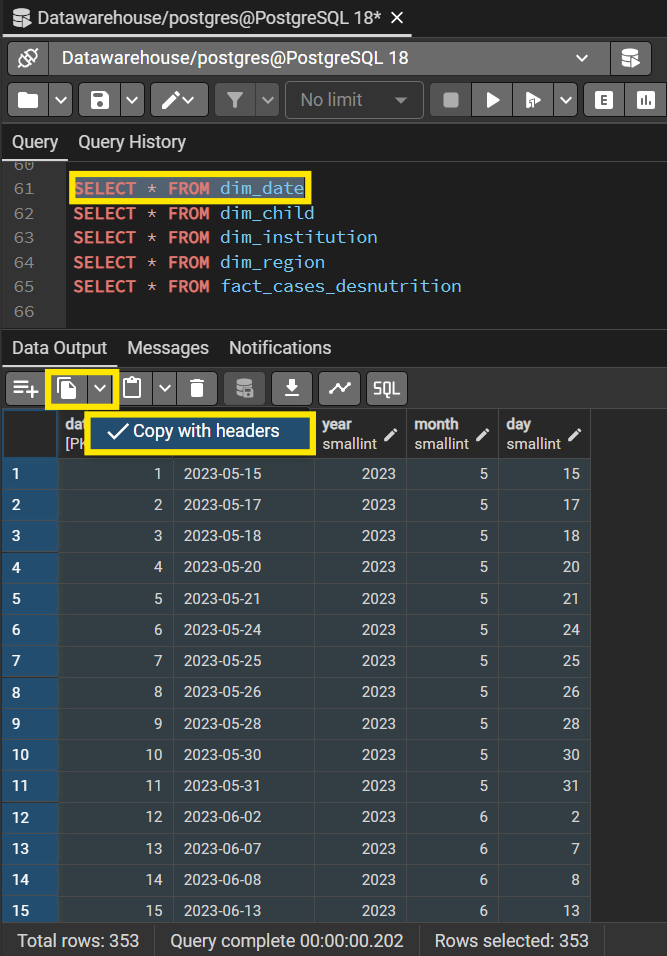 |
| :---: |
| *Figura 20: Query de selección de tabla dim_date* |

---

#### Hoja dim_date

Se hizo clic en la celda **A1** de la hoja `dim_date` y se pegaron los datos copiados desde 
PostgreSQL con **Ctrl + V**. Los encabezados (`date_id`, `date_measured`, `year`, `month`, `day`) 
quedaron en la primera fila y los registros en las filas siguientes.

| 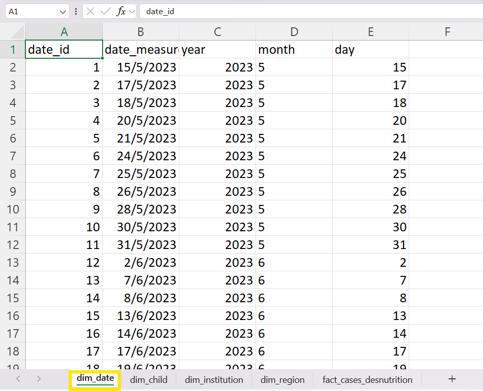 |
| :---: |
| *Figura 21: Datos de dim_date pegados en Excel* |


El mismo paso se repitió para las hojas restantes, pegando en cada una los datos copiados desde su respectiva consulta en PostgreSQL.

---

### 3.3 Aplicación de formato de tabla (Ctrl+T)

Con los datos pegados en la hoja `dim_date`, se hizo clic en cualquier celda dentro del 
rango de datos y se presionó **Ctrl + T**. En el cuadro de diálogo que apareció, se verificó 
que el rango fuera correcto y que la opción *"La tabla tiene encabezados"* estuviera marcada. 
Se confirmó con **Aceptar**.

| 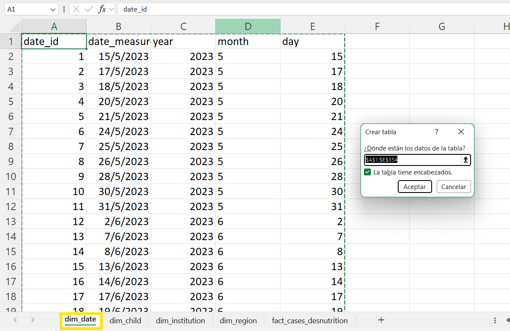 |
| :---: |
| *Figura 22: Cuadro de diálogo de formato de tabla dim_date* |

El mismo paso se repitió para las demás hojas, aplicando el formato de tabla con **Ctrl + T** en cada una.

---

### 3.4 Asignación de nombre a cada tabla

Con la tabla `dim_date` seleccionada, se accedió a la pestaña **Diseño de tabla** y en el 
campo **"Nombre de tabla"** ubicado en la esquina superior izquierda de la cinta, se reemplazó 
el nombre genérico por `dim_date`.

| 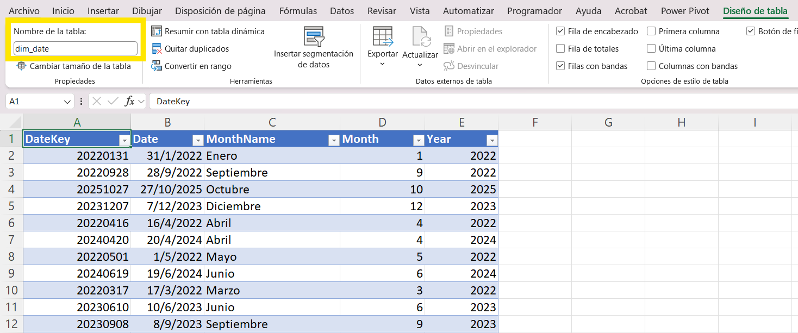 |
| :---: |
| *Figura 23: Tabla dim_date con nombre asignado* |

El mismo paso se repitió para las tablas restantes, asignando los nombres `dim_child`, 
`dim_institution`, `dim_region` y `fact_cases_desnutrition` respectivamente.

| 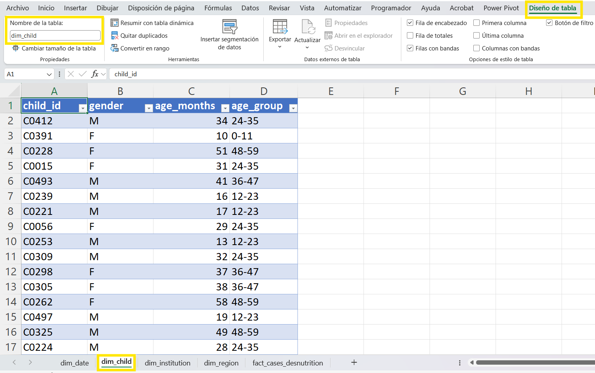 |
| :---: |
| *Figura 24: Tabla dim_child con nombre asignado* |

| 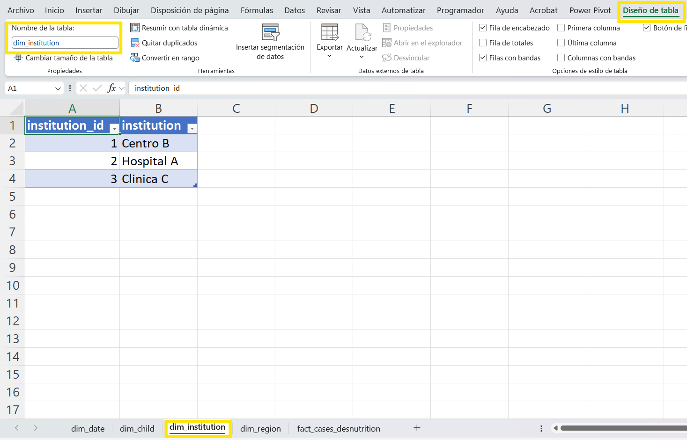 |
| :---: |
| *Figura 25: Tabla dim_institution con nombre asignado* |

| 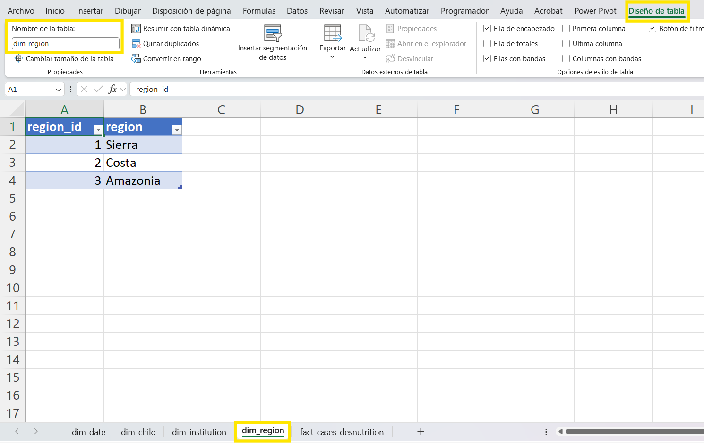 |
| :---: |
| *Figura 26: Tabla dim_region con nombre asignado* |

| 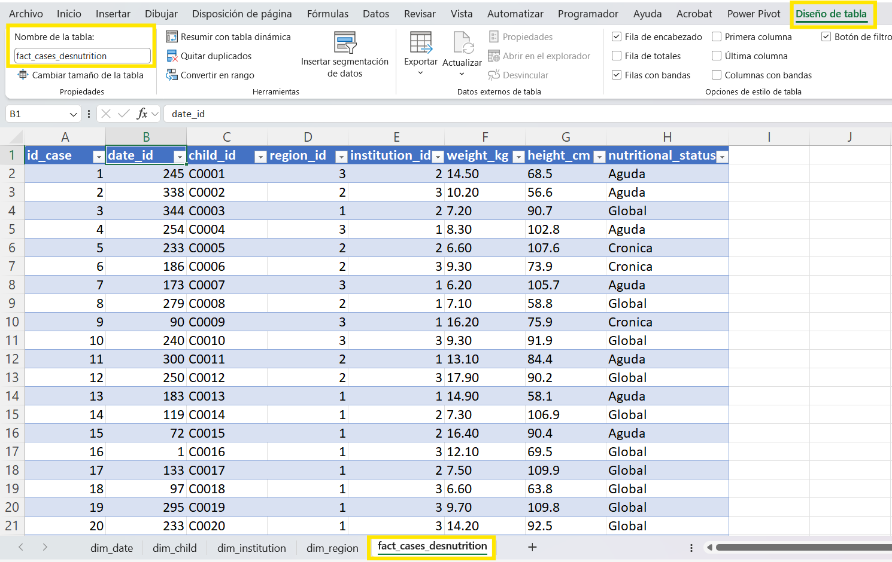 |
| :---: |
| *Figura 27: Tabla fact_cases_desnutrition con nombre asignado* |

---

### 3.5 Eliminación de duplicados

No fue necesario ejecutar la eliminación de duplicados en Excel, dado que el proceso ETL 
en Pentaho ya garantizó la unicidad de los datos desde el origen mediante el uso de 
`SELECT DISTINCT` y el step **Unique rows** en cada transformación, sumado a las 
restricciones `UNIQUE` definidas en las claves primarias de PostgreSQL.

---

### 3.6 Habilitación del complemento Power Pivot

Se accedió a **Archivo → Opciones → Complementos**. En la parte inferior de la ventana, 
en el menú *Administrar*, se seleccionó **Complementos COM** y se hizo clic en **Ir**. 
En la lista de complementos disponibles se marcó la casilla **Microsoft Power Pivot para Excel** 
y se confirmó con **Aceptar**. La pestaña **Power Pivot** quedó visible en la cinta de Excel.

| 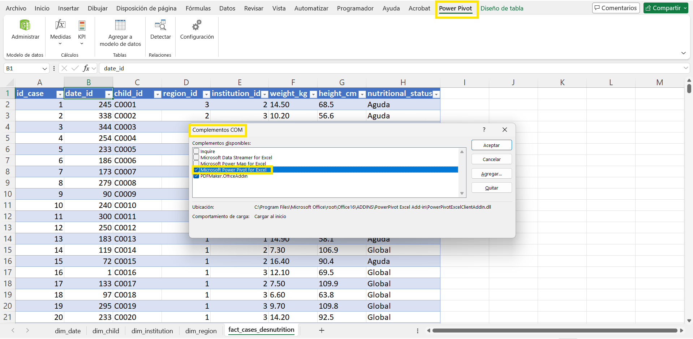 |
| :---: |
| *Figura 28: Complemento Power Pivot habilitado* |

---

### 3.7 Carga de tablas al modelo de datos

Se hizo clic dentro de la tabla `dim_date` y se navegó a **Power Pivot → Agregar al modelo 
de datos**. Excel confirmó que la tabla fue incorporada al modelo.

| 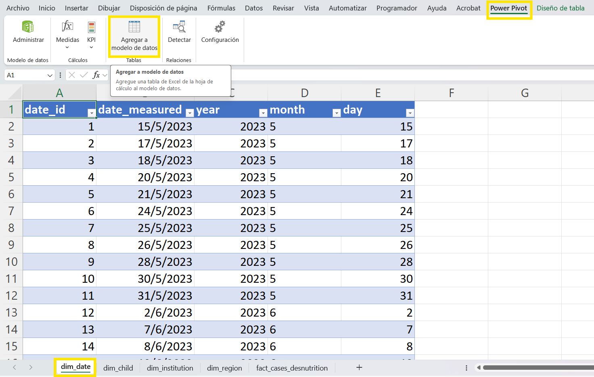 |
| :---: |
| *Figura 29: Carga de dim_date al modelo de datos* |

El mismo paso se repitió para las otras tablas, agregando cada una al modelo de datos desde la pestaña Power Pivot.

---

### 3.8 Verificación del modelo de datos

Se abrió la ventana de Power Pivot mediante **Power Pivot → Administrar**. En la parte 
inferior de la ventana se verificó la presencia de las cinco pestañas correspondientes a 
cada tabla cargada: `dim_date`, `dim_child`, `dim_institution`, `dim_region` y 
`fact_cases_desnutrition`, confirmando que el modelo de datos quedó correctamente constituido.

| 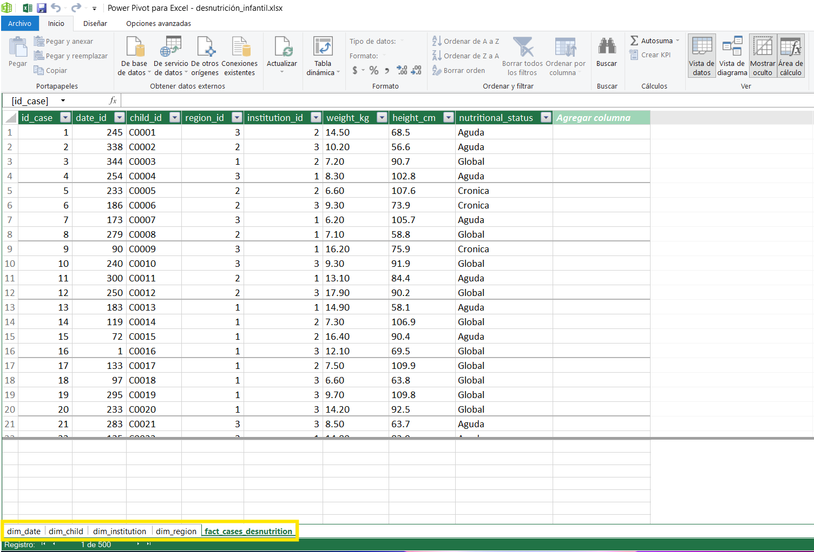 |
| :---: |
| *Figura 30: Tablas dentro del modelo de datos* |

### 3.9 Creación de relaciones entre tablas
Se accedió a la **Vista de diagrama** en Power Pivot y se establecieron las relaciones entre la tabla de hechos y cada una de las dimensiones arrastrando los campos de clave foránea hacia las claves primarias correspondientes.

| 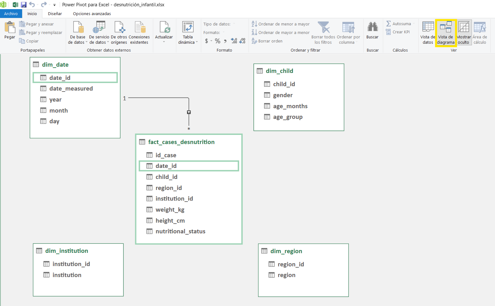 |
| :---: |
| *Figura 31: Configuración de relaciones* |

Finalmente, el modelo de datos quedó configurado con las relaciones necesarias para realizar análisis multidimensionales y responder las preguntas planteadas.

| 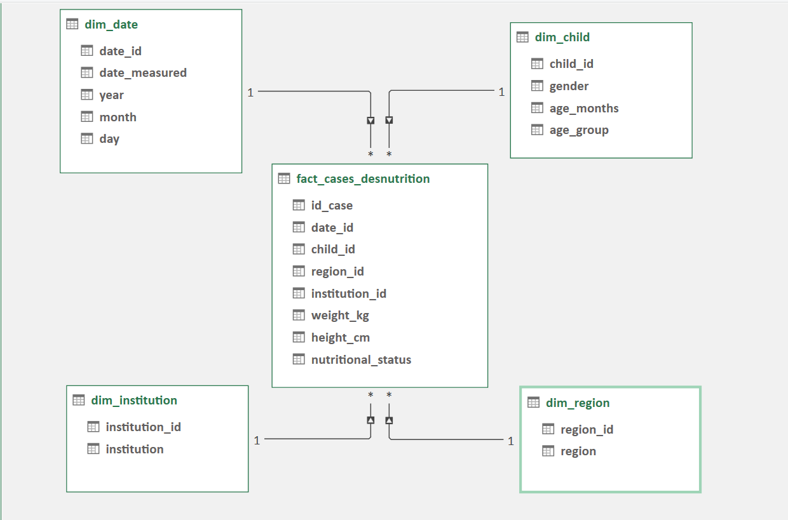 |
| :---: |
| *Figura 32: Modelo Estrella configurado en Power Pivot* |

---
## 4. Resolución de Preguntas
Una vez consolidado el modelo de datos en Power Pivot, se utilizaron Tablas Dinámicas y Gráficos Dinámicos para explorar el esquema estrella y dar respuesta a las interrogantes analíticas de la práctica.

### Pregunta 1
* **¿Cuál es el tipo de desnutrición más común por región?**

**Proceso de creación en Excel:**
1. Se insertó una Tabla Dinámica conectada al modelo de datos de Power Pivot.
2. En el área de **Filas**, se colocó el campo `region` (proveniente de la dimensión `dim_region`).
3. En el área de **Columnas**, se ubicó el campo `nutritional_status` (proveniente de la tabla de hechos `fact_cases_desnutrition`).
4. En el área de **Valores**, se agregó el recuento del campo `id_case` de la tabla de hechos para cuantificar los registros.
5. Se acompañó la tabla con un Gráfico Dinámico para facilitar la interpretación visual de la distribución geográfica.

|  |
| :---: |
| *Figura 20: Análisis de los tipos de desnutrición segmentados por región* |

**Respuesta:**
Al observar los resultados consolidados, se evidencia que en la región **[Región con mayor valor, ej. Costa]**, el tipo de desnutrición predominante es la **[Tipo de desnutrición]** con **[X]** casos. De manera global en el territorio analizado, el diagnóstico más común es la desnutrición **[Tipo más frecuente en el total general]**, representando la mayor carga hospitalaria en este ámbito.

---
### Pregunta 2
* **¿Cómo varía la desnutrición por edad y género?**
**Proceso de creación en Excel:**
1. Se generó una segunda Tabla Dinámica vinculada al modelo.
2. En el área de **Filas**, se construyó una jerarquía colocando primero el campo `age_group` (para agrupar por los rangos de meses) y debajo el campo `gender` (ambos de la dimensión `dim_child`).
3. En el área de **Columnas**, se mantuvo el campo `nutritional_status`.
4. En el área de **Valores**, se utilizó nuevamente el recuento de `id_case`.
5. Se generó un gráfico dinámico de columnas que permite contrastar los diagnósticos según la franja etaria y el sexo del infante.

|  |
| :---: |
| *Figura 21: Variación de la desnutrición según el grupo de edad y género del infante* |

**Respuesta:**
El análisis multivariado demuestra que la desnutrición tiene variaciones marcadas según la etapa de crecimiento. El grupo más vulnerable corresponde a los infantes de **[Rango de edad, ej. 12-23]** meses, donde se concentra la mayor cantidad de alertas, predominando los cuadros de desnutrición **[Tipo]**. 

Al analizar la variable de género, se observa que la incidencia afecta de manera **[ligeramente mayor / equitativa]** a los niños (M) en comparación con las niñas (F). El pico más crítico de todo el conjunto se da en **[niños/niñas]** del grupo de **[Rango de edad]** meses con diagnósticos **[Tipo]**.

---
### Pregunta 3
* **¿Qué instituciones atienden más casos?**

Consulta SQL en PostgreSQL<br>
Para responder esta pregunta se ejecutó la siguiente consulta que une la tabla de hechos con la dimensión de instituciones y cuenta los casos por institución:
```sql
SELECT 
    i.institution,
    COUNT(*) AS casos_atendidos
FROM fact_cases_desnutrition f
JOIN dim_institution i ON f.institution_id = i.institution_id
GROUP BY i.institution
ORDER BY casos_atendidos DESC;
```

Análisis en Power Pivot
Para obtener el mismo resultado mediante Power Pivot, se insertó una tabla dinámica siguiendo estos pasos:

Se accedió a Insertar → Tabla dinámica y se seleccionó la opción "Usar el modelo de datos de este libro".
En el panel de campos de la tabla dinámica:

Se arrastró el campo institution de dim_institution hacia Filas.
Se arrastró el campo id_case de fact_cases_desnutrition hacia Valores.


En el área de Valores, se hizo clic en la flecha desplegable de id_case y se seleccionó Configuración de campo de valor → Cuenta para contar la cantidad de casos por institución.
Se ordenó la tabla de mayor a menor haciendo clic derecho sobre los valores y seleccionando Ordenar → De mayor a menor.
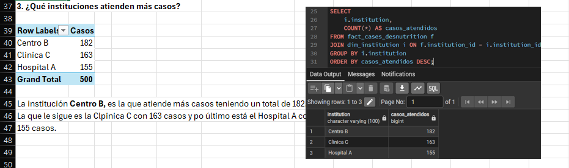

Interpretación
Los resultados muestran que Centro B es la institución que atiende la mayor cantidad de casos de desnutrición infantil con 182 casos (36.4% del total), seguida por Clínica C con 163 casos (32.6%) y Hospital A con 155 casos (31%).
La distribución es relativamente equilibrada entre las tres instituciones, con una diferencia de apenas 27 casos entre la que más atiende y la que menos atiende, lo que sugiere que la carga de atención está distribuida de manera proporcionada en el sistema de salud regional.

Conclusiones

- El proceso ETL implementado en Pentaho permitió transformar datos crudos en un modelo estrella funcional, siguiendo las mejores prácticas de Data Warehousing: separación clara entre staging, dimensiones y tabla de hechos.
- La creación de la dimensión dim_child con el atributo derivado age_group mediante Modified JavaScript Value demuestra que Pentaho permite aplicar lógica de negocio compleja durante la transformación, eliminando la necesidad de recalcular estos valores en cada consulta posterior.
- El uso de Stream Lookup en lugar de JOINs tradicionales es el patrón estándar en ETL de flujo continuo, permitiendo resolver claves foráneas de manera eficiente durante la carga de la tabla de hechos.
- El modelo estrella configurado en Power Pivot replica fielmente la estructura del Data Warehouse en PostgreSQL, permitiendo realizar análisis multidimensionales sin necesidad de escribir SQL, gracias al motor interno de relaciones.
- Las tres preguntas planteadas fueron respondidas exitosamente tanto mediante consultas SQL directas en PostgreSQL como mediante tablas dinámicas en Power Pivot, validando la correcta implementación del modelo de datos y confirmando que ambos enfoques son complementarios: SQL para análisis ad-hoc y Power Pivot para análisis visual e interactivo.
