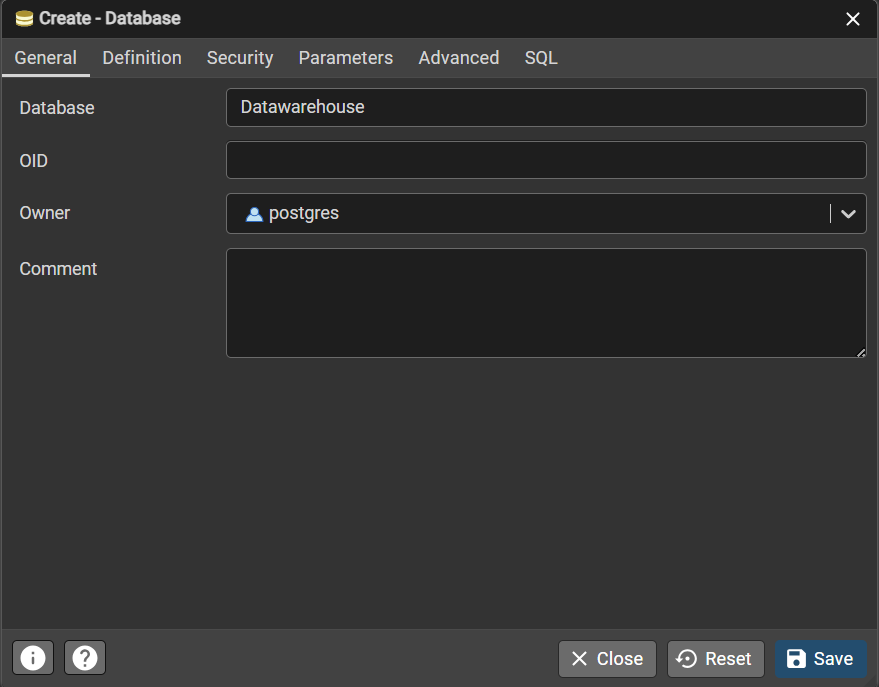
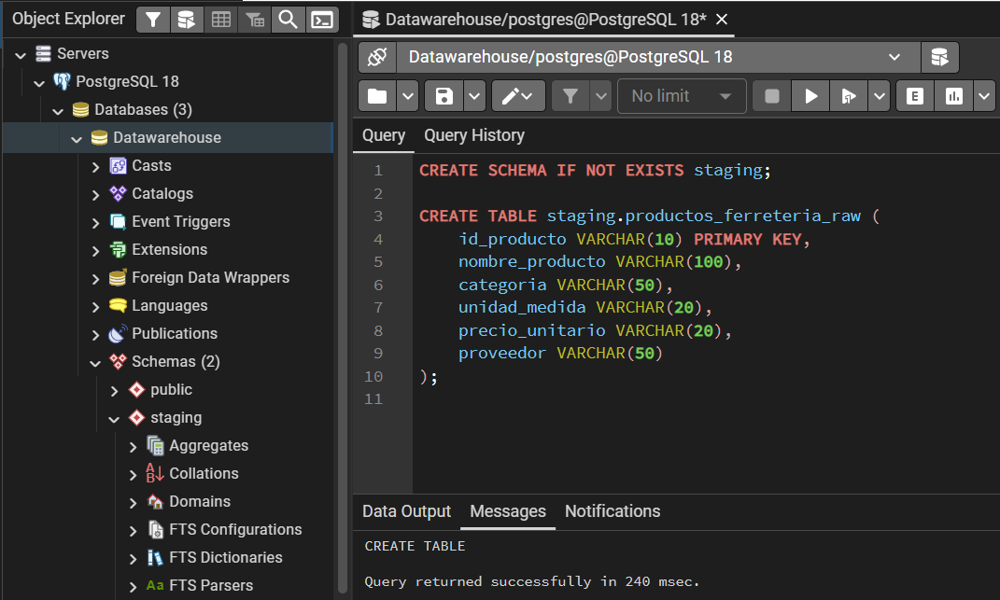
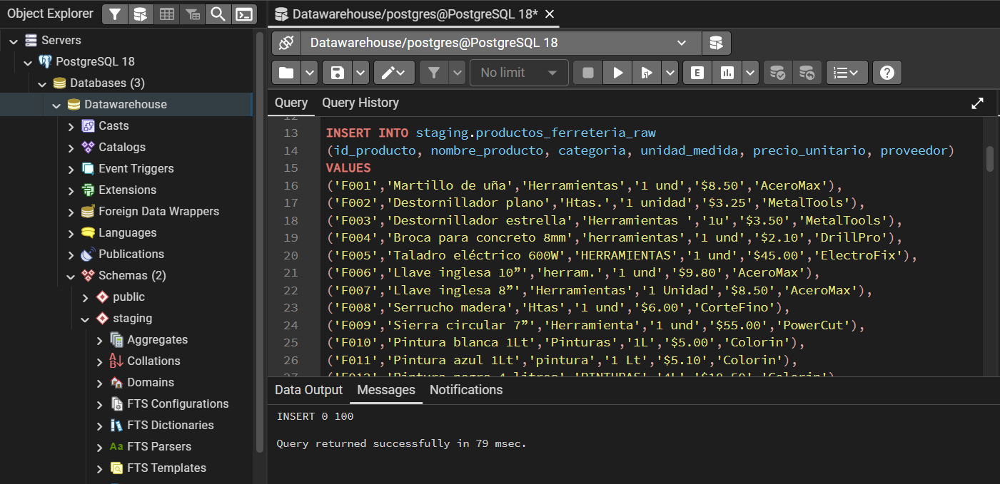
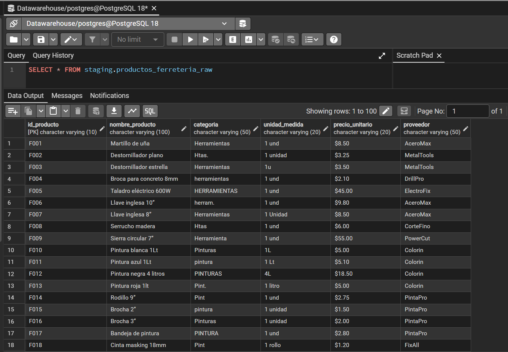
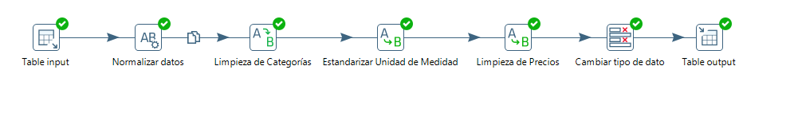
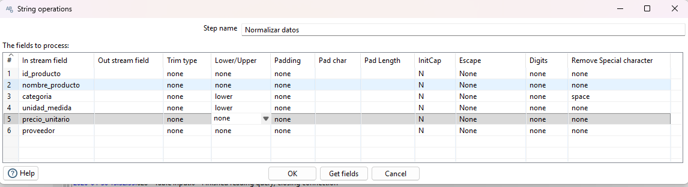
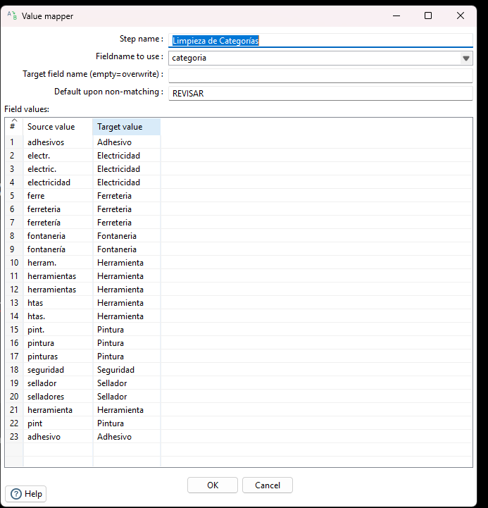
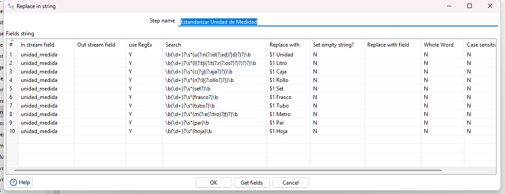
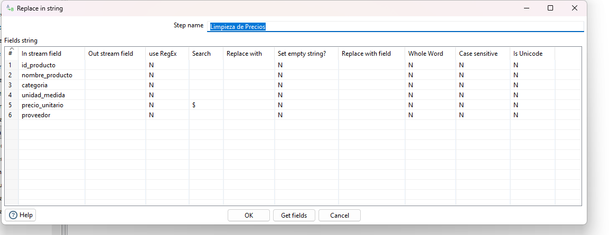
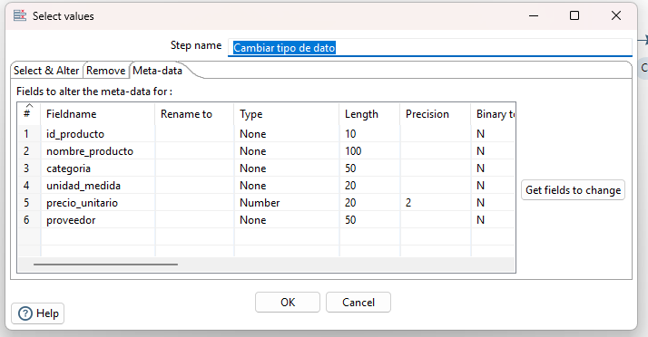

# 2026A-ISWD743-practica2
### Fecha: 01/05/2026
### Práctica ETL
  

  
  
  
  
  

>[!NOTE]
>
> Este repositorio contiene el desarrollo del trabajo grupal de la Práctica 2 de Business Intelligence, correspondiente al caso de estudio "Ferretería El Tornillo Feliz". 
> Se implementa un proceso ETL(Extract, Transform, Load) utilizando Pentaho Data Integration para limpiar y consolidar el catálogo de productos de la ferretería en una base de datos central PostgreSQL.

---

>[!NOTE]
>
> Objetivos específicos:
> * Crear la tabla staging.productos_ferreteria_raw en PostgreSQL y cargar los datos originales
> * Diseñar una transformación ETL en Pentaho que estandarice las categorías de productos.
> * Eliminar símbolos innecesarios ($) del campo precio_unitario.
> * Unificar los distintos formatos de unidad de medida
> * Cargar los datos limpios en la tabla staging.productos_ferreteria_clean.

---

## 📝 Descripción del Caso de Estudio

### Contexto de la Empresa

La **Ferretería El Tornillo Feliz** es una cadena nacional que cuenta con varios 
puntos de venta en distintas ciudades. Cada sucursal mantiene su propio registro 
de productos, elaborado manualmente y con poca estandarización.

El departamento administrativo desea integrar toda la información en una base de 
datos corporativa para mejorar la gestión del inventario, los pedidos y el control 
de existencias.

---

### Problemática Actual en los Datos

Los reportes de inventario provenientes de las sucursales presentan tres problemas 
principales que impiden su uso directo en un sistema corporativo:

| Problema | Variantes encontradas | Ejemplo correcto esperado |
|---|---|---|
| **Categorías no uniformes** | `Herramientas`, `herramientas`, `HERRAMIENTAS`, `Htas.`, `htas`, `Herramienta`, `herram.` | `Herramienta` |
|  **Precios en formato texto** | `$8.50`, `$3.25`, `$45.00` | `8.50` |
|  **Unidades de medida mezcladas** | `1 und`, `1 unidad`, `1u`, `1 Lt`, `1L`, `1 litro`, `1 rl`, `1 rollo` | `1 Unidad` |
---
###  Solución Propuesta

Para resolver los problemas identificados, se desarrollará un **Proceso ETL** que permita limpiar, unificar y centralizar los datos de productos; utilizando Pentaho Data Integration como herramienta principal y PostgreSQL como base de datos destino.

El proceso se divide en tres etapas:

| Etapa | Descripción |
|---|---|
| **Extract** | Conexión a PostgreSQL y lectura de la tabla RAW mediante Table Input. |
| **Transform** | Limpieza de categorías, eliminación del símbolo `$` y estandarización de unidades. |
| **Load** | Escritura de los datos limpios en la tabla `productos_ferreteria_clean` mediante Table Output. |

## 📊 Estructura de la tabla Raw
Para centralizar los datos, se creó una nueva base de datos llamada `Datawarehouse`,un esquema `staging` y la tabla de datos crudos `productos_ferreteria_raw`.

### Paso 1 — Creación de la base de datos Datawarehouse
| |
| :---: |
| *Figura 1: Configuración de la nueva base de datos en PostgreSQL* |

### Paso 2 — Creación de esquema y tabla
| |
| :---: |
| *Figura 2: Query SQL para crear el esquema y la tabla* |

### Paso 3 — Carga de datos originales en la tabla staging.productos_ferreteria_raw
||
| :---: |
| *Figura 3: Query SQL de inserción de datos* |

### Paso 4 — Verificación de la carga de datos en la tabla
||
| :---: |
| *Figura 4: Query SQL Select para visualización de datos cargados* |

---

---

## 🛠️ Detalle de los Pasos de Transformación (Transform)
Se diseño el siguiente flujo para transformar los datos.

A continuación, se detalla la configuración de cada componente del flujo de tranformación:

### 1. Normalización de Cadenas
* **Tipo de Transformación:** `String operations`
* **Nombre del paso:** `Normalizar datos`
* **Configuración:**
    * **Campo `categoria y unidad_medidad`**: Se aplicó la función `Lower` (minúsculas) y se eliminaron espacios en blanco con `Trim type: both`. Esto reduce las variaciones.

  

### 2. Homologación de Categorías
* **Tipo de Transformación:** `Value mapper`
* **Nombre del paso:** `Limpieza de Categorías`
* **Configuración:**
    * **Campo origen:** `categoria`
    * **Mapeo:** Se establecieron reglas para consolidar sinónimos y abreviaturas en términos estándar.
        * *Ejemplo:* `htas`, `herram`, `herramientas` se transforman en **Herramienta**.
        * *Ejemplo:* `electr`, `electric.` se transforman en **Electricidad**.
    * **Valor por defecto:** Se definió como `REVISAR` para capturar cualquier categoría nueva que no cumpla con los filtros establecidos.

### 3. Estandarización de Unidades de Medida
* **Tipo de Transformación:** `Replace in string`
* **Nombre del paso:** `Estandarizar Unidad de Medida`
* **Configuración:**
    * **Uso de RegEx:** Se activó la opción `Use regular expression` para realizar búsquedas avanzadas.
    * **Lógica:** Se configuraron expresiones para identificar variaciones de unidades (Unidad, Litro, Caja, Rollo, Set, Frasco, Tubo, Metro, Par, Hoja).
    * **Case Sensitive:** Configurado en `N` para ignorar mayúsculas.

### 4. Limpieza de Formato de Precios
* **Tipo de Transformación:** `Replace in string`
* **Nombre del paso:** `Limpieza de Precios`
* **Configuración:**
    * **Campo:** `precio_unitario`
    * **Búsqueda:** Se localiza el símbolo especial `$` (símbolo de moneda).
    * **Reemplazo:** Se deja vacío (cadena de longitud cero) para purificar el dato y permitir su conversión a formato numérico.

### 5. Definición de Metadatos y Tipado Final
* **Tipo de Transformación:** `Select values` (Pestaña Meta-data)
* **Nombre del paso:** `Cambiar tipo de dato`
* **Configuración:**
    * **precio_unitario**: Conversión formal de String a **Number**, definiendo una precisión de `2` decimales.

