

 

<h1><strong>Escuela Politécnica Nacional</strong></h1>

### Facultad de Ingeniería de Sistemas

**Business Intelligence (ISWD743) · GR2SW_2026-1**

**Association Mining in Weka**

---

**Fecha:**  
10 de Julio, 2026

**Integrantes:**  
Andrea Chicaiza  
Andreina Pallo  
Jose Arias  
Juan Mateo Quisilema  
Juan Suarez

---

> [!NOTE]
>
> Este repositorio contiene el desarrollo del trabajo grupal de la práctica de Association Mining in Weka, cuyo objetivo es aplicar los algoritmos Apriori y Predictive Apriori en Weka sobre datasets transaccionales y numéricos, generar reglas de asociación mediante la configuración de umbrales de soporte y confianza, aplicar procesos de discretización automática y manual sobre datos numéricos, y analizar el rendimiento estudiantil a través de reglas de asociación de clase (CAR).

---

> [!NOTE]
>
> Objetivos específicos:
> * Aplicar el algoritmo Apriori en Weka sobre datasets transaccionales de distinto tamaño, configurando adecuadamente los parámetros de soporte y confianza mínimos.
> * Aplicar el algoritmo Predictive Apriori sobre un dataset numérico de rendimiento estudiantil, empleando discretización automática y manual como paso de preprocesamiento.
> * Comparar los resultados obtenidos mediante discretización automática (equal frequency) frente a la discretización manual basada en percentiles (20%-60%-20%).
> * Analizar cómo el uso de la opción *Class Association Rules* (CAR) y el tratamiento de valores medios como datos perdidos ("?") afecta la calidad e interpretabilidad de las reglas generadas.

---

<h2><strong>Índice</strong></h2>

1. [Introducción](#1-introducción)
2. [Ejercicio 10.6 — Algoritmo Apriori sobre un dataset pequeño (DailyItem)](#2-ejercicio-106--algoritmo-apriori-sobre-un-dataset-pequeño-dailyitem)
3. [Ejercicio 10.7 — Algoritmo Apriori sobre un dataset más grande (DailyItem2)](#3-ejercicio-107--algoritmo-apriori-sobre-un-dataset-más-grande-dailyitem2)
4. [Ejercicio 10.8 — Minería de asociación sobre datos numéricos (Discretización automática)](#4-ejercicio-108--minería-de-asociación-sobre-datos-numéricos-discretización-automática)
5. [Ejercicio 10.9 — Discretización manual y análisis refinado](#5-ejercicio-109--discretización-manual-y-análisis-refinado)
6. [Análisis global de resultados](#6-análisis-global-de-resultados)
7. [Conclusiones](#7-conclusiones)
8. [Referencias bibliográficas](#8-referencias-bibliográficas)

---

## Desarrollo

---

## 1. Introducción

### 1.1. Minería de Asociación y Algoritmos Apriori / Predictive Apriori

La minería de asociación es una técnica de minería de datos orientada a descubrir relaciones interesantes entre variables dentro de grandes volúmenes de datos, comúnmente representadas como reglas del tipo *si X entonces Y*. El algoritmo **Apriori** es el método clásico para este propósito: genera de manera iterativa conjuntos de ítems frecuentes (itemsets), partiendo de ítems individuales y combinándolos progresivamente, descartando en cada nivel aquellos conjuntos que no superan un umbral mínimo de soporte, para finalmente derivar reglas de asociación que cumplan también con un umbral mínimo de confianza [[1]](#8-referencias-bibliográficas). Este enfoque de poda por niveles permite reducir considerablemente el espacio de búsqueda respecto a una exploración exhaustiva de todas las combinaciones posibles [[2]](#8-referencias-bibliográficas).

Por su parte, el algoritmo **Predictive Apriori**, implementado en Weka, combina de forma óptima el soporte y la confianza en un único valor denominado *precisión predictiva* (predictive accuracy), evitando que el usuario deba fijar manualmente los umbrales de soporte y confianza; en su lugar, basta con indicar el número de reglas deseadas y el propio algoritmo ajusta dichos umbrales para maximizar la calidad de las reglas encontradas.

### 1.2. Métricas: Soporte, Confianza y Precisión Predictiva

El **soporte** de un itemset indica la frecuencia con la que dicho conjunto de ítems aparece en el total de transacciones del dataset, mientras que la **confianza** de una regla mide la proporción de casos en los que, dado el antecedente, también se cumple el consecuente. Ambas métricas son ampliamente utilizadas como criterios de evaluación en algoritmos de aprendizaje no supervisado orientados a reglas de asociación, ya que permiten balancear la frecuencia de un patrón frente a su fiabilidad predictiva [[3]](#8-referencias-bibliográficas). La **precisión predictiva** utilizada por Predictive Apriori, en cambio, corresponde a una estimación bayesiana de la confianza esperada de la regla, lo que la hace especialmente útil cuando se busca comparar el desempeño de Apriori frente a Predictive Apriori sobre un mismo conjunto de datos, tal como se ha evaluado estadísticamente en estudios comparativos de ambos algoritmos [[4]](#8-referencias-bibliográficas).

### 1.3. Discretización de datos numéricos

Los algoritmos de minería de asociación, tanto Apriori como Predictive Apriori, trabajan exclusivamente con atributos nominales, por lo que no pueden aplicarse directamente sobre atributos numéricos continuos [[1]](#8-referencias-bibliográficas). Para superar esta limitación es necesario aplicar un proceso de **discretización** o *binning*, que consiste en agrupar los valores numéricos continuos de un atributo en un número finito de intervalos o categorías (bins), transformando así la variable numérica en una variable nominal u ordinal [[5]](#8-referencias-bibliográficas).

Existen principalmente dos estrategias de discretización: la discretización por **intervalos iguales** (equal width), en la que el rango de valores se divide en segmentos de igual amplitud; y la discretización por **frecuencia igual** (equal frequency), en la que los límites de los intervalos se ajustan de modo que cada bin contenga aproximadamente el mismo número de observaciones [[5]](#8-referencias-bibliográficas). Esta segunda estrategia, disponible en Weka mediante el filtro `Discretize` con la propiedad `useEqualFrequency`, evita que un grupo concentre una cantidad desproporcionada de instancias, lo que podría sesgar el peso de dicha categoría dentro de las reglas generadas. Adicionalmente, es posible realizar una discretización manual basada en percentiles (por ejemplo, clasificando el 20% superior como "Alto", el 20% inferior como "Bajo" y el 60% restante como "Medio"), lo cual otorga mayor control sobre la interpretación semántica de las categorías resultantes, aunque introduce un componente de subjetividad en la elección de los puntos de corte [[3]](#8-referencias-bibliográficas), [[4]](#8-referencias-bibliográficas).

---

## 2. Ejercicio 10.6 — Algoritmo Apriori sobre un dataset pequeño (DailyItem)

### 2.1. Objetivo

Ejecutar el algoritmo Apriori en Weka sobre el dataset de tienda **DailyItem** (4 transacciones, 4 productos), con el fin de identificar la mejor regla de asociación posible.

### 2.2. Descripción del dataset

El dataset representa las compras realizadas en una tienda. Existe una fila por transacción y una columna por producto, donde 1 indica presencia del producto en la transacción.

| # | Columna | Tipo | Descripción |
|:---:|:---:|:---:|:---|
| 1 | `Transaction` | INTEGER | Id de la transacción |
| 2 | `Bread` | NUMERIC (binario) | Indica si la transacción incluyó pan (1) o no (vacío/0) |
| 3 | `Cornflakes` | NUMERIC (binario) | Indica si la transacción incluyó hojuelas de maíz (1) o no |
| 4 | `Jam` | NUMERIC (binario) | Indica si la transacción incluyó mermelada (1) o no |
| 5 | `Milk` | NUMERIC (binario) | Indica si la transacción incluyó leche (1) o no |

*Tabla 1: Descripción de columnas del dataset DailyItem*

### 2.3. Procedimiento paso a paso

#### 2.3.1. Creación del dataset

Se abrió Microsoft Excel y se registraron las 4 transacciones con sus respectivos productos, marcando con el valor 1 según la presencia de cada ítem en la transacción correspondiente.

| 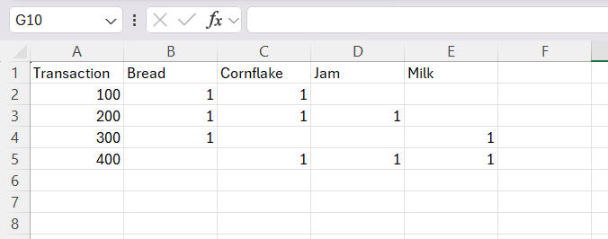 |
|:--:|
| *Figura 1: Dataset DailyItem tabulado en Microsoft Excel* |

Posteriormente, el archivo se guardó en formato **CSV (delimitado por comas)** con el nombre `DailyItem Dataset.csv`, utilizando la opción *Guardar como* del menú *Archivo*.

| 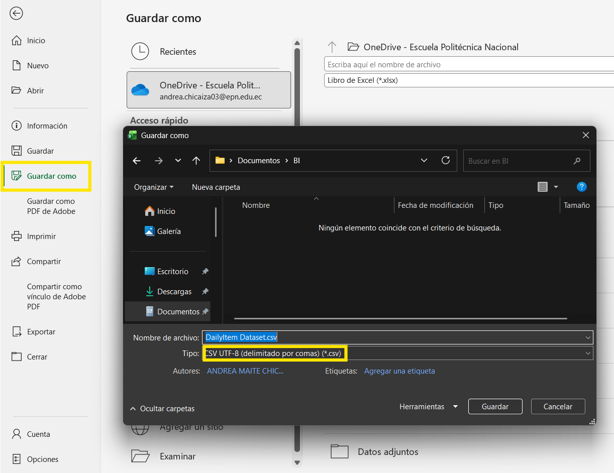 |
|:--:|
| *Figura 2: Cuadro de diálogo para guardar el archivo DailyItem Dataset en formato CSV* |

#### 2.3.2. Carga y preprocesamiento en Weka

Se abrió el **Weka GUI Chooser Panel** y se seleccionó la opción **Explorer**. Desde la pestaña *Preprocess*, se utilizó el botón **Open file** para cargar el archivo `DailyItem Dataset.csv` previamente creado.

| 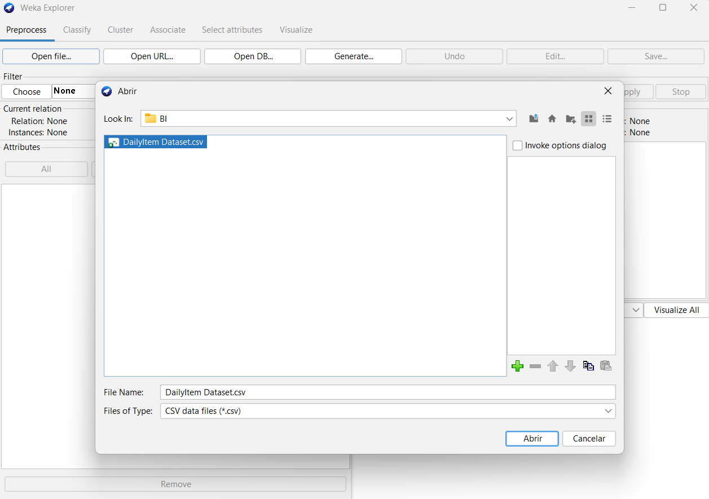 |
|:--:|
| *Figura 3: Dataset DailyItem cargado en la pestaña Preprocess de Weka Explorer* |

| 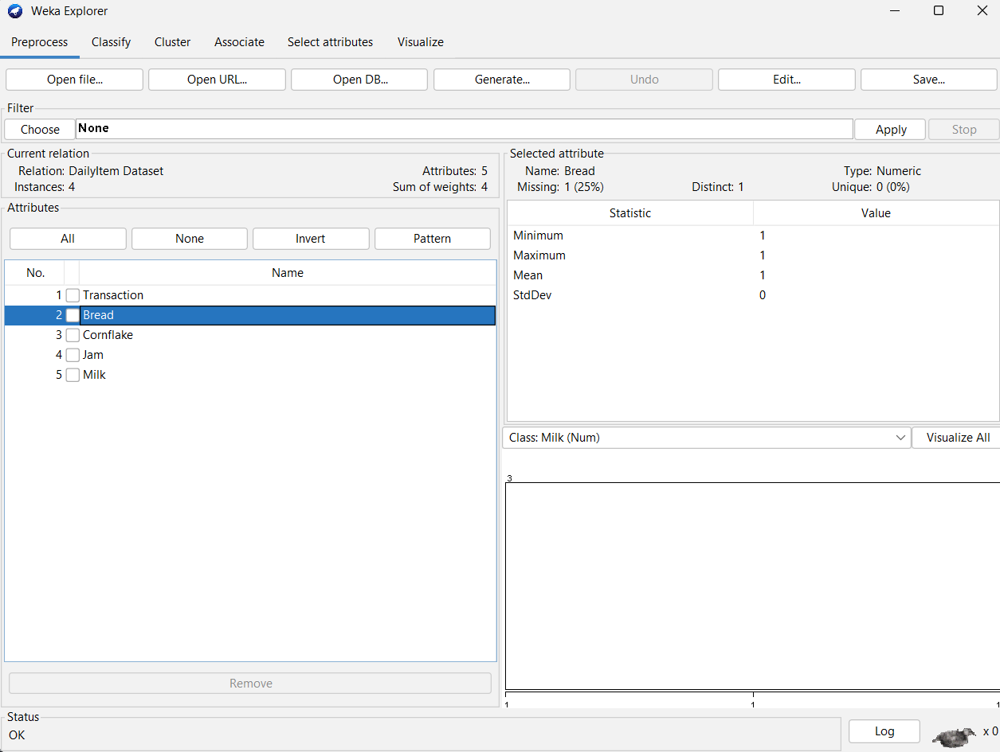 |
|:--:|
| *Figura 4: Vista previa del dataset DailyItem en Weka Explorer* |

Dado que Weka interpretó todas las columnas como atributos numéricos, y los algoritmos de asociación requieren atributos nominales, se aplicó el filtro **NumericToNominal**, siguiendo el proceso: `Choose → filters → unsupervised → attribute → NumericToNominal`, y se ejecutó mediante el botón **Apply**.

| 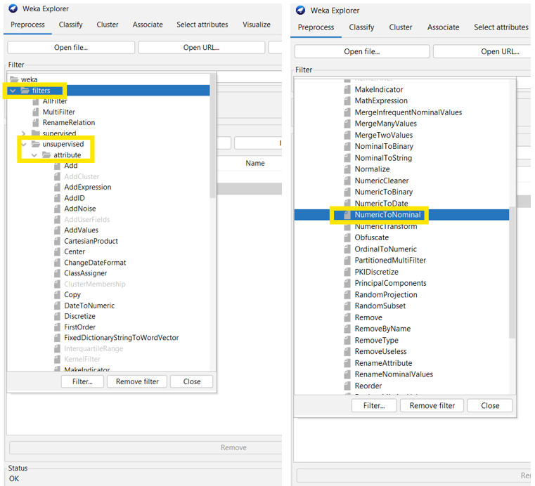 |
|:--:|
| *Figura 5: Filtro NumericToNominal seleccionado y aplicado sobre el dataset* |

| 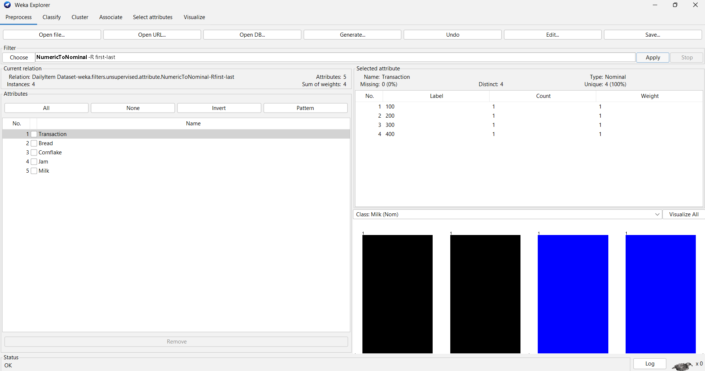 |
|:--:|
| *Figura 6: Resultado del filtro NumericToNominal aplicado sobre el dataset DailyItem* |

A continuación, se seleccionó el atributo **Transaction** en el panel de atributos y se eliminó mediante el botón **Remove**, ya que dicho identificador no aporta información relevante para el proceso de minería de asociación.

| 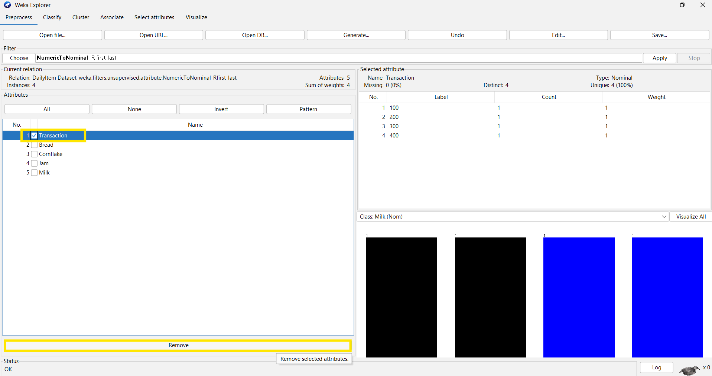 |
|:--:|
| *Figura 7: Eliminación del atributo Transaction del dataset* |

| 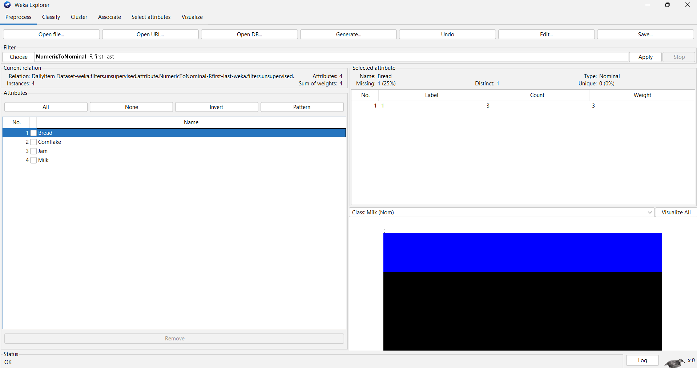 |
|:--:|
| *Figura 8: Dataset DailyItem listo para la ejecución del algoritmo Apriori* |

#### 2.3.3. Configuración y ejecución del algoritmo Apriori

Se accedió a la pestaña **Associate** y, mediante el botón **Choose**, se seleccionó el algoritmo **Apriori** dentro de la categoría *associations*.

| 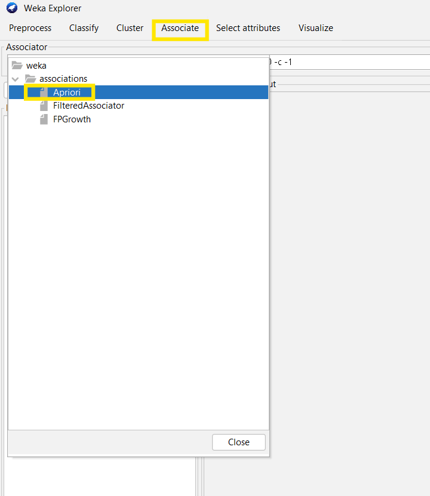 |
|:--:|
| *Figura 9: Selección del algoritmo Apriori en la pestaña Associate* |

Al hacer clic sobre el campo del *Associator*, se abrió el **Generic Object Editor**, en el cual se configuraron los siguientes parámetros:

| # | Parámetro | Valor configurado | Descripción |
|:---:|:---:|:---:|:---|
| 1 | `lowerBoundMinSupport` | 0.5 | Soporte mínimo requerido (50% de las transacciones) |
| 2 | `metricType` | Confidence | Métrica utilizada para rankear las reglas |
| 3 | `minMetric` | 0.75 | Confianza mínima requerida (75%) |
| 4 | `numRules` | 10 | Número máximo de reglas a generar |

*Tabla 2: Configuración de parámetros del algoritmo Apriori — Ejercicio 10.6*

| 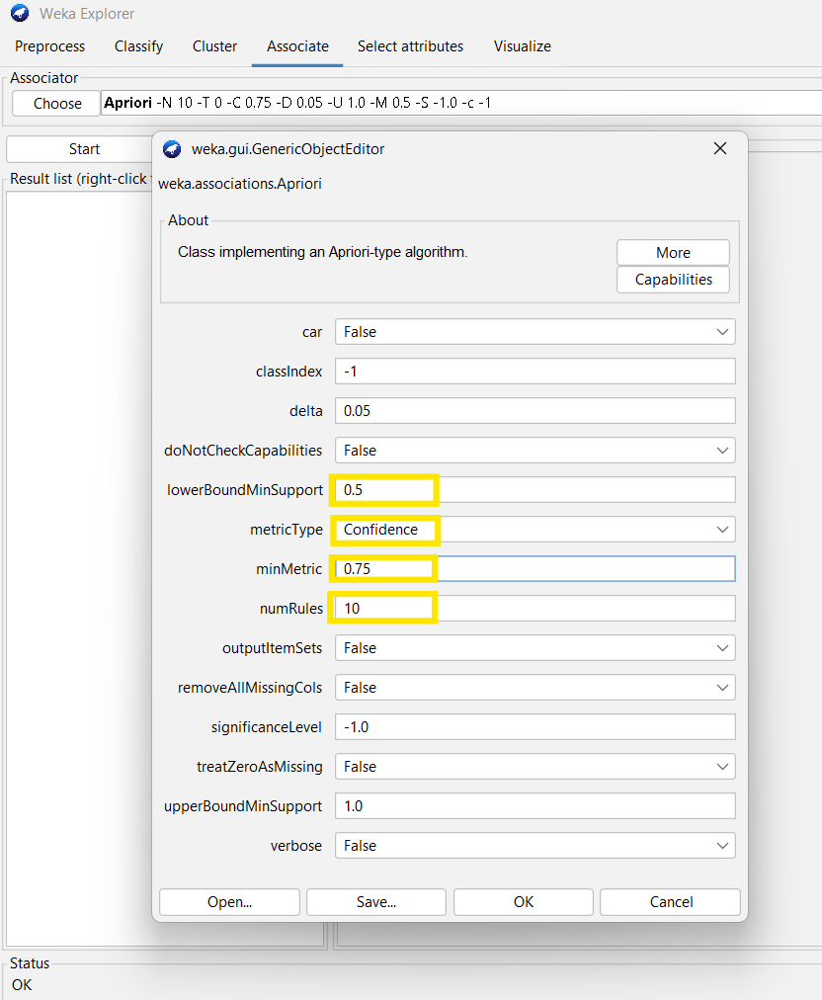 |
|:--:|
| *Figura 10: Parámetros de soporte, confianza y número de reglas configurados para Apriori* |

Finalmente, se guardó la configuración con el botón **OK** y se ejecutó el algoritmo mediante el botón **Start**.

| 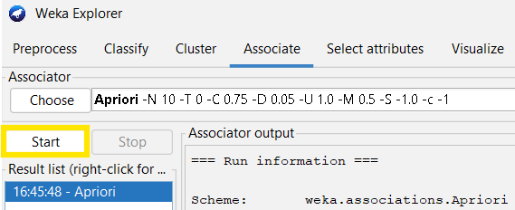 |
|:--:|
| *Figura 11: Botón Start utilizado para ejecutar el algoritmo Apriori sobre el dataset DailyItem* |

### 2.4. Resultados obtenidos

Tras la ejecución, Weka generó la siguiente salida en el panel *Associator output*:

| 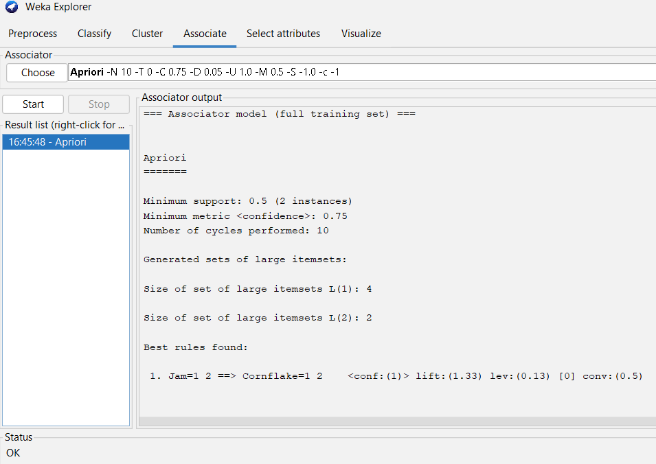 |
|:--:|
| *Figura 12: Resultado obtenido por el algoritmo Apriori* |

| # | Regla | Soporte (instancias) | Confianza | Lift | Leverage | Conviction |
|:---:|:---|:---:|:---:|:---:|:---:|:---:|
| 1 | Jam=1 → Cornflake=1 | 2 | 1 (100%) | 1.33 | 0.13 | 0.5 |

*Tabla 3: Mejor regla de asociación encontrada para el dataset DailyItem*

Se registró además la información de ejecución reportada por Weka:

- Soporte mínimo: 0.5 (2 instancias)
- Confianza mínima: 0.75
- Número de ciclos ejecutados: 10
- Tamaño del conjunto de itemsets grandes L(1): 4
- Tamaño del conjunto de itemsets grandes L(2): 2

### 2.5. Análisis e interpretación de resultados
La única regla encontrada, **Jam=1 → Cornflake=1**, tiene un soporte de 2 transacciones (50%) y una confianza del 100%, lo que indica que cada vez que un cliente compró mermelada, también compró hojuelas de maíz. Esto se debe a que Jam solo aparece en 2 de las 4 transacciones, y en ambas también está presente Cornflake.

Además de la regla, Weka reportó un **lift** de 1.33, que demuestra que comprar Mermelada (Jam) hace 1.33 veces más probable que también se compre Hojuelas de maíz (Cornflake), comparado con la probabilidad de comprar Hojuelas de maíz de manera independiente. También se obtuvo un **leverage** de 0.13, este valor confirma que la coocurrencia supera ligeramente lo que se esperaría de suceder al azar. Finalmente, la **conviction** registrada es de 0.5, sin embargo como la confianza es perfecta y la regla nunca falla, este valor no aporta información que sea relevante.

En general, en este ejercicio, debido al tamaño tan pequeño del dataset, pocos itemsets logran superar el soporte mínimo del 50%, lo cual explica por qué Apriori solo encontró una única regla tras 10 ciclos de ejecución.

---

## 3. Ejercicio 10.7 — Algoritmo Apriori sobre un dataset más grande (DailyItem2)

### 3.1. Objetivo

### 3.2. Descripción del dataset

### 3.3. Procedimiento paso a paso

#### 3.3.1. Creación del dataset

#### 3.3.2. Carga y preprocesamiento en Weka

#### 3.3.3. Configuración y ejecución del algoritmo Apriori

### 3.4. Resultados obtenidos

### 3.5. Análisis e interpretación de resultados

### 3.6. Comparación con resultados teóricos del Capítulo 9

---

## 4. Ejercicio 10.8 — Minería de asociación sobre datos numéricos (Discretización automática)

### 4.1. Objetivo

### 4.2. Descripción del dataset (Rendimiento estudiantil)

### 4.3. Procedimiento paso a paso

#### 4.3.1. Carga del dataset y eliminación de atributos irrelevantes

#### 4.3.2. Aplicación del filtro Discretize (equal frequency, 3 bins)

#### 4.3.3. Ejecución del algoritmo Predictive Apriori

### 4.4. Resultados obtenidos

### 4.5. Análisis e interpretación de resultados

### 4.6. Observaciones sobre las reglas generadas

---

## 5. Ejercicio 10.9 — Discretización manual y análisis refinado

### 5.1. Objetivo

### 5.2. Proceso de discretización manual (H, M, L)

#### 5.2.1. Criterio de segmentación (20% – 60% – 20%)

#### 5.2.2. Tratamiento de valores duplicados en puntos de corte

#### 5.2.3. Dataset resultante

### 5.3. Ejecución del Predictive Apriori sobre datos discretizados manualmente

### 5.4. Resultados obtenidos

### 5.5. Generación de reglas con CAR (Class Association Rules)

### 5.6. Variante: Exclusión de valores medios (reemplazo de M por ?)

#### 5.6.1. Procedimiento

#### 5.6.2. Resultados obtenidos

### 5.7. Análisis comparativo

#### 5.7.1. Discretización automática vs. manual

#### 5.7.2. Reglas generales vs. reglas de clase (CAR)

#### 5.7.3. Con valores medios vs. sin valores medios

---

## 6. Análisis global de resultados

### 6.1. Comparación entre algoritmos (Apriori vs. Predictive Apriori)

### 6.2. Impacto del tipo de datos en la minería de asociación

### 6.3. Influencia de la discretización en la calidad de las reglas

### 6.4. Aplicabilidad de las reglas encontradas

---

## 7. Conclusiones

---

## 8. Referencias bibliográficas

[1] Oracle, "Apriori," Oracle Machine Learning for SQL, 2023. [En línea]. Disponible en: https://docs.oracle.com/en/database/oracle/machine-learning/oml4sql/23/dmcon/apriori.html#GUID-B7D12599-FB4C-45E3-BCE4-E54A3C6F0E64. [Accedido: 09-jul-2026].

[2] IBM, "Pasos fáciles para minar asociaciones," IBM Db2 11.1.0 Documentation, 2021. [En línea]. Disponible en: https://www.ibm.com/docs/es/db2/11.1.0?topic=steps-easy-mining-procedures-associations-mining. [Accedido: 09-jul-2026].

[3] DataSource.ai, "Métricas de evaluación de modelos en el aprendizaje automático," DataSource.ai, 2023. [En línea]. Disponible en: https://www.datasource.ai/es/data-science-articles/metricas-de-evaluacion-de-modelos-en-el-aprendizaje-automatico. [Accedido: 09-jul-2026].

[4] M. Bharathi and D. Sharma, "Evaluating the performance of apriori and predictive apriori algorithm to find new association rules based on the statistical measures of datasets," ResearchGate, 2013. [En línea]. Disponible en: https://www.researchgate.net/publication/262979804_Evaluating_the_performance_of_apriori_and_predictive_apriori_algorithm_to_find_new_association_rules_based_on_the_statistical_measures_of_datasets. [Accedido: 09-jul-2026].

[5] Google Developers, "Datos numéricos: agrupamiento en buckets (binning)," Google Machine Learning Crash Course, 2024. [En línea]. Disponible en: https://developers.google.com/machine-learning/crash-course/numerical-data/binning?hl=es-419. [Accedido: 09-jul-2026].