# 2026A-ISWD743-practica3
### Fecha: 08/05/2026
### Práctica Modelo estrella
  

  
  
  
  
  

>[!NOTE]
>
> Este repositorio contiene el desarrollo del trabajo grupal de la Práctica 3 de Business Intelligence, en la que se implementa un modelo de datos tipo esquema estrella utilizando Microsoft Excel y Power Pivot. A partir de tablas de hechos y dimensiones relacionadas, se construyen tablas dinámicas que permiten responder preguntas comerciales clave sobre el rendimiento de ventas por producto, cliente, fecha y categoría.

---

>[!NOTE]
>
> Objetivos específicos:
> * Diseñar el esquema estrella identificando la tabla de hechos y las dimensiones del modelo de ventas.
> * Configurar Power Pivot en Excel para gestionar el modelo de datos relacional.
> * Establecer relaciones entre tablas mediante claves primarias y foráneas en Power Pivot.
> * Construir tablas dinámicas que respondan las preguntas comerciales clave de la empresa.
> * Interpretar los resultados obtenidos para apoyar la toma de decisiones sobre ventas y clientes.

---

---

## 1. Esquema estrella — identificación de tabla de hechos y dimensiones

### Diagrama del esquema estrella 

|  |
| :---: |
| *Figura 1: Esquema estrella* |

### Tabla de hechos — `fact_sales`

La tabla de hechos es `fact_sales`. Se identificó como tabla de hechos porque:

- Contiene las **métricas cuantitativas** que el negocio desea analizar: `Quantity`,
  `UnitPrice`, `ProductCost` y `SalesAmount`.
- Almacena las **claves foráneas (FK)** que la conectan con cada dimensión.
- Cada fila representa **un evento de venta** ocurrido en un momento específico,
  para un producto y cliente determinados.
- No describe "quién es" o "qué es" algo, sino **cuánto, cuándo y cuánto costó**.

---

### Dimensiones identificadas
---
#### `dim_product` — ¿Qué se vendió? 

Agrupa los atributos descriptivos del producto. Es una dimensión porque sus datos **no cambian con cada venta**. El nombre, color, categoría y precio de lista de un producto son constantes independientemente de cuántas veces se venda.

---

#### `dim_customer` — ¿Quién compró?

Contiene el perfil demográfico de cada cliente. Es una dimensión porque los datos
del cliente (género, edad, estado civil) son **atributos que describen a una
persona**, no métricas de una transacción.

---

#### `dim_date` — ¿Cuándo ocurrió la venta o el envío?

Agrupa los atributos temporales necesarios para analizar las ventas según fechas. 
Incluye información como día, mes, nombre del mes y año, lo que permite realizar análisis temporales sobre las transacciones. Es una dimensión porque la fecha representa un contexto de tiempo y no una métrica de negocio. En este modelo, `dim_date` representa tanto la fecha en que se realizó el pedido como la fecha en que fue enviado.

---
---

## 2. Configuración del Modelo Estrella en Power Pivot

### 2.1 Habilitación de Power Pivot en Excel

Power Pivot es un complemento de Excel que permite crear modelos de datos relacionales y realizar análisis avanzados. Para habilitarlo se siguieron los siguientes pasos:

1. Abrir Microsoft Excel.
2. Ir a **Archivo → Opciones**.

|  |
| :---: |
| *Figura 2: Sección Archivo en Excel en Barra de Herramientas* |

| 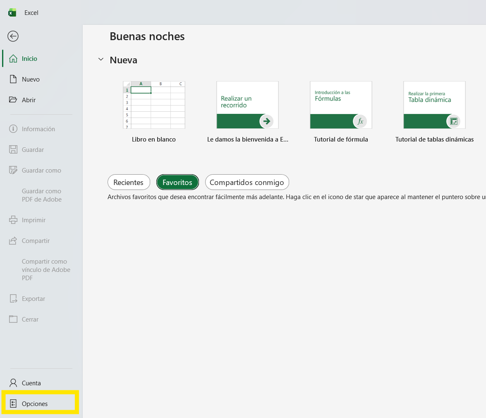 |
| :---: |
| *Figura 3: Sección Opciones dentro de Excel* |

3. Seleccionar la sección **Complementos** en el panel izquierdo.
4. En la parte inferior, en el campo **Administrar**, seleccionar **Complementos COM** y hacer clic en **Ir...**.

| 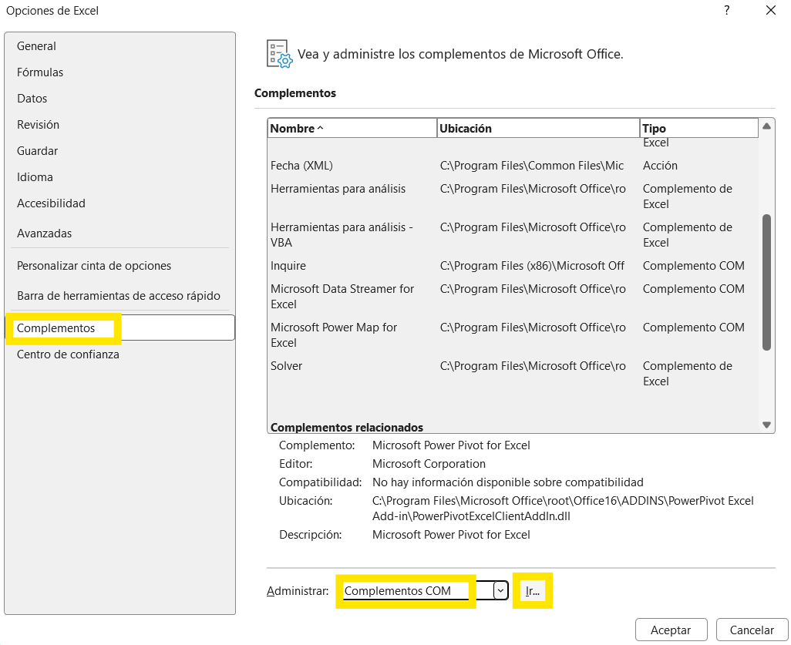 |
| :---: |
| *Figura 4: Opción Complementos COM* |

5. Marcar la casilla **Microsoft Power Pivot for Excel**.
6. Hacer clic en **Aceptar**.

| 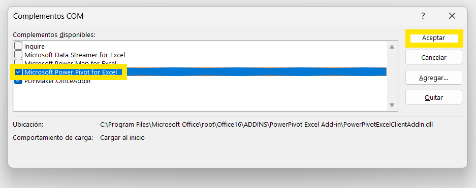 |
| :---: |
| *Figura 5: Configuración de Power Pivot en Complementos COM* |

7. Verificar que la pestaña **Power Pivot** aparece en la cinta superior de Excel.

| 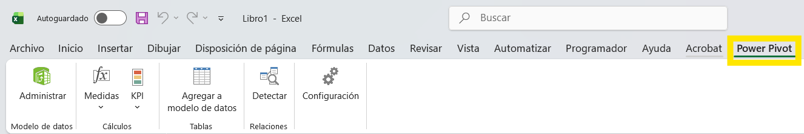 |
| :---: |
| *Figura 6: Ventana de Complementos COM con Power Pivot activado* |

---
### 2.2. Creación de Hojas de Trabajo

Se creó una hoja de Excel por cada tabla del modelo, siguiendo estos pasos:

1. Hacer clic derecho sobre una pestaña de hoja en la parte inferior → **Hoja Nueva**.
2. Nombrar cada hoja con el nombre de la tabla correspondiente.
3. En cada hoja insertar los datos con sus encabezados en la fila 1
Las cuatro hojas creadas fueron:

- `dim_product`
- `dim_customer`
- `dim_date`
- `fact_sales`

| 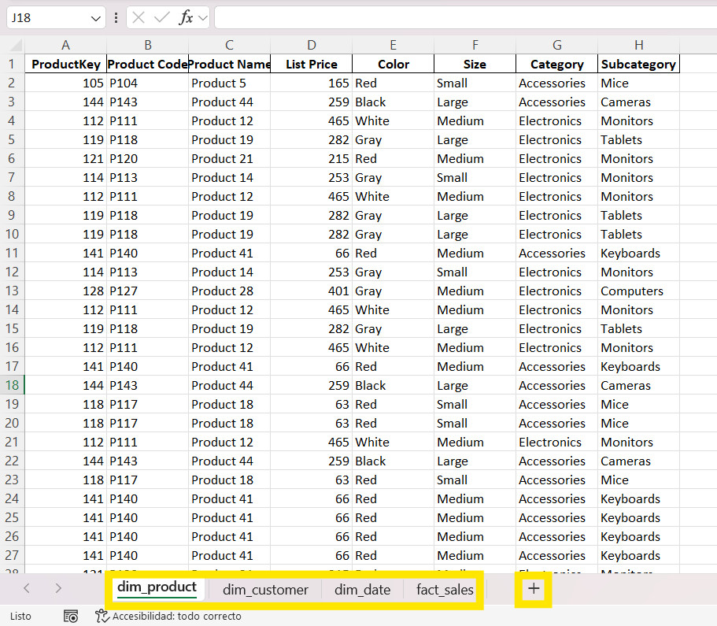 |
| :---: |
| *Figura 7: Hojas de trabajo creadas en Excel* |

---
### 2.3. Conversión a Tabla de Excel (Ctrl + T)

Para que Power Pivot pueda reconocer y cargar los datos correctamente, cada rango de datos fue convertido en una **tabla de Excel**. El proceso se repitió en cada una de las 4 hojas:

1. Seleccionar el rango de datos incluyendo los encabezados.
2. Presionar **Ctrl + T**.
3. En el cuadro de diálogo, verificar que la opción **"La tabla tiene encabezados"** esté marcada.
4. Hacer clic en **Aceptar**.

| 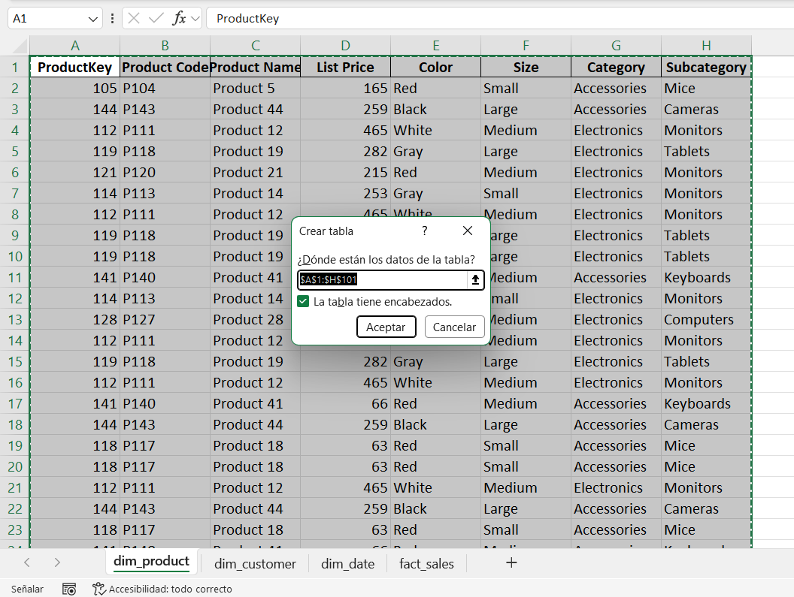 |
| :---: |
| *Figura 8: Cuadro de diálogo al aplicar Ctrl + T* |

---
### 2.4. Asignación de Nombres a las Tablas

Luego de convertir cada rango en tabla, se asignó un nombre personalizado a cada una para facilitar su identificación en el modelo de datos:

1. Hacer clic dentro de la tabla.
2. Ir a la pestaña **Diseño de tabla** que aparece en la cinta superior.
3. En el campo **Nombre de tabla** del extremo izquierdo se escribió el nombre adecuado para la tabla.
4. Presionar **Enter** para confirmar.

| 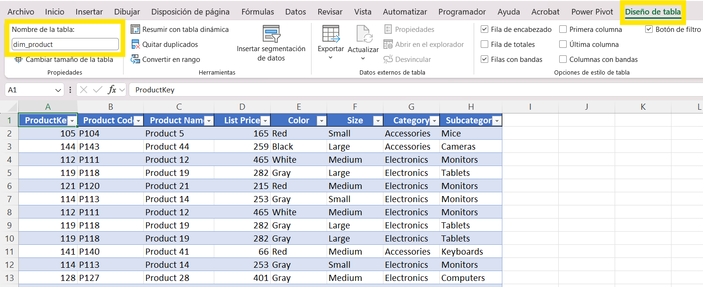 |
| :---: |
| *Figura 9: Tabla con nombre asignado (dim_product)* |

| 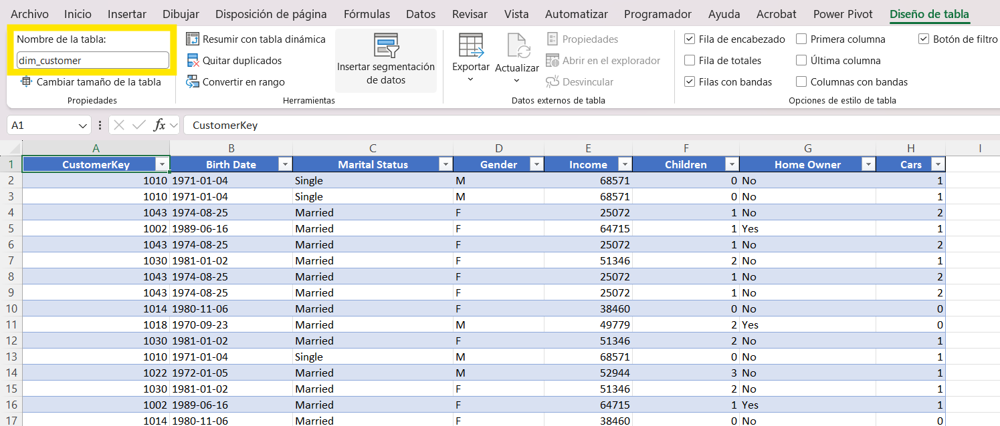 |
| :---: |
| *Figura 10: Tabla con nombre asignado (dim_customer)* |

|  |
| :---: |
| *Figura 11: Tabla con nombre asignado (dim_date)* |
| *Nota: para la tabla de dim_date, se generaron los datos utilizando funciones de Excel para descomponer en año, mes y nombre de mes.* |

| 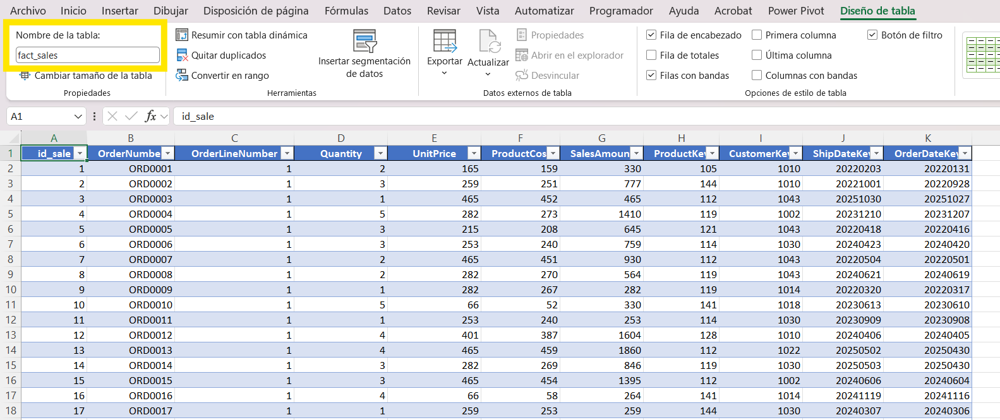 |
| :---: |
| *Figura 12: Tabla con nombre asignado (fact_sales)* |

---
### 2.5. Eliminación de Duplicados en las Dimensiones

Para garantizar la integridad del modelo, se eliminaron los registros duplicados en las tablas de dimensión, asegurando que cada llave primaria (PK) sea única. Este paso **no se aplica a la tabla de hechos (fact_sales)**.

El proceso se realizó de la siguiente forma para cada tabla de dimensión:

1. Hacer clic dentro de la tabla de dimensión.
2. Ir a la pestaña **Datos** en la cinta superior.
3. Hacer clic en **Quitar duplicados**.

| 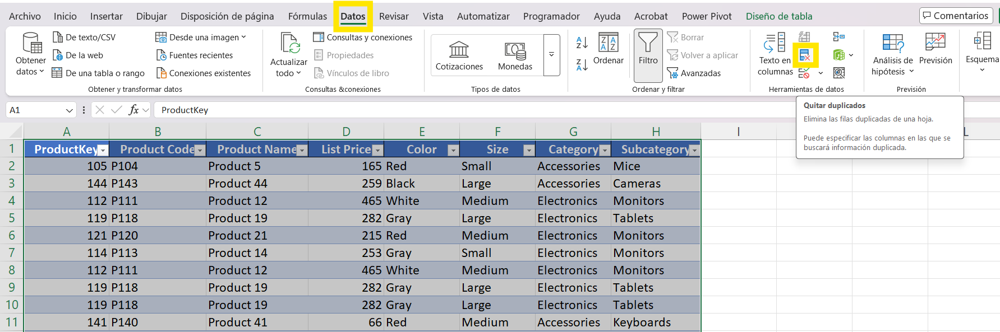 |
| :---: |
| *Figura 13: Opción Quitar duplicados en Excel* |

4. En el cuadro de diálogo, seleccionar **únicamente la columna de la llave primaria** correspondiente.
5. Hacer clic en **Aceptar**.

| 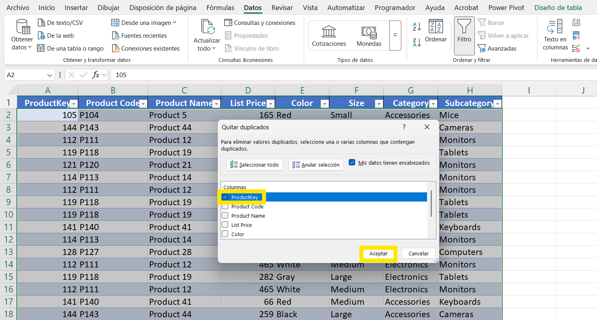 |
| :---: |
| *Figura 14: Cuadro de diálogo Quitar duplicados* |

6. Excel muestra un mensaje indicando cuántos duplicados fueron eliminados.

Las columnas utilizadas para eliminar duplicados por tabla fueron:

| Tabla | Columna utilizada |
|---|---|
| dim_product | `ProductKey` |
| dim_customer | `CustomerKey` |
| dim_date | `DateKey` |

| 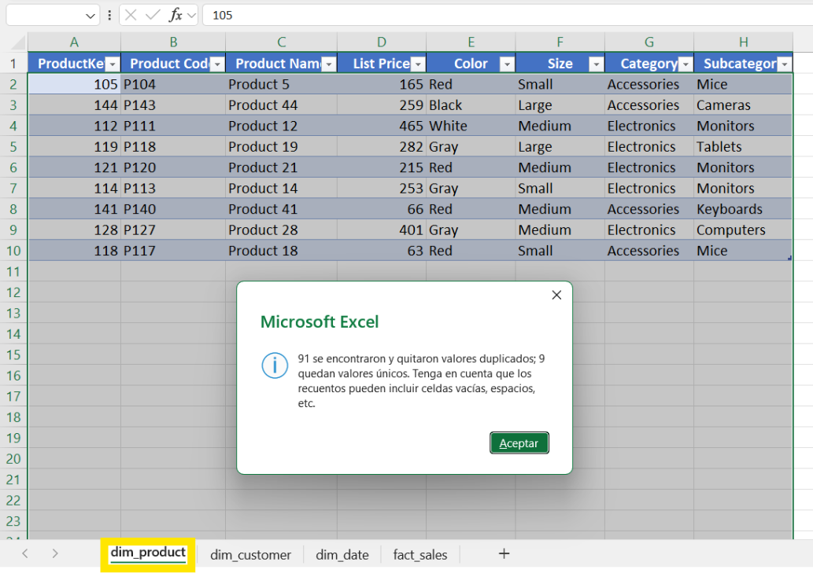 |
| :---: |
| *Figura 15: Eliminación de duplicados dim_product* |

| 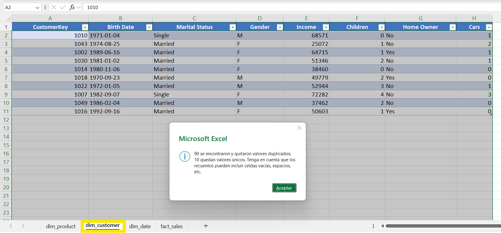 |
| :---: |
| *Figura 16: Eliminación de duplicados dim_customer* |

| 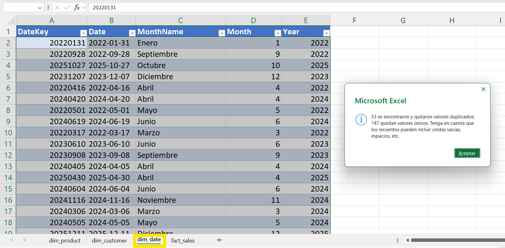 |
| :---: |
| *Figura 17: Eliminación de duplicados dim_date* |

---
---

## 3. Carga de tablas al modelo de datos

Con las 4 tablas formateadas y nombradas, se procedió a cargarlas al modelo de datos de Power Pivot. Este paso es fundamental para poder crear relaciones entre tablas y construir las tablas dinámicas.

Por cada tabla se repitió el siguiente proceso:

1. Clic en cualquier celda dentro de la tabla
2. Ir a la pestaña **Power Pivot** en la cinta superior
3. Clic en **Add to Data Model**

|  |
| :---: |
| *Figura 18: Opción Add to Data Model en la pestaña Power Pivot* |

Al abrir Power Pivot (**Power Pivot → Manage**) se verificó que las tablas se fueran cargando correctamente. A continuación se muestra `dim_product` como segunda tabla cargada:

|  |
| :---: |
| *Figura 19: Tabla dim_product cargada en el modelo de Power Pivot* |

Se fue repitiendo el mismo proceso tabla por tabla hasta completar la carga de las 4. En la figura 10 se puede observar `dim_date` como última tabla cargada, y en las pestañas inferiores se confirma la presencia de todas las tablas del modelo (`fact_sales`, `dim_product`, `dim_customer` y `dim_date`):

|  |
| :---: |
| *Figura 20: Todas las tablas cargadas en el modelo de Power Pivot, visualizando dim_date como última incorporada* |

Una vez cargadas todas las tablas, se procedió a crear las relaciones entre ellas en la vista de diagrama de Power Pivot, obteniendo el siguiente modelo estrella, igual al que se realizó al inicio:

|  |
| :---: |
| *Figura 21: Modelo estrella completo con todas las relaciones establecidas en Power Pivot* |

Cabe recalcar que la relación entre `dim_date` y `fact_sales` se estableció de forma doble:
- `DateKey` → `OrderDateKey`: relación **activa** (línea sólida), utilizada por defecto en las tablas dinámicas para analizar ventas por fecha de orden.
- `DateKey` → `ShipDateKey`: relación **inactiva** (línea punteada), disponible para análisis por fecha de envío cuando se requiera.

Power Pivot solo permite una relación activa entre dos tablas, por lo que la relación con `ShipDateKey` queda inactiva y debe activarse explícitamente mediante DAX cuando sea necesario.

---
---

## 4 — Creación de tablas dinámicas para las preguntas
---
### Pregunta 1

* **¿Cuántas ventas se realizaron por categoría de producto y mes?**

Para responder esta pregunta se creó una tabla dinámica conectada al modelo de datos de Power Pivot. El proceso fue el siguiente:

1. En una hoja nueva llamada `Preguntas`, ir a **Insert → PivotTable → From Data Model**

|  |
| :---: |
| *Figura 22: Selección de PivotTable From Data Model* |

2. Seleccionar **Existing Worksheet** con ubicación en este caso  `Preguntas!$A$4` → **OK**

|  |
| :---: |
| *Figura 23: Configuración de ubicación de la tabla dinámica* |

3. En el panel **PivotTable Fields** se visualizan las 4 tablas del modelo disponibles

|  |
| :---: |
| *Figura 24: Panel PivotTable Fields con las tablas del modelo de datos* |

4. Se arrastraron los campos a las siguientes áreas:

| Área | Campo | Tabla origen |
|---|---|---|
| **Rows** | `Category` | `dim_product` |
| **Columns** | `MonthName` | `dim_date` |
| **Values** | `Quantity` | `fact_sales` |

|  |
| :---: |
| *Figura 25: Campos configurados en el panel PivotTable Fields* |

---

### Resultado — Pregunta 1

|  |
| :---: |
| *Figura 26: Tabla dinámica con ventas por categoría de producto y mes* |

**Interpretación de resultados:**

- La categoría **Electronics** registró el mayor volumen de ventas con **174 unidades** en total.
- La categoría **Accessories** vendió **122 unidades** en total.
- El mes con mayor cantidad de ventas fue **Junio** con **52 unidades** entre ambas categorías.
- El mes con menor actividad fue **Agosto** con únicamente **2 unidades** vendidas.

---
### Pregunta 2

* **¿Cuál es el ingreso total (ventas) por cliente y género?**

1. En la hoja `Preguntas`, ir a **Insert → PivotTable → From Data Model**
2. Seleccionar **Existing Worksheet** → **OK**
3. En el panel **PivotTable Fields** configurar los siguientes campos:

| Área | Campo | Tabla origen |
|---|---|---|
| **Rows** | `CustomerKey` | `dim_customer` |
| **Columns** | `Gender` | `dim_customer` |
| **Values** | `SalesAmount` | `fact_sales` |

| 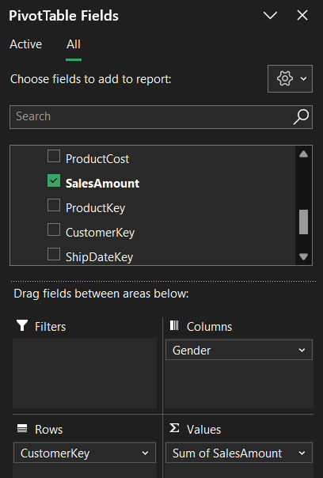 |
| :---: |
| *Figura 27: Campos configurados para la Pregunta 2* |

---
#### Resultado — Pregunta 2

| 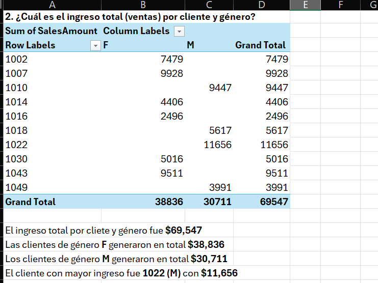 |
| :---: |
| *Figura 28: Tabla dinámica con ingreso total por cliente y género* |

**Interpretación de resultados:**

- Las clientes de género **F** generaron un ingreso total de **\$38,836**, superando a los clientes de género **M** con **\$30,711**.
- El cliente con mayor ingreso fue el **1022 (M)** con **\$11,656**.
- El ingreso total entre todos los clientes fue de **\$69,547**.

>[!NOTE]
> Los valores vacíos indican que cada cliente pertenece a un único género, por lo que solo aparece valor en la columna correspondiente.

---
### Pregunta 3

* **¿Cuál es la cantidad total vendida por producto?**

1. En la hoja `Preguntas`, ir a **Insert → PivotTable → From Data Model**
2. Seleccionar **Existing Worksheet** → **OK**
3. En el panel **PivotTable Fields** configurar los siguientes campos:

| Área | Campo | Tabla origen |
|---|---|---|
| **Rows** | `Product Name` | `dim_product` |
| **Values** | `Quantity` | `fact_sales` |

| 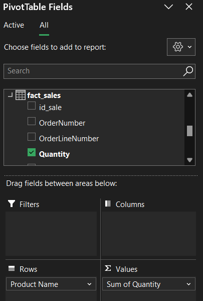 |
| :---: |
| *Figura 29: Campos configurados para la Pregunta 3* |

---
#### Resultado — Pregunta 3

| 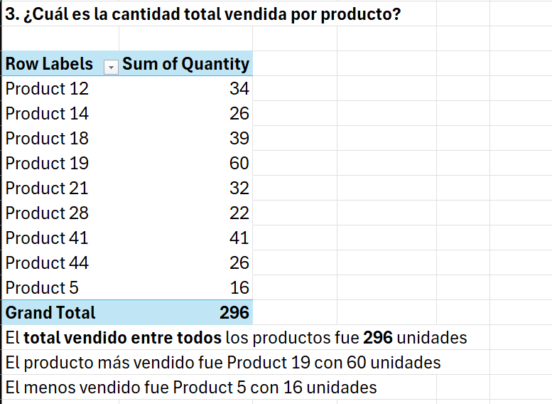 |
| :---: |
| *Figura 30: Tabla dinámica con cantidad total vendida por producto* |

**Interpretación de resultados:**

- El producto más vendido fue **Product 19** con **60 unidades**.
- El producto con menor volumen de ventas fue **Product 5** con **16 unidades**.
- La cantidad total vendida entre todos los productos fue de **296 unidades**.

---

### Pregunta 4

* **¿Cuál fue la cantidad enviada por mes de envío?**

1. En la hoja `Preguntas`, ir a **Insert → PivotTable → From Data Model**
2. Seleccionar **New Worksheet** → **OK**
3. Crear una medida DAX en Power Pivot para activar la relación inactiva con ShipDateKey:

Esta pregunta requiere analizar las ventas por fecha de **envío** (`ShipDateKey`), sin embargo Power Pivot solo permite una relación activa entre dos tablas. La relación activa de `dim_date` está configurada con `OrderDateKey`, por lo que la relación con `ShipDateKey` quedó **inactiva**. 

Al usar directamente el campo `Quantity` en la tabla dinámica, Power Pivot utiliza por defecto la relación activa (`OrderDateKey`), devolviendo resultados por mes de **orden** y no de **envío**. Para solucionar esto se creó una medida DAX con `USERELATIONSHIP()`, que activa temporalmente la relación inactiva durante el cálculo.

En **Power Pivot → Manage**, clic derecho en fact_sales → **Add Measure**:

| Campo | Valor |
|---|---|
| **Nombre** | `CantidadEnviada` |
| **Fórmula** | `=CALCULATE(SUM(fact_sales[Quantity]), USERELATIONSHIP(fact_sales[ShipDateKey], dim_date[DateKey]))` |

| 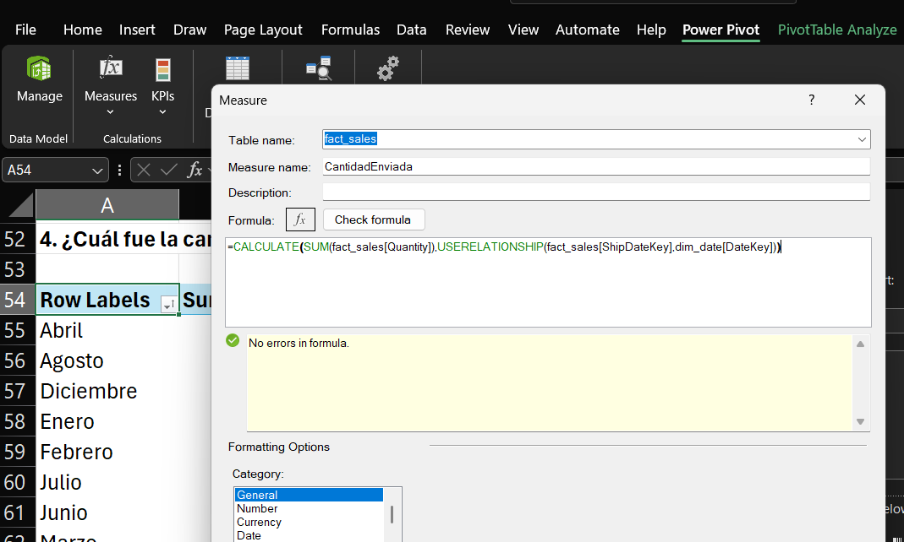 |
| :---: |
| *Figura 31: Configuración de la medida DAX con USERELATIONSHIP* |

4. En el panel **PivotTable Fields** configurar:

| Área | Campo | Tabla origen |
|---|---|---|
| **Rows** | `MonthName` | `dim_date` |
| **Values** | `CantidadEnviada` | `fact_sales` (medida) |

---

### Resultado — Pregunta 4

| 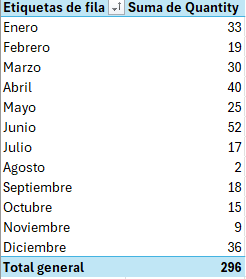 |
| :---: |
| *Figura 32: Tabla dinámica con cantidad enviada por mes de envío* |

**Interpretación de resultados:**

- El mes con mayor cantidad de unidades enviadas fue **Junio** con **47 unidades**.
- El mes con menor actividad de envíos fue **Agosto** con únicamente **5 unidades**.
- En total se enviaron **296 unidades** durante el período analizado.

---

### Pregunta 5

* **¿Cuánto se vendió por tamaño de producto y por estado civil del cliente?**

1. En la hoja `Preguntas`, ir a **Insert → PivotTable → From Data Model**
2. Seleccionar **Existing Worksheet** → **OK**
3. En el panel **PivotTable Fields** configurar los siguientes campos:

| Área | Campo | Tabla origen |
|---|---|---|
| **Rows** | `Size` | `dim_product` |
| **Columns** | `Marital Status` | `dim_customer` |
| **Values** | `SalesAmount` | `fact_sales` |

---

### Resultado — Pregunta 5

| 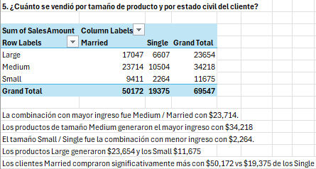 |
| :---: |
| *Figura 33: Tabla dinámica con ventas por tamaño de producto y estado civil* |

**Interpretación de resultados:**

- La combinación con mayor ingreso fue **Medium / Married** con **$23,714**.
- Los clientes **Married** generaron más ventas en todos los tamaños de producto.
- El tamaño **Small / Single** fue la combinación con menor ingreso con **$2,264**.
