

 

<h1><strong>Escuela Politécnica Nacional</strong></h1>

### Facultad de Ingeniería de Sistemas

**Business Intelligence (ISWD743) · GR2SW_2026-1**

**Association Mining in Weka**

---

**Fecha:**  
10 de Julio, 2026

**Integrantes:**  
Andrea Chicaiza  
Andreina Pallo  
Jose Arias  
Juan Mateo Quisilema  
Juan Suarez

---

> [!NOTE]
>
> Este repositorio contiene el desarrollo del trabajo grupal de la práctica de Association Mining in Weka, cuyo objetivo es aplicar los algoritmos Apriori y Predictive Apriori en Weka sobre datasets transaccionales y numéricos, generar reglas de asociación mediante la configuración de umbrales de soporte y confianza, aplicar procesos de discretización automática y manual sobre datos numéricos, y analizar el rendimiento estudiantil a través de reglas de asociación de clase (CAR).

---

> [!NOTE]
>
> Objetivos específicos:
> * Aplicar el algoritmo Apriori en Weka sobre datasets transaccionales de distinto tamaño, configurando adecuadamente los parámetros de soporte y confianza mínimos.
> * Aplicar el algoritmo Predictive Apriori sobre un dataset numérico, empleando discretización automática y manual como paso de preprocesamiento.
> * Comparar los resultados obtenidos mediante discretización automática (equal frequency) frente a la discretización manual basada en percentiles (20%-60%-20%).
> * Analizar cómo el uso de la opción *Class Association Rules* (CAR) y el tratamiento de valores medios como datos perdidos afecta la calidad e interpretabilidad de las reglas generadas.

---

<h2><strong>Índice</strong></h2>

1. [Introducción](#1-introducción)
2. [Ejercicio 10.6 — Algoritmo Apriori sobre un dataset pequeño (DailyItem)](#2-ejercicio-106--algoritmo-apriori-sobre-un-dataset-pequeño-dailyitem)
3. [Ejercicio 10.7 — Algoritmo Apriori sobre un dataset más grande (DailyItem2)](#3-ejercicio-107--algoritmo-apriori-sobre-un-dataset-más-grande-dailyitem2)
4. [Ejercicio 10.8 — Minería de asociación sobre datos numéricos (Discretización automática)](#4-ejercicio-108--minería-de-asociación-sobre-datos-numéricos-discretización-automática)
5. [Ejercicio 10.9 — Discretización manual y análisis refinado](#5-ejercicio-109--discretización-manual-y-análisis-refinado)
6. [Análisis global de resultados](#6-análisis-global-de-resultados)
7. [Conclusiones](#7-conclusiones)
8. [Referencias bibliográficas](#8-referencias-bibliográficas)

---

## Desarrollo

---

## 1. Introducción

### 1.1. Minería de Asociación y Algoritmos Apriori / Predictive Apriori

La minería de asociación es una técnica de minería de datos orientada a descubrir relaciones interesantes entre variables dentro de grandes volúmenes de datos, comúnmente representadas como reglas del tipo *si X entonces Y*. El algoritmo **Apriori** es el método clásico para este propósito: genera de manera iterativa conjuntos de ítems frecuentes (itemsets), partiendo de ítems individuales y combinándolos progresivamente, descartando en cada nivel aquellos conjuntos que no superan un umbral mínimo de soporte, para finalmente derivar reglas de asociación que cumplan también con un umbral mínimo de confianza [[1]](#8-referencias-bibliográficas). Este enfoque de poda por niveles permite reducir considerablemente el espacio de búsqueda respecto a una exploración exhaustiva de todas las combinaciones posibles [[2]](#8-referencias-bibliográficas).

Por su parte, el algoritmo **Predictive Apriori**, implementado en Weka, combina de forma óptima el soporte y la confianza en un único valor denominado *precisión predictiva* (predictive accuracy), evitando que el usuario deba fijar manualmente los umbrales de soporte y confianza; en su lugar, basta con indicar el número de reglas deseadas y el propio algoritmo ajusta dichos umbrales para maximizar la calidad de las reglas encontradas.

### 1.2. Métricas: Soporte, Confianza y Precisión Predictiva

El **soporte** de un itemset indica la frecuencia con la que dicho conjunto de ítems aparece en el total de transacciones del dataset, mientras que la **confianza** de una regla mide la proporción de casos en los que, dado el antecedente, también se cumple el consecuente. Ambas métricas son ampliamente utilizadas como criterios de evaluación en algoritmos de aprendizaje no supervisado orientados a reglas de asociación, ya que permiten balancear la frecuencia de un patrón frente a su fiabilidad predictiva [[3]](#8-referencias-bibliográficas). La **precisión predictiva** utilizada por Predictive Apriori, en cambio, corresponde a una estimación bayesiana de la confianza esperada de la regla, lo que la hace especialmente útil cuando se busca comparar el desempeño de Apriori frente a Predictive Apriori sobre un mismo conjunto de datos, tal como se ha evaluado estadísticamente en estudios comparativos de ambos algoritmos [[4]](#8-referencias-bibliográficas).

### 1.3. Discretización de datos numéricos

Los algoritmos de minería de asociación, tanto Apriori como Predictive Apriori, trabajan exclusivamente con atributos nominales, por lo que no pueden aplicarse directamente sobre atributos numéricos continuos [[1]](#8-referencias-bibliográficas). Para superar esta limitación es necesario aplicar un proceso de **discretización** o *binning*, que consiste en agrupar los valores numéricos continuos de un atributo en un número finito de intervalos o categorías (bins), transformando así la variable numérica en una variable nominal u ordinal [[5]](#8-referencias-bibliográficas).

Existen principalmente dos estrategias de discretización: la discretización por **intervalos iguales** (equal width), en la que el rango de valores se divide en segmentos de igual amplitud; y la discretización por **frecuencia igual** (equal frequency), en la que los límites de los intervalos se ajustan de modo que cada bin contenga aproximadamente el mismo número de observaciones [[5]](#8-referencias-bibliográficas). Esta segunda estrategia, disponible en Weka mediante el filtro `Discretize` con la propiedad `useEqualFrequency`, evita que un grupo concentre una cantidad desproporcionada de instancias, lo que podría sesgar el peso de dicha categoría dentro de las reglas generadas. Adicionalmente, es posible realizar una discretización manual basada en percentiles (por ejemplo, clasificando el 20% superior como "Alto", el 20% inferior como "Bajo" y el 60% restante como "Medio"), lo cual otorga mayor control sobre la interpretación semántica de las categorías resultantes, aunque introduce un componente de subjetividad en la elección de los puntos de corte [[3]](#8-referencias-bibliográficas), [[4]](#8-referencias-bibliográficas).

---

## 2. Ejercicio 10.6 — Algoritmo Apriori sobre un dataset pequeño (DailyItem)

### 2.1. Objetivo

Ejecutar el algoritmo Apriori en Weka sobre el dataset de tienda **DailyItem** (4 transacciones, 4 productos), con el fin de identificar la mejor regla de asociación posible.

### 2.2. Descripción del dataset

El dataset representa las compras realizadas en una tienda. Existe una fila por transacción y una columna por producto, donde 1 indica presencia del producto en la transacción.

| # | Columna | Tipo | Descripción |
|:---:|:---:|:---:|:---|
| 1 | `Transaction` | INTEGER | Id de la transacción |
| 2 | `Bread` | NUMERIC (binario) | Indica si la transacción incluyó pan (1) o no (vacío/0) |
| 3 | `Cornflakes` | NUMERIC (binario) | Indica si la transacción incluyó hojuelas de maíz (1) o no |
| 4 | `Jam` | NUMERIC (binario) | Indica si la transacción incluyó mermelada (1) o no |
| 5 | `Milk` | NUMERIC (binario) | Indica si la transacción incluyó leche (1) o no |

*Tabla 1: Descripción de columnas del dataset DailyItem*

### 2.3. Procedimiento paso a paso

#### 2.3.1. Creación del dataset

Se abrió Microsoft Excel y se registraron las 4 transacciones con sus respectivos productos, marcando con el valor 1 según la presencia de cada ítem en la transacción correspondiente.

|  |
|:--:|
| *Figura 1: Dataset DailyItem tabulado en Microsoft Excel* |

Posteriormente, el archivo se guardó en formato **CSV (delimitado por comas)** con el nombre `DailyItem Dataset.csv`, utilizando la opción *Guardar como* del menú *Archivo*.

|  |
|:--:|
| *Figura 2: Cuadro de diálogo para guardar el archivo DailyItem Dataset en formato CSV* |

#### 2.3.2. Carga y preprocesamiento en Weka

Se abrió el **Weka GUI Chooser Panel** y se seleccionó la opción **Explorer**. Desde la pestaña *Preprocess*, se utilizó el botón **Open file** para cargar el archivo `DailyItem Dataset.csv` previamente creado.

|  |
|:--:|
| *Figura 3: Dataset DailyItem cargado en la pestaña Preprocess de Weka Explorer* |

|  |
|:--:|
| *Figura 4: Vista previa del dataset DailyItem en Weka Explorer* |

Dado que Weka interpretó todas las columnas como atributos numéricos, y los algoritmos de asociación requieren atributos nominales, se aplicó el filtro **NumericToNominal**, siguiendo el proceso: `Choose → filters → unsupervised → attribute → NumericToNominal`, y se ejecutó mediante el botón **Apply**.

|  |
|:--:|
| *Figura 5: Filtro NumericToNominal seleccionado y aplicado sobre el dataset* |

|  |
|:--:|
| *Figura 6: Resultado del filtro NumericToNominal aplicado sobre el dataset DailyItem* |

A continuación, se seleccionó el atributo **Transaction** en el panel de atributos y se eliminó mediante el botón **Remove**, ya que dicho identificador no aporta información relevante para el proceso de minería de asociación.

|  |
|:--:|
| *Figura 7: Eliminación del atributo Transaction del dataset* |

|  |
|:--:|
| *Figura 8: Dataset DailyItem listo para la ejecución del algoritmo Apriori* |

#### 2.3.3. Configuración y ejecución del algoritmo Apriori

Se accedió a la pestaña **Associate** y, mediante el botón **Choose**, se seleccionó el algoritmo **Apriori** dentro de la categoría *associations*.

|  |
|:--:|
| *Figura 9: Selección del algoritmo Apriori en la pestaña Associate* |

Al hacer clic sobre el campo del *Associator*, se abrió el **Generic Object Editor**, en el cual se configuraron los siguientes parámetros:

| # | Parámetro | Valor configurado | Descripción |
|:---:|:---:|:---:|:---|
| 1 | `lowerBoundMinSupport` | 0.5 | Soporte mínimo requerido (50% de las transacciones) |
| 2 | `metricType` | Confidence | Métrica utilizada para rankear las reglas |
| 3 | `minMetric` | 0.75 | Confianza mínima requerida (75%) |
| 4 | `numRules` | 10 | Número máximo de reglas a generar |

*Tabla 2: Configuración de parámetros del algoritmo Apriori — Ejercicio 10.6*

|  |
|:--:|
| *Figura 10: Parámetros de soporte, confianza y número de reglas configurados para Apriori* |

Finalmente, se guardó la configuración con el botón **OK** y se ejecutó el algoritmo mediante el botón **Start**.

|  |
|:--:|
| *Figura 11: Botón Start utilizado para ejecutar el algoritmo Apriori sobre el dataset DailyItem* |

### 2.4. Resultados obtenidos

Tras la ejecución, Weka generó la siguiente salida en el panel *Associator output*:

|  |
|:--:|
| *Figura 12: Resultado obtenido por el algoritmo Apriori* |

| # | Regla | Soporte (instancias) | Confianza | Lift | Leverage | Conviction |
|:---:|:---|:---:|:---:|:---:|:---:|:---:|
| 1 | Jam=1 → Cornflake=1 | 2 | 1 (100%) | 1.33 | 0.13 | 0.5 |

*Tabla 3: Mejor regla de asociación encontrada para el dataset DailyItem*

### 2.5. Análisis e interpretación de resultados
La única regla encontrada, **Jam=1 → Cornflake=1**, tiene un soporte de 2 transacciones (50%) y una confianza del 100%, lo que indica que cada vez que un cliente compró mermelada, también compró hojuelas de maíz. Esto se debe a que Jam solo aparece en 2 de las 4 transacciones, y en ambas también está presente Cornflake.

Además de la regla, Weka reportó un **lift** de 1.33, que demuestra que comprar Mermelada (Jam) hace 1.33 veces más probable que también se compre Hojuelas de maíz (Cornflake), comparado con la probabilidad de comprar Hojuelas de maíz de manera independiente. También se obtuvo un **leverage** de 0.13, este valor confirma que la coocurrencia supera ligeramente lo que se esperaría de suceder al azar. Finalmente, la **conviction** registrada es de 0.5, sin embargo como la confianza es perfecta y la regla nunca falla, este valor no aporta información que sea relevante.

En general, en este ejercicio, debido al tamaño tan pequeño del dataset, pocos itemsets logran superar el soporte mínimo del 50%, lo cual explica por qué Apriori solo encontró una única regla tras 10 ciclos de ejecución.

---

## 3. Ejercicio 10.7 — Algoritmo Apriori sobre un dataset más grande (DailyItem2)

### 3.1. Objetivo

### 3.2. Descripción del dataset

### 3.3. Procedimiento paso a paso

#### 3.3.1. Creación del dataset

#### 3.3.2. Carga y preprocesamiento en Weka

#### 3.3.3. Configuración y ejecución del algoritmo Apriori

### 3.4. Resultados obtenidos

### 3.5. Análisis e interpretación de resultados

### 3.6. Comparación con resultados teóricos del Capítulo 9

---

---

# 4. Ejercicio 10.8 — Minería de asociación sobre datos numéricos (Discretización automática)

## 4.1. Objetivo

Aplicar el algoritmo **Predictive Apriori** sobre el conjunto de datos **MARKS_org.csv**, demostrando cómo la discretización automática en Weka convierte atributos numéricos en categorías nominales, permitiendo la generación de reglas de asociación significativas sobre el rendimiento académico.

---

## 4.2. Descripción del dataset

Se utilizó un dataset de **60 instancias** con los siguientes atributos:

| Atributo | Rango Máximo |
|----------|--------------:|
| MST | 20.0 |
| Quiz | 15 |
| Lab | 20.0 |
| ENDSEM | 45.0 |
| Total | 100.0 |
| Grade | Categoría |

---

## 4.3. Procedimiento paso a paso

### 4.3.1. Carga y preprocesamiento

**Carga del dataset**

Se importó el archivo **MARKS_org.csv**. En la pestaña **Preprocess** se eliminaron los atributos **Roll No.** y **Name**, con el objetivo de centrar el análisis únicamente en las variables académicas.

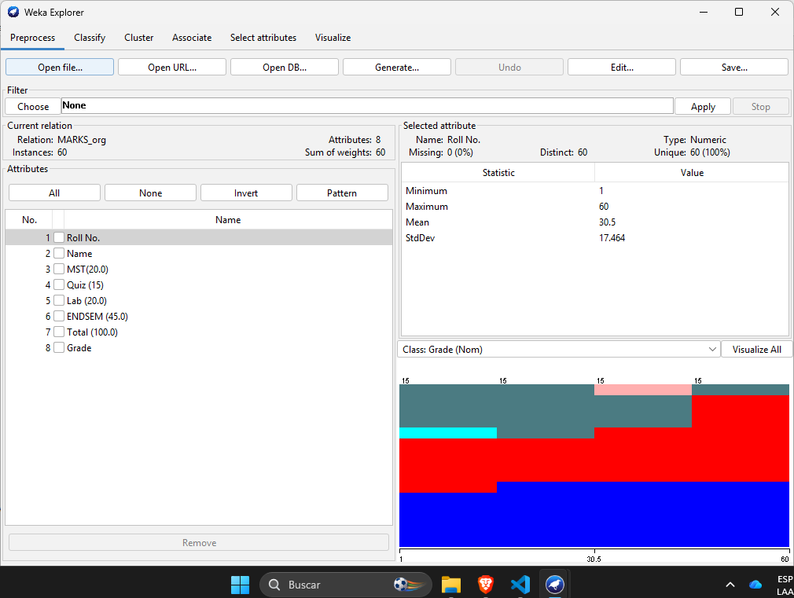

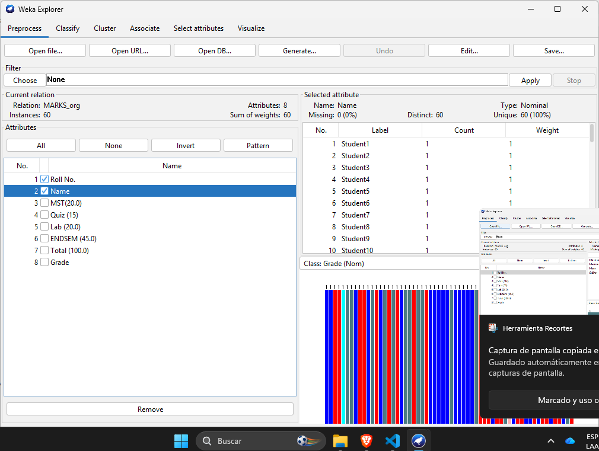

**Discretización**

Posteriormente se aplicó el filtro **Discretize** utilizando **10 bins**. Este paso es indispensable debido a que el algoritmo **Predictive Apriori** únicamente trabaja con atributos nominales. La discretización transforma automáticamente los valores numéricos en intervalos, permitiendo ejecutar el algoritmo de reglas de asociación.

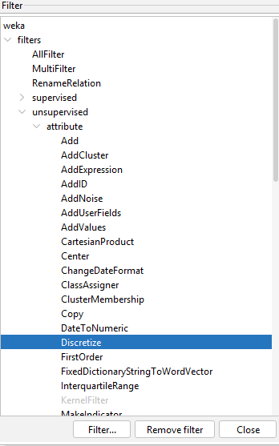

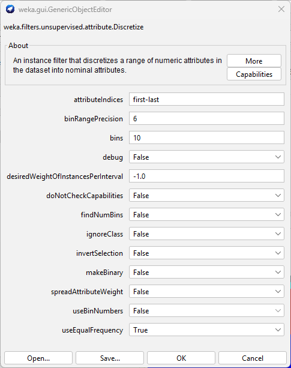

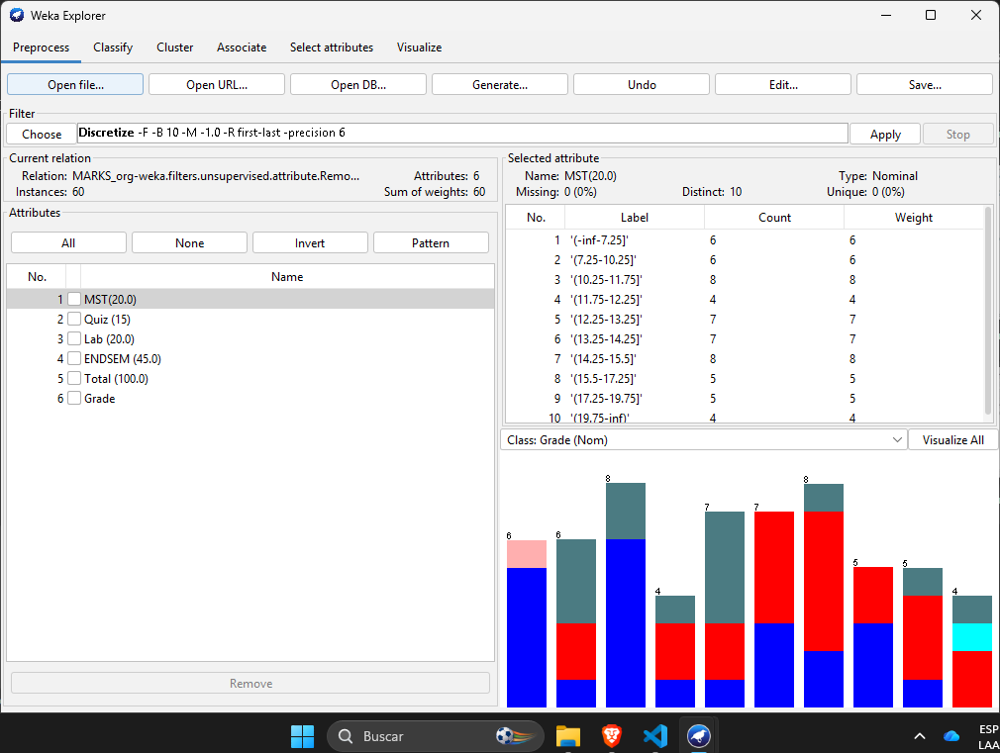

---

### 4.3.2. Ejecución del algoritmo

Una vez discretizados los datos, se seleccionó el algoritmo **Predictive Apriori** desde la pestaña **Associate** de Weka y se configuró para generar un máximo de **100 reglas de asociación**.

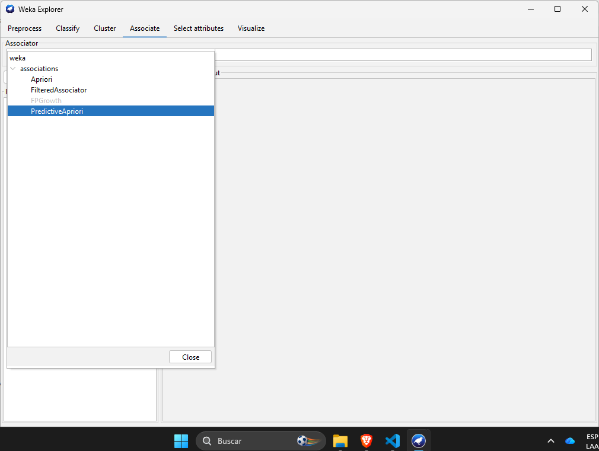

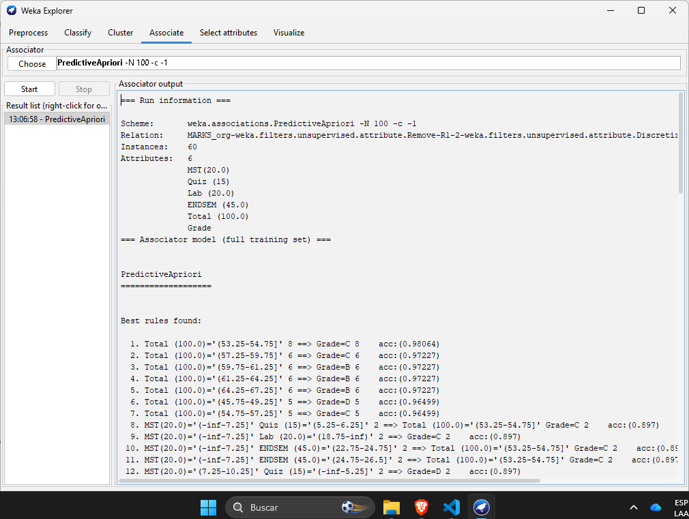
---

## 4.4. Resultados obtenidos

Una vez aplicado el filtro **Discretize** con **10 intervalos (bins)** y ejecutado el algoritmo **Predictive Apriori**, Weka generó un conjunto de **100 reglas de asociación**, ordenadas de acuerdo con su precisión predictiva (*acc*).

Las reglas con mayor precisión se presentan en la siguiente tabla:

| Regla                   | Instancias | Consecuente | Precisión (acc) |
| ----------------------- | ---------: | ----------- | --------------: |
| Total = '(53.25–54.75]' |          8 | Grade = C   |         0.98064 |
| Total = '(57.25–59.75]' |          6 | Grade = C   |         0.97227 |
| Total = '(59.75–61.25]' |          6 | Grade = B   |         0.97227 |
| Total = '(61.25–64.25]' |          6 | Grade = B   |         0.97227 |
| Total = '(64.25–67.25]' |          6 | Grade = B   |         0.97227 |
| Total = '(45.75–49.25]' |          5 | Grade = D   |         0.96499 |
| Total = '(54.75–57.25]' |          5 | Grade = C   |         0.96499 |

Además de estas reglas, el algoritmo identificó asociaciones entre las evaluaciones parciales (**MST**, **Quiz**, **Lab** y **ENDSEM**) y la calificación final, así como reglas que relacionan simultáneamente varios atributos con intervalos específicos del puntaje total.

En conjunto, las reglas obtenidas muestran que la discretización permitió descubrir patrones de comportamiento entre los distintos componentes de evaluación y el rendimiento académico de los estudiantes.

---

## 4.5. Análisis e interpretación de resultados

Las reglas obtenidas evidencian una fuerte asociación entre el atributo **Total** y la variable **Grade**. Las cinco reglas con mayor precisión utilizan únicamente el puntaje total como antecedente, alcanzando valores de precisión entre **0.96499** y **0.98064**, lo que indica que los intervalos generados mediante la discretización representan adecuadamente las categorías de calificación.

Asimismo, el algoritmo identifica claramente los umbrales asociados al rendimiento académico. Por ejemplo, la regla:

> **Total = '(-inf–45.75]' ⇒ Grade = D**

permite identificar un rango de puntaje que se encuentra fuertemente asociado con un bajo desempeño académico, constituyendo un posible indicador de riesgo para los estudiantes.

Además del puntaje total, Predictive Apriori descubrió reglas que relacionan distintas evaluaciones parciales. Un ejemplo es la siguiente asociación:

> **MST = '(-inf–7.25]' y Quiz = '(5.25–6.25]' ⇒ Total = '(53.25–54.75]' y Grade = C**

Esta regla muestra que determinadas combinaciones de evaluaciones parciales conducen tanto a un intervalo específico del puntaje total como a una calificación final determinada, evidenciando la influencia conjunta de los diferentes componentes de evaluación.

En general, los resultados muestran que la discretización automática permitió transformar variables numéricas en intervalos significativos, facilitando el descubrimiento de patrones que no serían obtenidos directamente sobre datos continuos mediante este algoritmo.

---

## 4.6. Observaciones sobre las reglas generadas

Las reglas obtenidas permiten realizar las siguientes observaciones:

* Las reglas con mayor precisión están dominadas por el atributo **Total**, lo que evidencia que este constituye el principal indicador del rendimiento académico dentro del conjunto de datos.

* La discretización en **10 intervalos** produjo reglas altamente específicas, permitiendo identificar con precisión los puntos de corte entre las diferentes categorías de calificación.

* El soporte de las reglas varía considerablemente. Mientras las reglas más representativas abarcan entre **5 y 8 estudiantes**, otras reglas describen patrones muy específicos presentes únicamente en **2 instancias**, por lo que deben interpretarse con mayor cautela.

* Los atributos **MST**, **Quiz**, **Lab** y **ENDSEM** aparecen principalmente en reglas compuestas, complementando la explicación del desempeño académico cuando se analizan en conjunto y no de forma individual.

* La elevada precisión de las primeras reglas confirma que la discretización automática realizada por Weka generó intervalos adecuados para aplicar **Predictive Apriori**, permitiendo obtener reglas de asociación claras, interpretables y útiles para comprender la relación entre las calificaciones parciales y la nota final de los estudiantes.

---

## 5. Ejercicio 10.9 — Discretización manual y análisis refinado

### 5.1. Objetivo

Categorizar las notas en Excel mediante intervención y criterio humano donde el 20% con notas más altas será **"H"(High/Alto)**, el 20% más bajo será **"L(Low/Bajo)"** y el 60% restante será **"M"(Medium/Medio)**. Esto con el fin de demostrar que el conocimiento humano sobre el problema puede sacar conclusiones más lógicas.

### 5.2. Proceso de discretización manual (H, M, L)

#### 5.2.1. Criterio de segmentación (20% – 60% – 20%)

- Se abrió el archivo Excel del rendimiento estudiantil y se eliminaron las columnas: **Roll No.** y **Name**, esto debido a que no aportan nada para el proceso de minería.

| 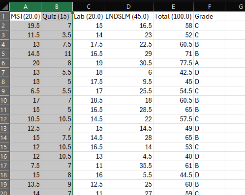 |
|:--:|
| *Figura : Eliminación de las columnas Roll No. y Name en el dataset original para preparar los datos para la minería* |

1. **Columna MST**

- Se realizó un ordenamiento en el dataset por el atributo **MST**. Dentro del excel se seleccionan todos los datos del dataset y se va a la opción de **Sort & Filter** y se realiza por MST de mayor a menor.

| 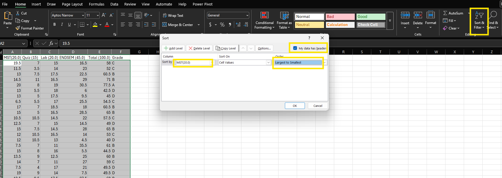 |
|:--:|
| *Figura : Proceso de ordenamiento de los registros basado en el atributo MST* |

- Se clasificaron los registros manualmente de la siguiente manera:

    - Primeros 12 registros: Reemplaza sus campos de MST con **H**

        | 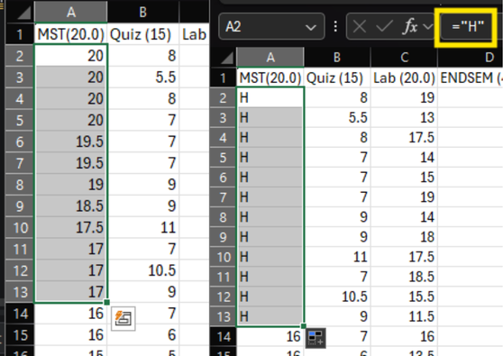 |
        |:--:|
        | *Figura : Asignación de la categoría H (Alto) a los estudiantes con mejor rendimiento en MST* |

    - Los registros de las filas 50 al 61 se reemplazan sus campos de MST con **L**

        | 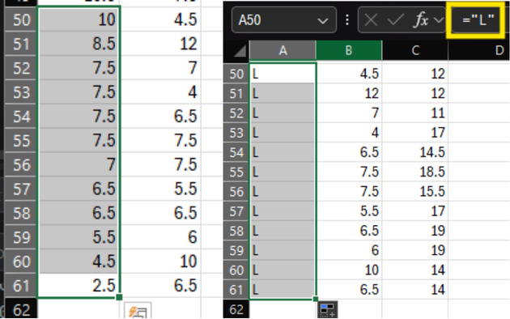 |
        |:--:|
        | *Figura : Asignación de la categoría L (Bajo) a los estudiantes con menor rendimiento en MST* |

    - Los registros restantes en la columna de MST se reemplazan sus notas con **M**

        | 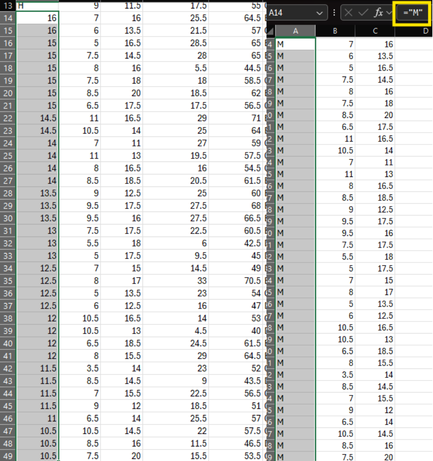 |
        |:--:|
        | *Figura : Asignación de la categoría M (Medio) a la mayoría de los estudiantes según la segmentación establecida* |

2. **Columna Quiz**

- Se realizó un ordenamiento en el dataset por el atributo **Quiz** igual que el anterior de mayor a menor.

| 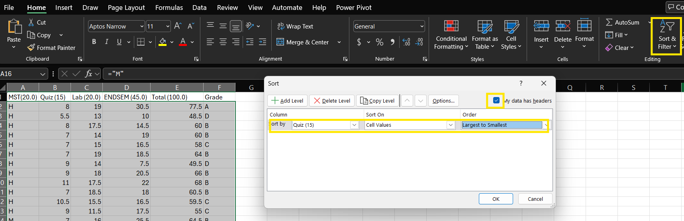 |
|:--:|
| *Figura : Proceso de ordenamiento de los registros basado en el atributo Quiz* |

- Se clasificaron los registros manualmente de la siguiente manera:

    - Primeros 12 registros: Reemplaza sus campos de Quiz con **H**

        | 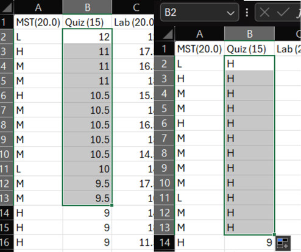 |
        |:--:|
        | *Figura : Asignación de la categoría H (Alto) a los estudiantes con mejor rendimiento en Quiz* |

    - Los registros de las filas 50 al 61 se reemplazan sus campos de Quiz con **L**

        | 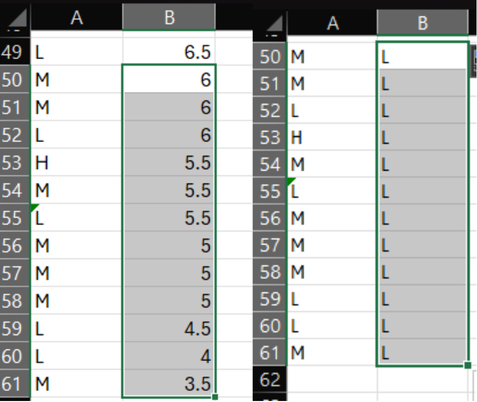 |
        |:--:|
        | *Figura : Asignación de la categoría L (Bajo) a los estudiantes con menor rendimiento en Quiz* |

    - Los registros restantes en la columna de Quiz se reemplazan las notas con **M**

        | 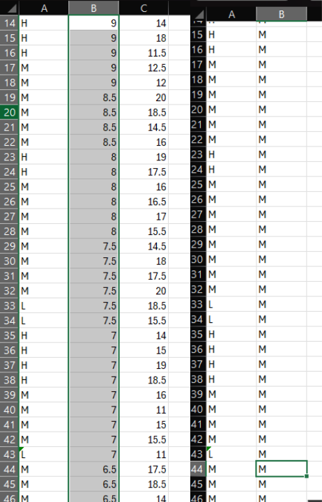 |
        |:--:|
        | *Figura : Asignación de la categoría M (Medio) a la mayoría de los estudiantes según la segmentación establecida* |

3. **Columna Lab**

- Se realizó un ordenamiento en el dataset por el atributo **Lab** de mayor a menor.

| 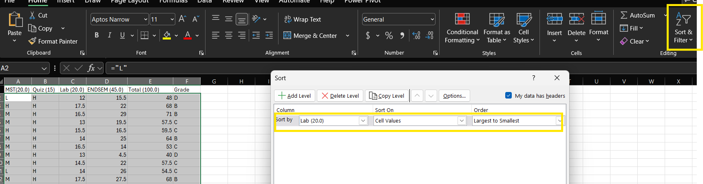 |
|:--:|
| *Figura : Proceso de ordenamiento de los registros basado en el atributo lAB* |

- Se verificaron los puntos de corte debido a que en esta columna, en los extremos superiores e inferiores los valores eran los mismos. En el borde de H se tenía repetido el 18 y en el borde de L estaba repetido el 13.5. Por lo tanto, ambos valores se van a categorizar como M.

| 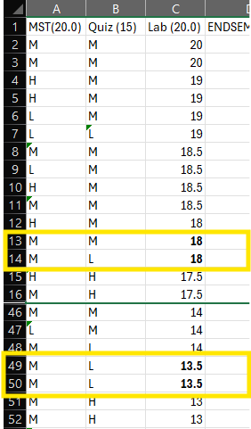 |
|:--:|
| *Figura : Valores duplicados en los puntos de corte* |

- Entonces se clasificaron los registros manualmente de la siguiente manera:

    - Primeros 10 registros: Reemplaza sus campos de Lab con **H**

        | 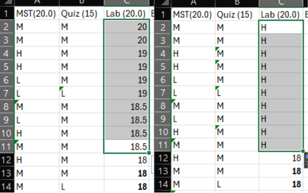 |
        |:--:|
        | *Figura : Asignación de la categoría H (Alto) a los estudiantes con mejor rendimiento en Lab* |

    - Los registros de las filas 51 al 61 se reemplazan sus campos de Lab con **L**

        | 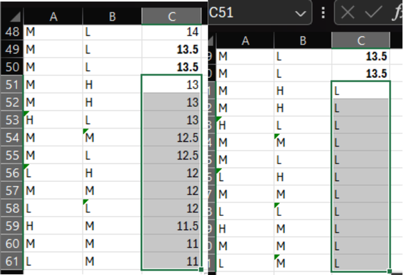 |
        |:--:|
        | *Figura : Asignación de la categoría L (Bajo) a los estudiantes con menor rendimiento en Lab* |

    - Los registros restantes en la columna de Lab se reemplazan las notas con **M**

        | 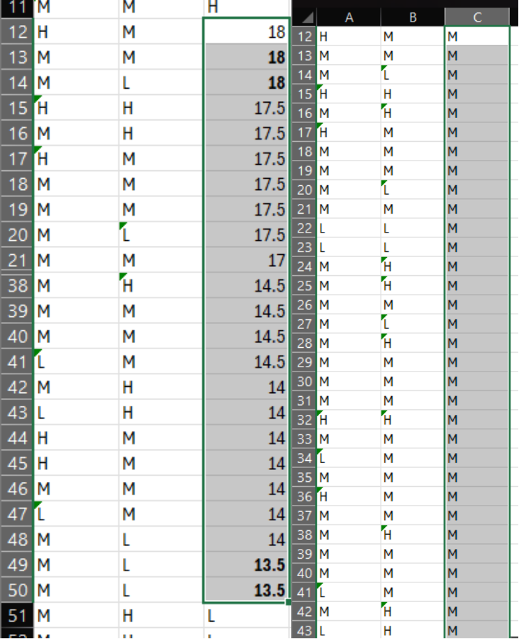 |
        |:--:|
        | *Figura : Asignación de la categoría M (Medio) a la mayoría de los estudiantes según la segmentación establecida* |

4. **Columna ENDSEM**

- Se realizó un ordenamiento en el dataset por el atributo **ENDSEM** de mayor a menor.

| 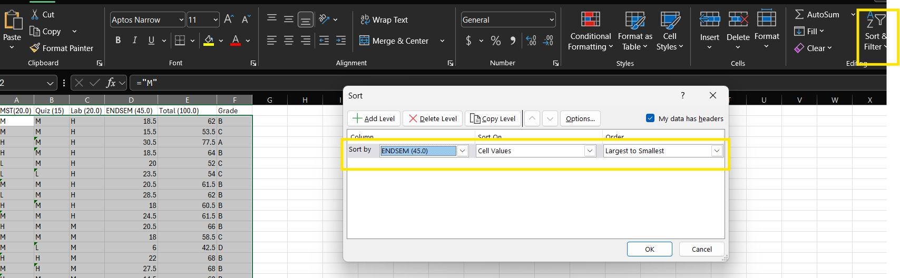 |
|:--:|
| *Figura : Proceso de ordenamiento de los registros basado en el atributo ENDSEM* |

- Se verificaron los puntos de corte debido a que en esta columna, en el extremo superior los valores eran los mismos en la fila 12 y 13. Por lo tanto, estos valores repetidos se van a categorizar con M.

| 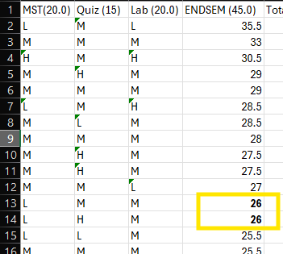 |
|:--:|
| *Figura : Valores duplicados en los puntos de corte* |

- Entonces se clasificaron los registros manualmente de la siguiente manera:

    - Primeros 11 registros: Reemplaza sus campos de ENDSEM con **H**

        | 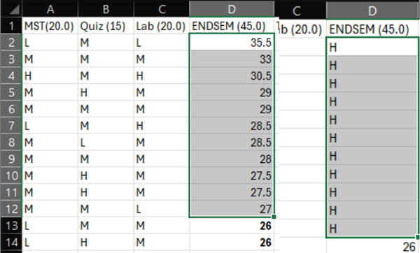 |
        |:--:|
        | *Figura : Asignación de la categoría H (Alto) a los estudiantes con mejor rendimiento en ENDSEM* |

    - Los registros de las filas 50 al 61 se reemplazan sus campos de ENDSEM con **L**

        | 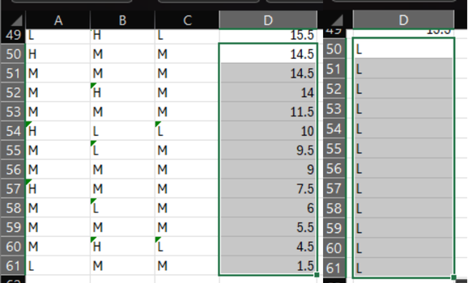 |
        |:--:|
        | *Figura : Asignación de la categoría L (Bajo) a los estudiantes con menor rendimiento en ENDSEM* |

    - Los registros restantes en la columna de ENDSEM se reemplazan las notas con **M**

        | 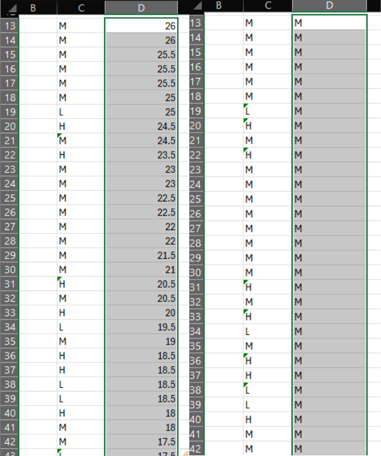 |
        |:--:|
        | *Figura : Asignación de la categoría M (Medio) a la mayoría de los estudiantes según la segmentación establecida* |

#### 5.2.2. Tratamiento de valores duplicados en puntos de corte

Antes de asignar las categorías H, M y L en cada columna, se verificaron los valores en los dos puntos de corte del ordenamiento descendente: la frontera entre la posición 12 y la 13 (límite H/M) y la frontera entre la posición 48 y la 49 (límite M/L). El criterio adoptado es que un mismo valor numérico no puede quedar asignado a dos categorías distintas; cuando esto ocurre, todos los registros con ese valor se desplazan hacia la categoría central (M) y el límite de la categoría extrema (H o L) se contrae al siguiente valor distinto.

* **MST (20.0)**
Al ordenar de mayor a menor, el valor en la posición 12 fue 17.0 y en la posición 13 fue 16.0 (frontera H/M); el valor en la posición 48 fue 10.5 y en la posición 49 fue 10.0 (frontera M/L). Todos distintos. Sin ajuste.
Resultado: L (≤ 10.0, 12 registros) · M (10.5 – 16.0, 36 registros) · H (≥ 17.0, 12 registros).

* **Quiz (15)**
Al ordenar de mayor a menor, el valor en la posición 12 fue 9.5 y en la posición 13 fue 9.0 (frontera H/M); el valor en la posición 48 fue 6.5 y en la posición 49 fue 6.0 (frontera M/L). Todos distintos. Sin ajuste.
Resultado: L (≤ 6.0, 12 registros) · M (6.5 – 9.0, 36 registros) · H (≥ 9.5, 12 registros).

* **Lab (20.0)**
Al ordenar de mayor a menor, el valor en la **posición 12 fue 18.0** y en la **posición 13 también fue 18.0** (duplicado en frontera H/M). Aplicando el criterio de contracción, todos los registros con **Lab = 18.0 se asignaron a M**; la categoría H quedó restringida a valores ≥ 18.5 (10 registros). En la frontera opuesta, el valor en la **posición 48 fue 13.5** y en la **posición 49 también fue 13.5** (duplicado en frontera M/L). Todos los registros con **Lab = 13.5 se asignaron a M**; la categoría L quedó restringida a valores ≤ 13.0 (11 registros).
Resultado: L (≤ 13.0, 11 registros) · M (13.5 – 18.0, 39 registros) · H (≥ 18.5, 10 registros).

* **ENDSEM (45.0)**
Al ordenar de mayor a menor, el valor en la **posición 12 fue 26.0** y en la **posición 13 también fue 26.0** (duplicado en frontera H/M). Todos los registros con ENDSEM = 26.0 se asignaron a M; la categoría H quedó restringida a valores ≥ 27.0 (11 registros). La frontera M/L (posición 48 vs 49) mostró valores 15.5 y 14.5, distintos entre sí. Sin ajuste en ese extremo.
Resultado: L (≤ 14.5, 12 registros) · M (15.5 – 26.0, 37 registros) · H (≥ 27.0, 11 registros).

#### 5.2.3. Dataset resultante

 La columna Total, se elimina también de este dataset y la columna Grade se deja tal como está desde un inicio. Por lo tanto, el dataset con la discretización manual queda de la siguiente manera:

| 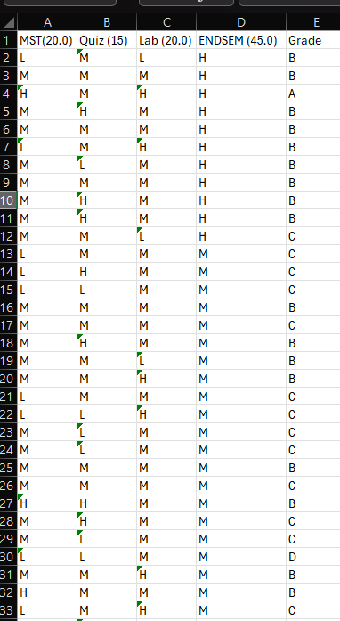 |
|:--:|
| *Figura : Dataset con discretización manual aplicada* |

### 5.3. Ejecución del Predictive Apriori sobre datos discretizados manualmente

1. En WEKA se carga el csv discretizado y en el panel se muestran los 5 atributos pertenecientes a las columnas del csv, en deonde todas estas son de tipo nominal. Además, se muestra que hay 60 datos en la sección de *Instances*

| 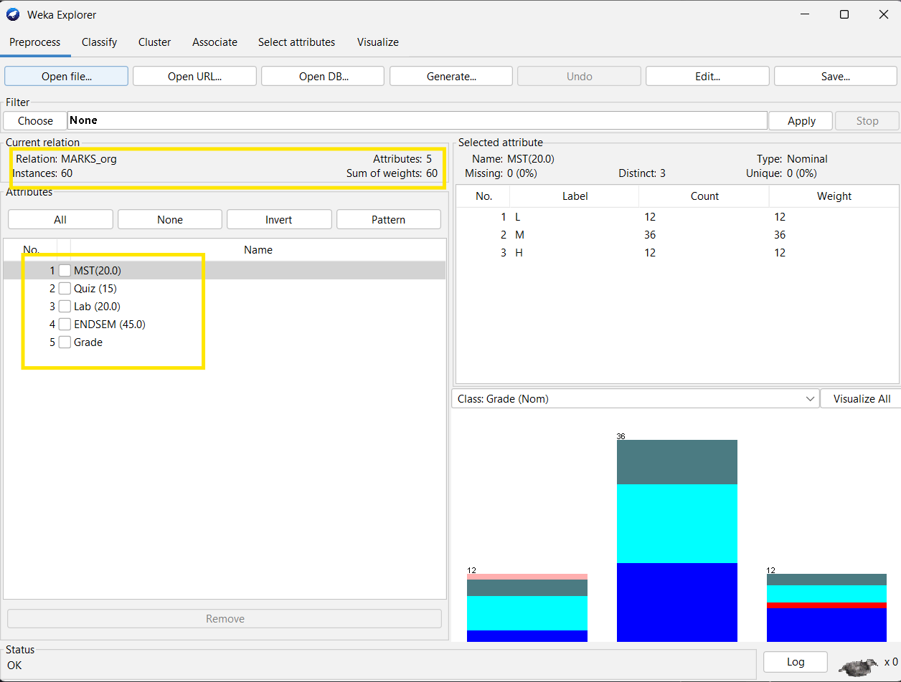 |
|:--:|
| *Figura : Carga del Dataset en Weka* |

2. A continuación se accedió a la pestaña Associate y se seleccionó el algoritmo PredictiveApriori.
El parámetro `car` se mantuvo en `True` para generar Class Association Rules (CAR), es decir, reglas cuyo consecuente es siempre la variable Grade. El parámetro `numRules` se dejó en su valor por defecto de 100. Se ejecutó el algoritmo con el botón Start.

| 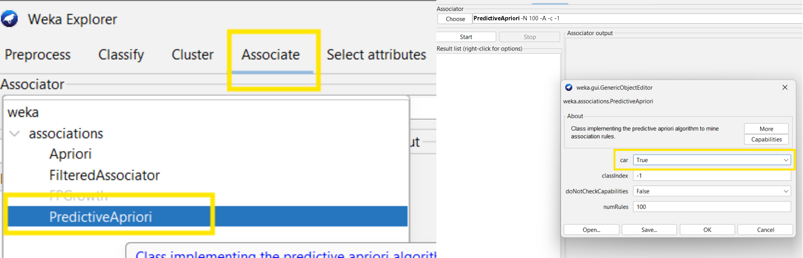 |
|:--:|
| *Figura : Configuración del algoritmo PredictiveApriori en Weka* |

### 5.4. Resultados obtenidos

El algoritmo generó 88 reglas ordenadas de mayor a menor precisión predictiva (acc). La Tabla siguiente resume las 10 reglas con mayor confiabilidad:

| # | Antecedente | Consecuente | Soporte | acc |
|---|-------------|-------------|---------|-----|
| 1 | Lab=M ∧ ENDSEM=H | Grade=B | 7/60 | 0.983 |
| 2 | MST=M ∧ Quiz=M ∧ ENDSEM=L | Grade=D | 4/60 | 0.956 |
| 3 | Quiz=H ∧ ENDSEM=H | Grade=B | 3/60 | 0.932 |
| 4 | Quiz=L ∧ Lab=L | Grade=D | 3/60 | 0.932 |
| 5 | Quiz=L ∧ ENDSEM=L | Grade=D | 3/60 | 0.932 |
| 6 | MST=L ∧ Quiz=M ∧ ENDSEM=M | Grade=C | 3/60 | 0.932 |
| 7 | MST=M ∧ Quiz=L ∧ Lab=M ∧ ENDSEM=M | Grade=C | 3/60 | 0.932 |
| 8 | MST=L ∧ ENDSEM=H | Grade=B | 2/60 | 0.892 |
| 9 | Lab=L ∧ ENDSEM=L | Grade=D | 2/60 | 0.892 |
| 10 | MST=L ∧ Lab=L ∧ ENDSEM=M | Grade=D | 2/60 | 0.892 |

| 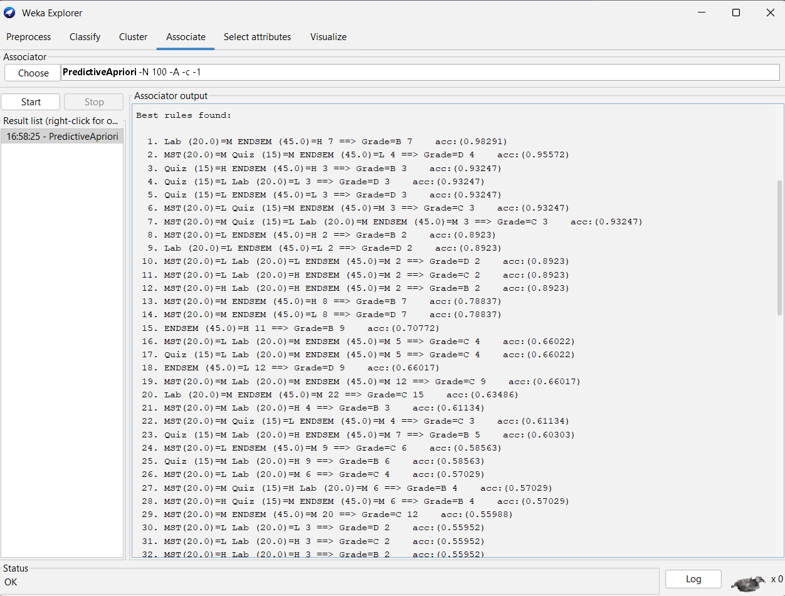 |
|:--:|
| *Figura : Primeras reglas generadas por PredictiveApriori ordenadas por precisión predictiva descendente* |

### 5.5. Generación de reglas con CAR (Class Association Rules)

El uso del parámetro `car=True` restringe el consecuente de todas las reglas a la variable clase Grade. Esto convierte el problema de association mining en un problema de clasificación basada en reglas, donde cada regla describe un perfil de estudiante y predice su calificación final.

Del análisis de las reglas obtenidas se identifican tres patrones principales:

**Predicción de Grade=B (alto rendimiento):**
La regla de mayor precisión (acc=0.983) establece que un estudiante con Lab medio y ENDSEM alto obtendrá con casi total certeza una B. Esto sugiere que un desempeño alto en el examen final compensa niveles medios en los demás componentes. 
La regla 8 (acc=0.892) refuerza esta idea: incluso con MST bajo, un ENDSEM alto lleva al estudiante a grado B.

**Predicción de Grade=D (bajo rendimiento):**
Las reglas 2, 4, 5, 9 y 10 convergen en un patrón claro: cualquier combinación de dos o más componentes en categoría L, especialmente cuando ENDSEM=L, predice con alta precisión una D. ENDSEM resulta ser el factor más determinante del rendimiento final, lo que es coherente con su peso de 45 puntos sobre 100.

**Predicción de Grade=C (rendimiento medio):**
Los perfiles con MST bajo o Quiz bajo combinados con ENDSEM medio tienden a resultar en grado C, como muestran las reglas 6 y 7. Esto indica que un desempeño inconsistente entre componentes posiciona al estudiante en el rango medio.

**Hallazgo transversal:** 
ENDSEM aparece como el atributo con mayor poder predictivo, presente en 8 de las 10 reglas principales. Su peso relativo de 45% en la nota final explica esta dominancia en las reglas de asociación generadas.

### 5.6. Variante: Exclusión de valores medios (reemplazo de M por ?)

El objetivo de esta variante es eliminar reglas con patrones mixtos, es decir, ambigüedades.

#### 5.6.1. Procedimiento

Se abre el dataset discretizado en excel. Dentro del csv se van a reemplazar todos los datos que se categorizaron con M se reemplazan por '?'. El proceso realizó 148 reemplazos en total: 36 en MST, 36 en Quiz, 39 en Lab y 37 en ENDSEM.

| 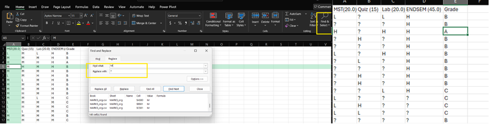 |
|:--:|
| *Figura : Dataset con valores M reemplazados por ? para excluir perfiles medios del análisis de asociación* |

Se guarda este CSV con el nombre: *MARKS_org_MReplace.csv* y se cargó en Weka siguiendo el mismo procedimiento anterior. Se ejecutó PredictiveApriori con los mismos parámetros (car=True, numRules=100).

| 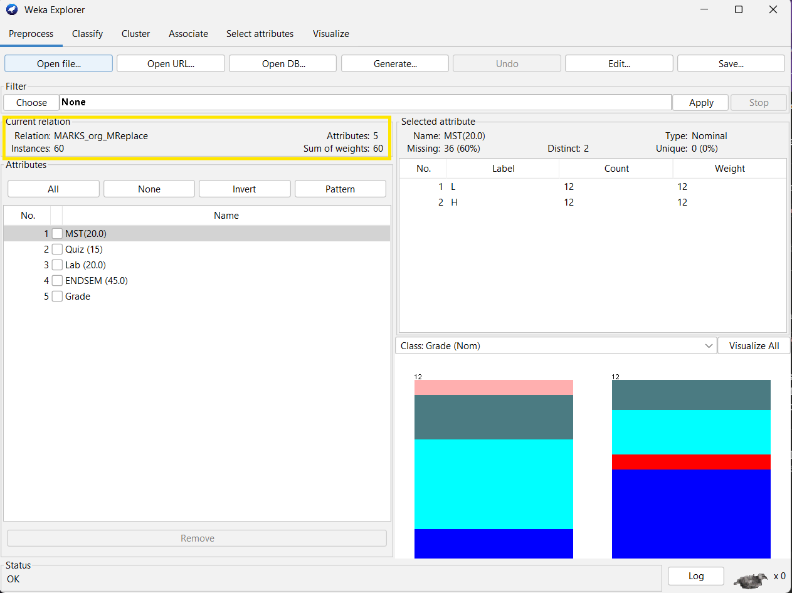 |
|:--:|
| *Figura : Dataset cargado en WEKA* |

#### 5.6.2. Resultados obtenidos

El algoritmo generó 27 reglas, frente a las 88 de la versión completa. La reducción se debe directamente a que los registros con valores M quedan excluidos, dejando únicamente los perfiles claramente extremos (H o L) para construir asociaciones.

| 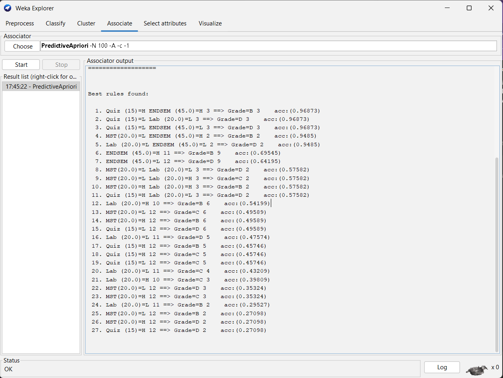 |
|:--:|
| *Figura : Reglas generadas por PredictiveApriori tras excluir los valores medios del dataset* |

Las cinco reglas de mayor precisión obtenidas son:

| # | Antecedente | Consecuente | Soporte | acc |
|---|-------------|-------------|---------|-----|
| 1 | Quiz=H ∧ ENDSEM=H | Grade=B | 3/60 | 0.969 |
| 2 | Quiz=L ∧ Lab=L | Grade=D | 3/60 | 0.969 |
| 3 | Quiz=L ∧ ENDSEM=L | Grade=D | 3/60 | 0.969 |
| 4 | MST=L ∧ ENDSEM=H | Grade=B | 2/60 | 0.948 |
| 5 | Lab=L ∧ ENDSEM=L | Grade=D | 2/60 | 0.948 |

**Comparación con la versión completa:**
Las reglas equivalentes que aparecen en ambas variantes presentan una precisión sistemáticamente mayor en la versión sin M. Por ejemplo, la regla Quiz=H ∧ ENDSEM=H → Grade=B pasó de acc=0.932 a acc=0.969, y la regla MST=L ∧ ENDSEM=H → Grade=B pasó de acc=0.892 a acc=0.948.

Este incremento se explica porque al eliminar los perfiles medios, el algoritmo trabaja exclusivamente con estudiantes en los extremos del rendimiento, donde los patrones son más consistentes y predecibles.Como contrapartida, las reglas resultantes tienen menor cobertura: la mayor parte del dataset (los estudiantes con desempeño M) queda fuera del análisis, lo que limita la generalización de las reglas a solo una fracción de la población estudiantil.

En ambas variantes, ENDSEM (45.0) se confirma como el atributo con mayor poder predictivo, apareciendo en las reglas de mayor precisión de los dos experimentos. Su peso relativo del 45% en la calificación final explica su dominancia en los patrones de asociación identificados.

### 5.7. Análisis comparativo

#### 5.7.1. Discretización automática vs. manual

La discretización automática con 10 intervalos generó reglas cuyo antecedente principal fue el atributo Total, alcanzando precisiones entre 0.96499 y 0.98064. Esto ocurrió porque los intervalos numéricos del puntaje total se alinearon casi directamente con los rangos de cada calificación, produciendo asociaciones evidentes del tipo Total = '(53.25–54.75]' ⇒ Grade = C. Si bien estas reglas son precisas, reflejan una relación prácticamente determinista entre el puntaje acumulado y la nota final, lo cual aporta poca información nueva sobre el rendimiento del estudiante.
En contraste, la discretización manual con categorías H, M y L eliminó el atributo Total del dataset y obligó al algoritmo a buscar asociaciones directamente entre las evaluaciones parciales (MST, Quiz, Lab, ENDSEM) y la variable Grade. Las reglas resultantes, como Lab=M ∧ ENDSEM=H ⇒ Grade=B (acc=0.983), describen perfiles de rendimiento basados en la combinación de componentes individuales. Aunque la precisión máxima fue ligeramente inferior a la obtenida con discretización automática, las reglas manuales resultaron más informativas porque permiten identificar qué combinaciones específicas de desempeño parcial conducen a cada calificación, algo que la presencia del atributo Total opacaba en el ejercicio 10.8.

#### 5.7.2. Reglas generales vs. reglas de clase (CAR)

En el ejercicio 10.8, Predictive Apriori generó reglas generales sin restricción sobre el consecuente, lo que produjo asociaciones en múltiples direcciones: desde el Total hacia Grade, pero también entre evaluaciones parciales y el puntaje total, o entre combinaciones de atributos sin involucrar necesariamente la calificación final. Esto ofreció una visión amplia de las relaciones existentes en el dataset, aunque muchas reglas resultaron redundantes o de difícil aplicación práctica, como aquellas que simplemente vinculaban rangos del Total con rangos de sus propios componentes.
Al activar el parámetro CAR=True en el ejercicio 10.9, todas las reglas se orientaron hacia la predicción de Grade como consecuente. Esta restricción redujo la cantidad de reglas generadas (88 frente a 100), pero cada una de ellas respondía directamente a una pregunta útil: dado un perfil de evaluaciones parciales, ¿qué calificación se espera? Esto convirtió el análisis de asociación en un problema más cercano a la clasificación, donde las reglas funcionan como descriptores de perfiles estudiantiles. En el contexto de esta práctica, las reglas CAR resultaron más interpretables y orientadas a la toma de decisiones, mientras que las reglas generales fueron más útiles para explorar relaciones estructurales entre los atributos del dataset.

#### 5.7.3. Con valores medios vs. sin valores medios

La versión con las tres categorías (H, M, L) generó 88 reglas, donde varias de ellas incluían la categoría M en el antecedente. Estas reglas capturaron patrones de rendimiento intermedio, como MST=M ∧ Quiz=M ∧ ENDSEM=L ⇒ Grade=D (acc=0.956), que describen estudiantes con desempeño medio en algunos componentes pero bajo en otros. Sin embargo, la presencia mayoritaria de registros M (entre 36 y 39 por columna) también generó reglas con antecedentes ambiguos, donde la categoría media no delimitaba con claridad el perfil del estudiante.
Al reemplazar los valores M por datos perdidos, el algoritmo trabajó exclusivamente con los perfiles extremos (H y L), reduciendo la cantidad de reglas a 27. Las reglas equivalentes que aparecieron en ambas variantes mostraron un incremento sistemático en la precisión predictiva: por ejemplo, Quiz=H ∧ ENDSEM=H ⇒ Grade=B subió de 0.932 a 0.969. Este aumento se debe a que, al excluir los perfiles intermedios, los patrones restantes son más consistentes y el algoritmo encuentra menos excepciones. No obstante, esta ganancia en precisión tiene como costo una pérdida significativa de cobertura, dado que la mayoría de los estudiantes del dataset quedaron fuera del análisis. En la práctica, la variante sin M resulta útil para identificar señales claras de riesgo o de alto rendimiento, pero no reemplaza al análisis completo si el objetivo es describir a toda la población estudiantil.

---

## 6. Análisis global de resultados

### 6.1. Comparación entre algoritmos (Apriori vs. Predictive Apriori)

En esta sección se realizará una comparación entre los algoritmos **Apriori** y **Predictive Apriori**, considerando los resultados obtenidos en los ejercicios 10.6, 10.7, 10.8 y 10.9.

Apriori fue aplicado sobre los datasets transaccionales **DailyItem** y **DailyItem2**, mientras que Predictive Apriori fue utilizado sobre el dataset de rendimiento académico previamente discretizado.

La comparación deberá considerar los siguientes aspectos:

* Parámetros requeridos por cada algoritmo.
* Cantidad de reglas obtenidas.
* Métrica utilizada para ordenar las reglas.
* Facilidad de interpretación de los resultados.
* Tipo de dataset sobre el cual fue aplicado cada algoritmo.

| Criterio | Apriori | Predictive Apriori |
|:---|:---|:---|
| Parámetros principales | Soporte mínimo y confianza mínima | Número de reglas y precisión predictiva |
| Tipo de datos | Datos nominales o transaccionales | Datos nominales o numéricos discretizados |
| Ordenamiento de reglas | Confianza, lift u otra métrica | Precisión predictiva |
| Ejercicios aplicados | 10.6 y 10.7 | 10.8 y 10.9 |
| Resultado principal | [Completar con resultados] | [Completar con resultados] |

*Tabla X: Comparación entre Apriori y Predictive Apriori*

A partir de los resultados obtenidos, se observó que [completar comparación utilizando los resultados de todos los ejercicios].

---

### 6.2. Impacto del tipo de datos en la minería de asociación

Los ejercicios desarrollados utilizaron dos tipos principales de datos: datos transaccionales binarios y datos numéricos correspondientes al rendimiento académico.

Los datasets **DailyItem** y **DailyItem2** representan la presencia o ausencia de productos dentro de cada transacción. Estos datos pueden convertirse directamente a atributos nominales mediante el filtro `NumericToNominal`.

Por otro lado, el dataset de rendimiento académico contiene atributos numéricos continuos, como **MST**, **Quiz**, **Lab**, **ENDSEM** y **Total**. Debido a que los algoritmos de asociación de Weka no trabajan directamente con este tipo de atributos, fue necesario aplicar un proceso de discretización.

| Tipo de datos | Dataset | Preprocesamiento requerido | Ejemplo de regla |
|:---|:---|:---|:---|
| Transaccionales binarios | DailyItem / DailyItem2 | NumericToNominal | Jam=1 → Cornflakes=1 |
| Numéricos | MARKS_org | Discretize | Total=Alto → Grade=B |

*Tabla X: Influencia del tipo de datos en el proceso de minería de asociación*

Los datos transaccionales producen reglas directas relacionadas con la presencia conjunta de productos, mientras que los datos académicos generan reglas relacionadas con intervalos de rendimiento y categorías de calificación.

En consecuencia, el tipo de dato influye directamente en el preprocesamiento necesario, en la forma de las reglas obtenidas y en su posterior interpretación.

---

### 6.3. Influencia de la discretización en la calidad de las reglas

La discretización fue un proceso fundamental para aplicar Predictive Apriori sobre el dataset de rendimiento académico.

En el ejercicio 10.8 se utilizó una discretización automática mediante el filtro `Discretize` de Weka, mientras que en el ejercicio 10.9 se realizó una discretización manual basada en la distribución:

* 20% inferior: categoría **L**.
* 60% intermedio: categoría **M**.
* 20% superior: categoría **H**.

| Criterio | Discretización automática | Discretización manual |
|:---|:---|:---|
| Definición de intervalos | Generada automáticamente por Weka | Definida mediante percentiles |
| Categorías obtenidas | Intervalos numéricos | H, M y L |
| Control del analista | Menor | Mayor |
| Interpretación | Puede ser menos intuitiva | Más directa |
| Resultado obtenido | [Completar] | [Completar] |

*Tabla X: Comparación entre discretización automática y manual*

La discretización automática permitió [completar con resultados del ejercicio 10.8].

La discretización manual permitió [completar con resultados del ejercicio 10.9].

También se evaluó el efecto de activar la opción `CAR=true`, con el objetivo de generar reglas cuyo consecuente estuviera relacionado con la clase seleccionada.

Asimismo, se reemplazó la categoría media **M** por valores perdidos (`?`) para analizar si la eliminación de los valores intermedios producía reglas más específicas.

| Variante | Cantidad de reglas | Precisión predictiva | Observación principal |
|:---|:---:|:---:|:---|
| Discretización automática | [Completar] | [Completar] | [Completar] |
| Discretización manual | [Completar] | [Completar] | [Completar] |
| CAR=true | [Completar] | [Completar] | [Completar] |
| Sin valores medios | [Completar] | [Completar] | [Completar] |

*Tabla X: Resultados de las variantes de discretización y generación de reglas*

En general, los resultados muestran que la forma en que se discretizan los datos modifica la cantidad, precisión e interpretabilidad de las reglas obtenidas.

---

### 6.4. Aplicabilidad de las reglas encontradas

Las reglas obtenidas mediante minería de asociación pueden utilizarse como apoyo para la toma de decisiones en distintos contextos.

En los datasets transaccionales, las reglas permiten identificar productos que suelen comprarse conjuntamente. Esta información podría utilizarse para:

* Diseñar promociones combinadas.
* Organizar productos relacionados dentro de una tienda.
* Crear sistemas de recomendación.
* Analizar hábitos de compra.

En el dataset académico, las reglas permiten relacionar las evaluaciones parciales con el puntaje total y la calificación final. Estas asociaciones podrían utilizarse para:

* Identificar patrones de rendimiento académico.
* Detectar estudiantes con posibles dificultades.
* Analizar qué evaluaciones influyen con mayor frecuencia en la nota final.
* Diseñar estrategias de acompañamiento académico.

Sin embargo, las reglas deben interpretarse con cautela. Una asociación entre dos variables no significa necesariamente que una cause directamente a la otra.

Además, los datasets DailyItem y DailyItem2 contienen pocas transacciones, por lo que sus resultados no pueden generalizarse a escenarios comerciales reales sin utilizar una muestra más amplia.

---

## 7. Conclusiones

* Los algoritmos Apriori y Predictive Apriori permitieron identificar relaciones frecuentes entre los atributos de los diferentes datasets analizados.

* Apriori fue adecuado para analizar datos transaccionales, debido a que permite controlar directamente los valores mínimos de soporte y confianza.

* Predictive Apriori facilitó la identificación de reglas sobre el dataset académico, ordenándolas según su precisión predictiva.

* Los atributos numéricos tuvieron que ser discretizados antes de aplicar los algoritmos de asociación, demostrando que el preprocesamiento depende directamente del tipo de datos utilizado.

* La discretización automática permitió generar intervalos de manera rápida, mientras que la discretización manual ofreció un mayor control sobre el significado de las categorías.

* La utilización de reglas CAR permitió orientar los resultados hacia una variable de clase específica, facilitando la interpretación de las asociaciones relacionadas con la calificación final.

* La eliminación de los valores medios permitió obtener reglas más enfocadas en casos extremos, aunque redujo la cantidad de datos disponibles para el análisis.

* Las reglas obtenidas pueden utilizarse como apoyo en contextos comerciales y educativos, pero deben analizarse considerando el tamaño del dataset, el soporte de cada regla y el hecho de que una asociación no implica causalidad.

---

## 8. Referencias bibliográficas

[1] Oracle, "Apriori," Oracle Machine Learning for SQL, 2023. [En línea]. Disponible en: https://docs.oracle.com/en/database/oracle/machine-learning/oml4sql/23/dmcon/apriori.html. [Accedido: 09-jul-2026].

[2] IBM, "Pasos fáciles para minar asociaciones," IBM Db2 Documentation, 2021. [En línea]. Disponible en: https://www.ibm.com/docs/es/db2/11.1.0. [Accedido: 09-jul-2026].

[3] Google Developers, "Datos numéricos: agrupamiento en buckets," Machine Learning Crash Course, 2024. [En línea]. Disponible en: https://developers.google.com/machine-learning/crash-course/numerical-data/binning?hl=es-419. [Accedido: 09-jul-2026].

[4] University of Waikato, "Weka Documentation," Weka Machine Learning Project. [En línea]. Disponible en: https://weka.sourceforge.io/doc.dev/. [Accedido: 10-jul-2026].

[5] M. Bharathi and D. Sharma, "Evaluating the performance of Apriori and Predictive Apriori algorithm to find new association rules based on the statistical measures of datasets," 2013.
