# 2026A-ISWD743-practica7
### Fecha: 12/06/2026
### Práctica Creación Cubo Excel

  
  
  
  
  

> [!NOTE]
>
> Este repositorio contiene el desarrollo del trabajo grupal de la Práctica 7, correspondiente a la creación de un cubo de datos multidimensional mediante tablas dinámicas en Microsoft Excel, utilizando un conjunto de datos de ventas por producto, ciudad y año.

---

> [!NOTE]
>
> Objetivos específicos:
> * Construir una tabla dinámica principal en Excel configurando los campos Producto, Fecha, Ciudad y Total para analizar ventas desde múltiples perspectivas.
> * Generar tablas dinámicas adicionales mediante duplicación y reconfiguración matricial que permitan visualizar los datos alternando las dimensiones de fila y columna.
> * Aplicar opciones de formato tabular y desactivar los totales generales para producir una estructura de cubo limpia y analíticamente comparable.

---

## Desarrollo

### Paso 1 – Configuración de la Tabla Dinámica Principal

Se creó la primera tabla dinámica mapeando los campos de la siguiente manera:

| Área        | Campo asignado   |
|-------------|------------------|
| Filas       | Productos        |
| Filtro      | Fecha            |
| Columnas    | Ciudad           |
| Valores     | Suma de Total    |

El resultado muestra las ventas totales de cada producto (Archivadores, Bolígrafos, Carpetas, Grapas, Lápices) desglosadas por ciudad (La Vega, Moca, Santiago, Santo Domingo), con el filtro de Fecha configurado para mostrar todas las fechas.

| 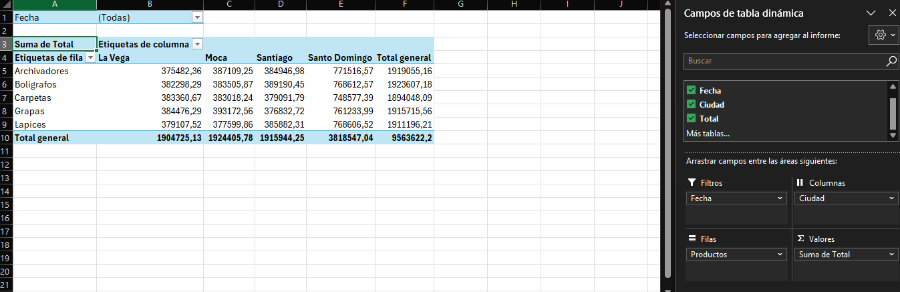 |
|:--:|
| *Figura 1: Tabla dinámica principal — Producto × Ciudad* |

---

### Pasos 2 y 3 – Construcción y Reconfiguración Matricial de las Tablas Dinámicas Secundarias

Se duplicó la tabla dinámica original y se reconfiguraron los campos para obtener **dos perspectivas alternativas**:

**Segunda tabla dinámica — Fecha × Ciudad**

Los campos se redistribuyeron así:

| Área        | Campo asignado   |
|-------------|------------------|
| Filas       | Fecha            |
| Filtro      | Productos        |
| Columnas    | Ciudad           |
| Valores     | Suma de Total    |

Esto permite comparar el desempeño de ventas por año (2014, 2015, 2016) en cada ciudad.
| 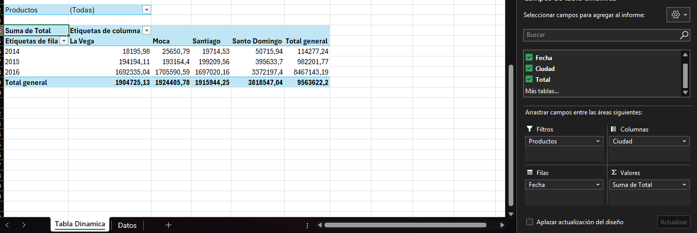 |
|:--:|
| *Figura 2: Tabla dinámica 2 — Fecha × Ciudad* |

**Tercera tabla dinámica — Fecha × Producto**

| Área        | Campo asignado   |
|-------------|------------------|
| Filas       | Fecha            |
| Columnas    | Productos        |
| Valores     | Suma de Total    |

Esta configuración expone la evolución temporal de las ventas por línea de producto.

| 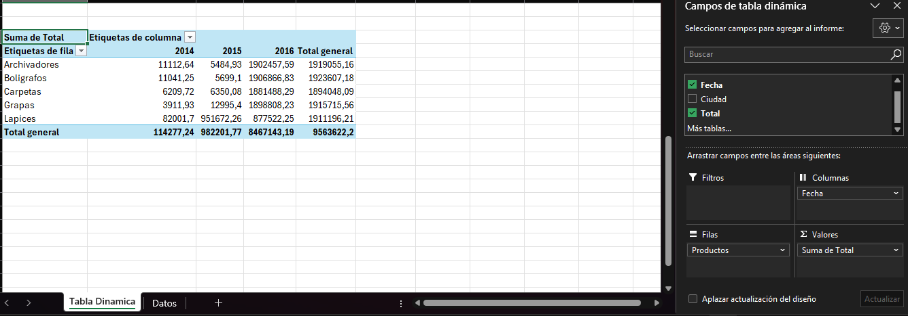 |
|:--:|
| *Figura 3: Tabla dinámica 3 — Fecha × Producto* |

---

### Pasos 4 y 5 – Desactivación de Totales Generales y Formato Tabular

Para limpiar la estructura visual y homologar el formato entre las tres tablas:

1. Se desactivó la opción **Totales Generales** (tanto para filas como para columnas) desde la pestaña **Diseño → Totales generales → Desactivado para filas y columnas**.
2. Se aplicó el formato **"Mostrar en Forma Tabular"** desde **Diseño → Diseño de informe → Mostrar en forma tabular**, lo que alinea los encabezados de forma plana y facilita la lectura tipo cubo.

El resultado final muestra las tres tablas con estructura uniforme, sin filas de totales que distorsionen la comparación analítica entre dimensiones.

| 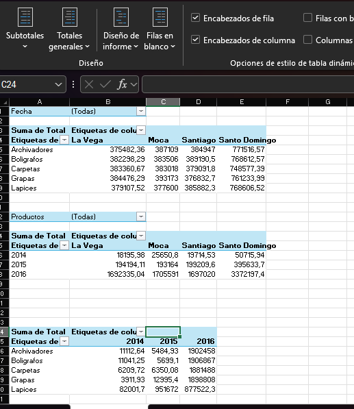 |
|:--:|
| *Figura 4: Formato totales desactivados* |

| 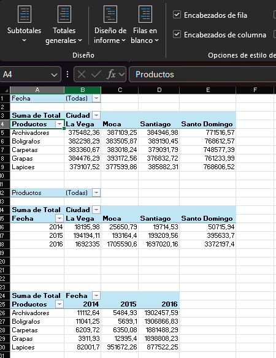 |
|:--:|
| *Figura 5: Formato tabular aplicado* |

---
### Paso 6 – Creación de la Hoja Cubo y Vinculación de Celdas

Se insertó una nueva hoja de trabajo renombrada como **'Cubo'**.

| 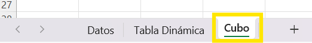 |
|:--:|
| *Figura 6: Nueva hoja de trabajo 'Cubo'* |

**6.a – Igualación de la celda inicial**

En la celda **A2** de la hoja 'Cubo' se ingresó una referencia directa a la celda **A4** de la hoja que contiene las tablas dinámicas (en este caso: `='Tabla Dinámica'!A4`), vinculando así el punto de origen de los datos.

| 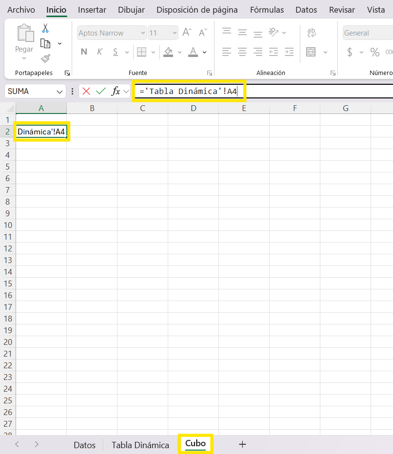 |
|:--:|
| *Figura 7: Igualación de celda A2 de la hoja Cubo con A4 de la hoja de tablas dinámicas* |

---

**6.b – Arrastre para completar las tres tablas**

Desde la celda vinculada, se arrastró la fórmula horizontal y verticalmente hasta cubrir el rango completo de las tres tablas, de modo que cualquier actualización en los datos de origen se refleje automáticamente en la hoja Cubo.

| 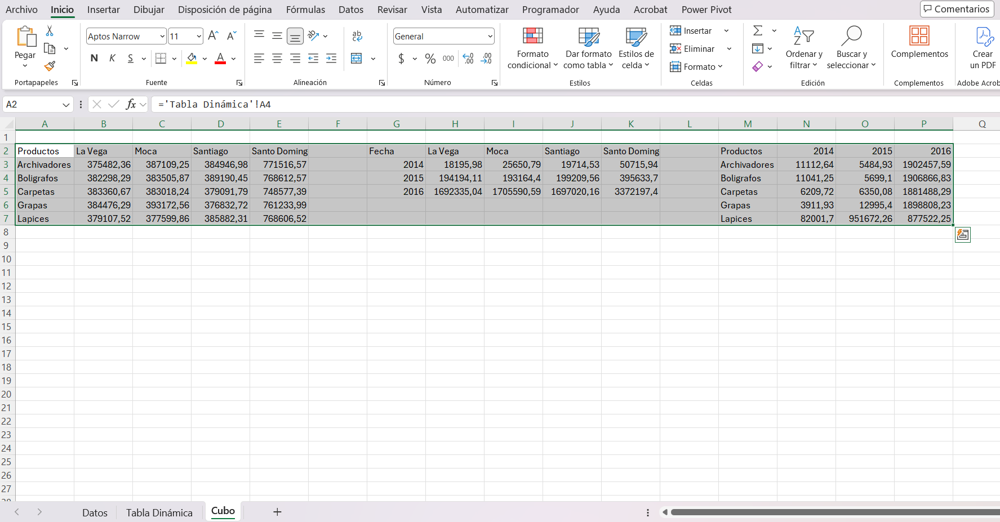 |
|:--:|
| *Figura 8: Hoja Cubo con las tres tablas completamente vinculadas*    | 

---

### Paso 7 – Aplicación de Formato de Bordes y Estilo a las Tres Tablas

Una vez vinculados todos los datos en la hoja Cubo, se aplicó formato visual uniforme a las tres tablas:

- Se seleccionó el rango de cada tabla y se aplicaron **bordes completos** desde **Inicio → Fuente → Bordes**.

| 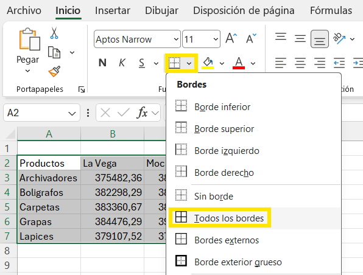 |
|:--:|
| *Figura 9: Selección de bordes* |

- Se asignaron **rellenos de color** diferentes a las tablas para distinguirlas.

| 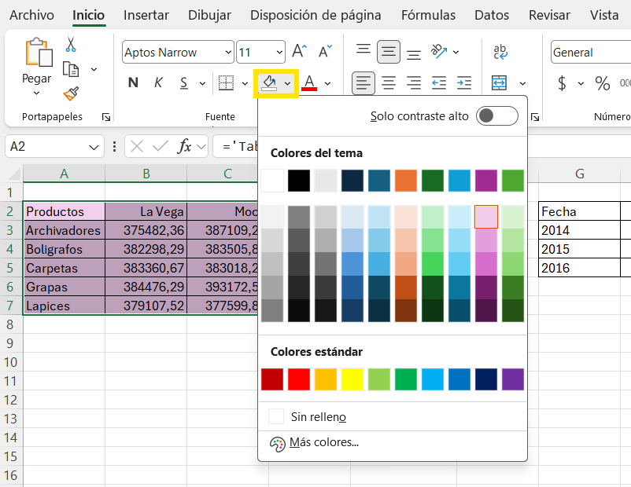 |
|:--:|
| *Figura 10: Aplicación de relleno de color a las tablas* |

- Finalmente, se ajustó el ancho de columnas y alto de filas.

| 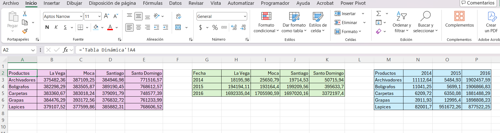 |
|:--:|
| *Figura 11: Tablas con formato de bordes y estilo aplicado en la hoja 'Cubo'* |

---

### Paso 8 – Copiar y Pegar como Imagen Vinculada

Con las tres tablas ya formateadas en la hoja **'Cubo'**, el siguiente paso consiste en copiar partes específicas de cada tabla como **imagen vinculada**. Esto permite que las imágenes se actualicen automáticamente al cambiar los datos de origen, y habilita la aplicación del efecto 3D del siguiente paso.

**8.a – Primera tabla: solo productos y valores por ciudad (sin encabezado de columnas)**

Se selecciona únicamente el rango de datos de la **Tabla 1 (Producto × Ciudad)**, excluyendo la fila de encabezado de columnas (los nombres de las ciudades). Es decir, se seleccionan solo las filas de productos con sus valores numéricos.

Pasos:
1. Seleccionar el rango de datos de la Tabla 1 **sin incluir la fila de ciudades**.
2. Ir a **Inicio → Copiar** (o `Ctrl+C`).
3. Posicionarse en la celda de destino dentro de la hoja Cubo donde irá la cara frontal del cubo.
4. Ir a **Inicio → Pegar → Como imagen vinculada** (el ícono de imagen con el símbolo de cadena).

| 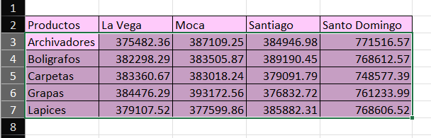 |
|:--:|
| *Figura 12: Selección del rango de la Tabla 1 excluyendo la fila de encabezados de ciudad* |

| 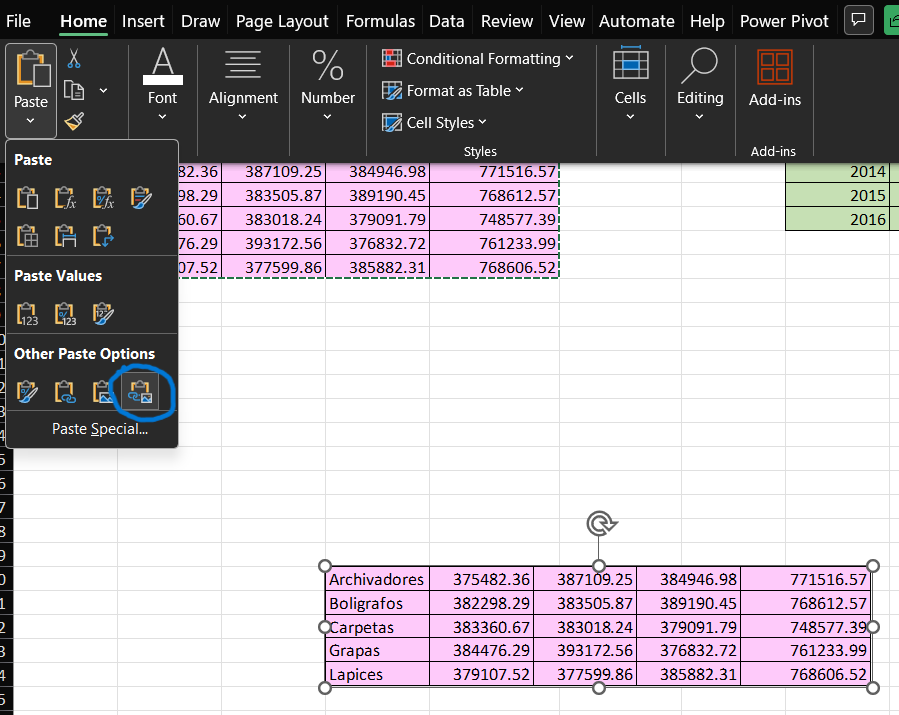 |
|:--:|
| *Figura 13: Opción "Pegar como imagen vinculada" en la cinta de opciones* |

| 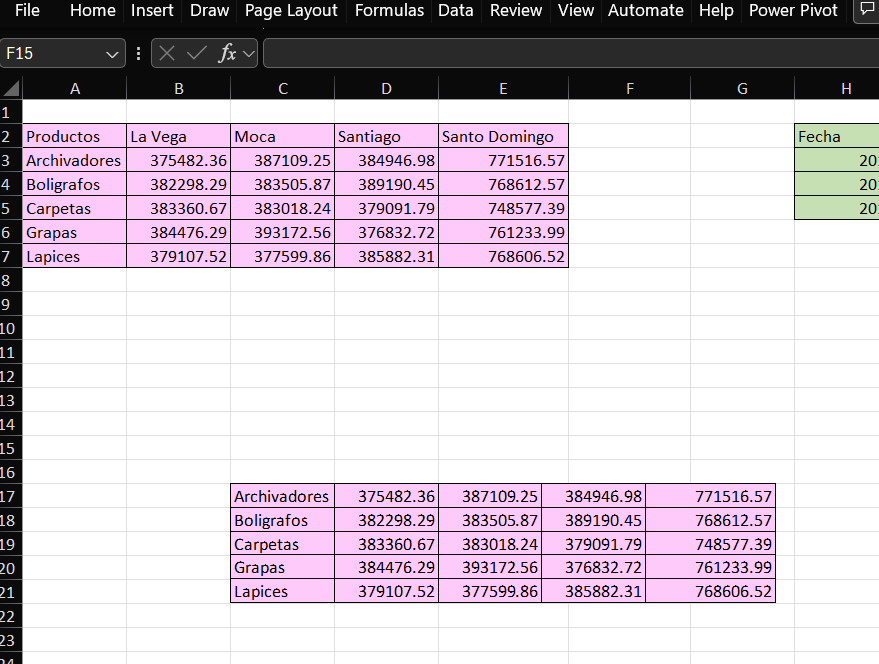 |
|:--:|
| *Figura 14: Imagen vinculada de la Tabla 1 insertada en la hoja Cubo* |

---

**8.b – Segunda tabla: completa (encabezado + datos)**

Se selecciona la **Tabla 2 (Fecha × Ciudad)** completa, incluyendo la fila de encabezado de ciudades y todas las filas de años.

Pasos:
1. Seleccionar **todo el rango** de la Tabla 2 (encabezados + datos).
2. Ir a **Inicio → Copiar** (o `Ctrl+C`).
3. Posicionarse en la celda de destino correspondiente a la cara superior del cubo.
4. Ir a **Inicio → Pegar → Como imagen vinculada**.

| 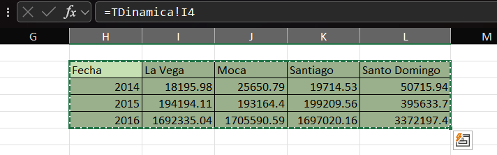 |
|:--:|
| *Figura 15: Selección completa de la Tabla 2 — Fecha × Ciudad* |

| 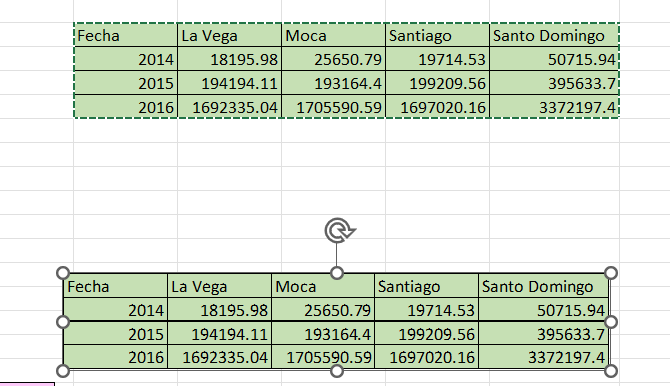 |
|:--:|
| *Figura 16: Imagen vinculada de la Tabla 2 insertada en la hoja Cubo* |

---

**8.c – Tercera tabla: solo los valores (sin encabezados de filas ni columnas)**

Se selecciona únicamente el bloque de valores numéricos de la **Tabla 3 (Fecha × Producto)**, omitiendo tanto la columna de etiquetas de fila (años) como la fila de encabezados de columna (productos).

Pasos:
1. Seleccionar **solo el bloque de valores numéricos** de la Tabla 3.
2. Ir a **Inicio → Copiar** (o `Ctrl+C`).
3. Posicionarse en la celda de destino correspondiente a la cara lateral del cubo.
4. Ir a **Inicio → Pegar → Como imagen vinculada**.

| 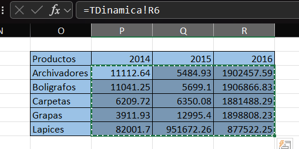 |
|:--:|
| *Figura 17: Selección únicamente del bloque de valores de la Tabla 3 — Fecha × Producto* |

| 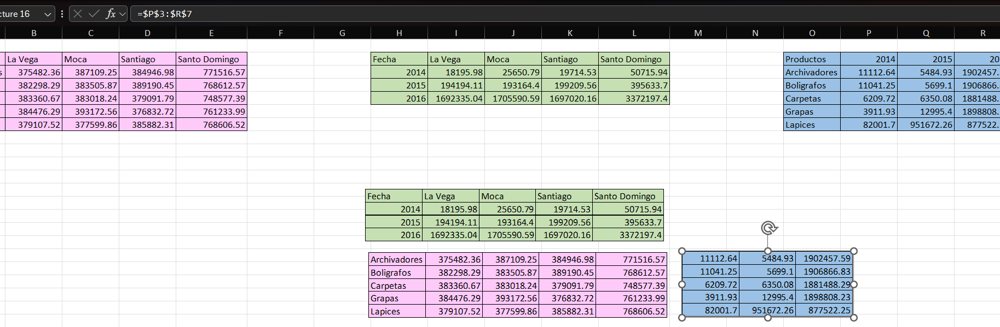 |
|:--:|
| *Figura 18: Vista general de la hoja Cubo con las tres imágenes vinculadas listas para el paso siguiente* |

---

### Paso 9 – Cubo con imágenes creadas

**9.a – Creación del cubo**
Se repite el siguiente procedimiento para **cada una de las tres imágenes vinculadas**:

1. Dar clic sobre la imagen para seleccionarla.
2. Ir a la pestaña **Formato de imagen** (aparece en la cinta al seleccionar la imagen).
3. Hacer clic en **Efectos de la imagen**.
4. Seleccionar **Giro 3D**.
5. En el submenú, elegir un preajuste de perspectiva o ingresar manualmente los valores de rotación en los ejes X, Y y Z según la cara que representa la imagen:
   - **Cara frontal** (Tabla 1): rotación que deja la imagen de frente al espectador.
   - **Cara superior** (Tabla 2): rotación que inclina la imagen hacia arriba simulando la tapa del cubo.
   - **Cara lateral** (Tabla 3): rotación que inclina la imagen hacia la derecha simulando el costado del cubo.

| 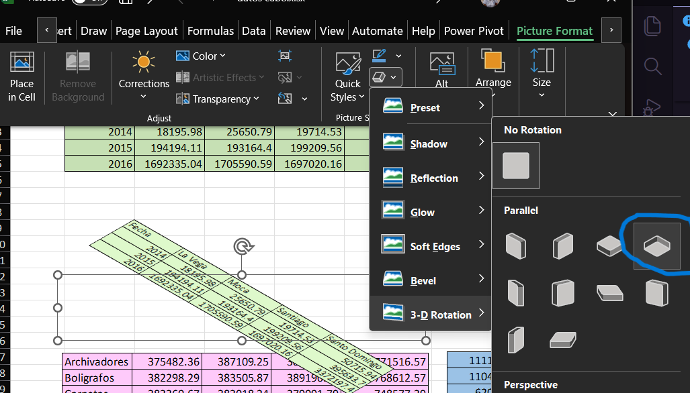 |
|:--:|
| *Figura 19: Ruta Formato de imagen → Efectos de la imagen → Giro 3D* |

| 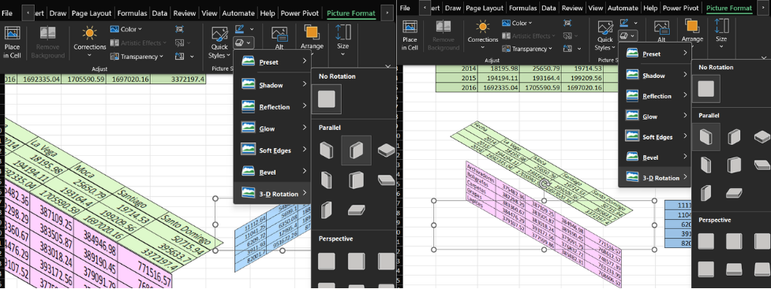 |
|:--:|
| *Figura 20: 3D aplicado a las imagenes vinculadas de la tabla 2 y 3* |

Una vez aplicado el giro a cada imagen, se arrastran y reposicionan manualmente para que las tres caras queden alineadas formando la figura del cubo: las aristas deben coincidir entre imagen e imagen.

| 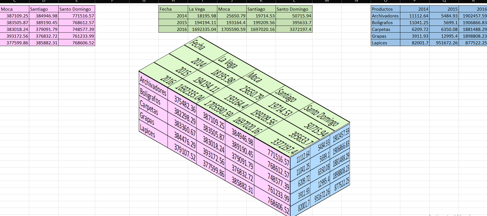 |
|:--:|
| *Figura 21: Cubo de datos tridimensional finalizado en la hoja Cubo* |

---

## Paso 13 – Prueba de Interactividad del Cubo

Se verificó el correcto funcionamiento de los filtros interactivos implementados en el cubo multidimensional. Para la prueba se aplicaron filtros simultáneos sobre las tres dimensiones principales:

- **Ciudad:** La Vega
- **Fecha:** 2014
- **Producto:** Archivadores

El objetivo fue comprobar que los cambios realizados en las segmentaciones de datos actualizan automáticamente todas las vistas vinculadas al cubo, garantizando consistencia en la navegación analítica.

| 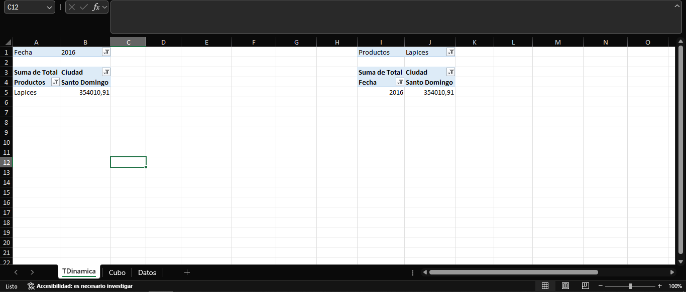 |
|:--:|
| *Figura 22: Aplicación de filtros cruzados en la tabla dinámica.* |

| 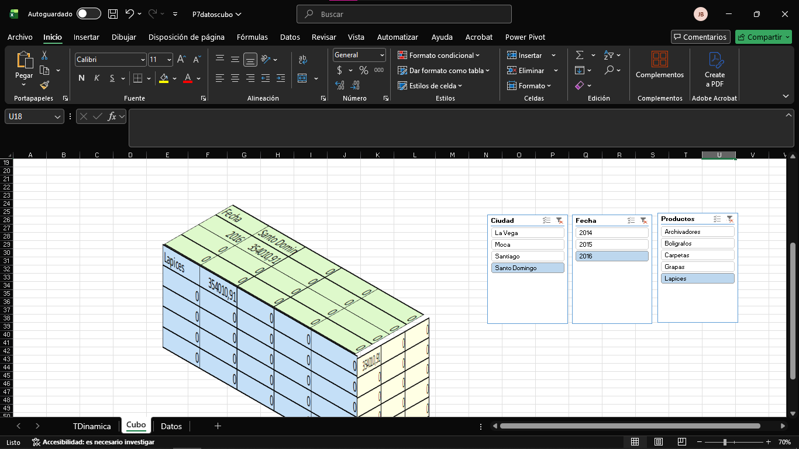 |
|:--:|
| *Figura 23: Resultado reflejado en el cubo multidimensional.* |

---

## Paso 14 – Resolución Analítica de Consultas de Negocio

### Pregunta 1

#### ¿Cuál fue el valor total de ventas de los lápices en la ciudad de Santo Domingo en el año 2016?

Para responder esta consulta se aplicaron los filtros:

- Producto = Lápices
- Ciudad = Santo Domingo
- Fecha = 2016

| 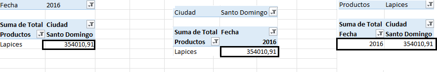 |
|:--:|
| *Figura 24: Consulta realizada sobre la tabla dinámica.* |

| 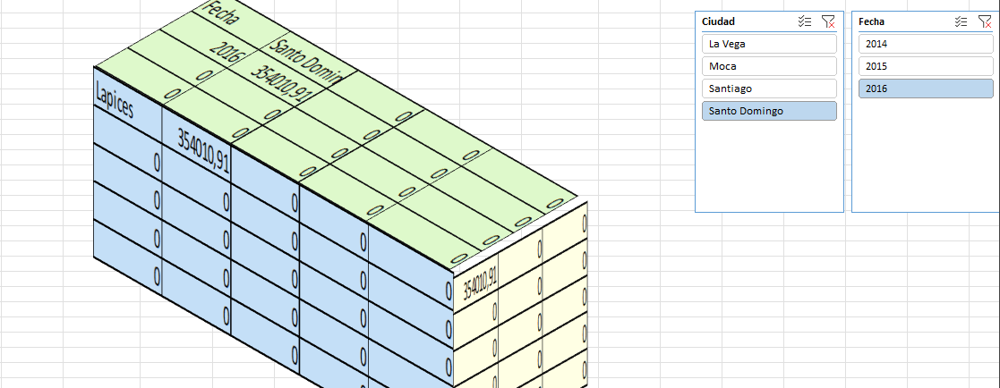 |
|:--:|
| *Figura 25: Consulta realizada sobre el cubo.* |

**Resultado:**

> Ventas totales de Lápices en Santo Domingo durante 2016: **$ 354010,91**

---

### Pregunta 2

#### ¿Qué ciudad tuvo mayores ventas de Carpetas en el año 2015?

Para responder esta consulta se aplicaron los filtros:

- Producto = Carpetas
- Fecha = 2015

Posteriormente se compararon los valores obtenidos para cada ciudad.

| 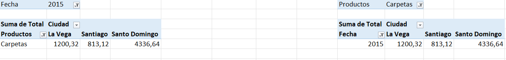 |
|:--:|
| *Figura 26: Consulta realizada sobre la tabla dinámica.* |

| 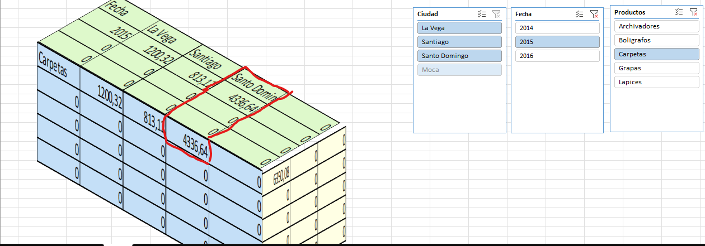 |
|:--:|
| *Figura 27: Consulta realizada sobre el cubo.* |

**Resultado:**

> La ciudad con mayores ventas de Carpetas en 2015 fue: **Santo Domingo**

---

### Pregunta 3

#### ¿Cuál es el total acumulado de ventas de Bolígrafos entre 2014 y 2016 para todas las ciudades?

Para responder esta consulta se seleccionó:

- Producto = Bolígrafos
- Fechas = 2014–2016
- Todas las ciudades

Se procedió a sumar los valores correspondientes al período completo.

| 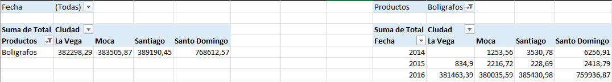 |
|:--:|
| *Figura 28: Consulta realizada sobre la tabla dinámica.* |

| 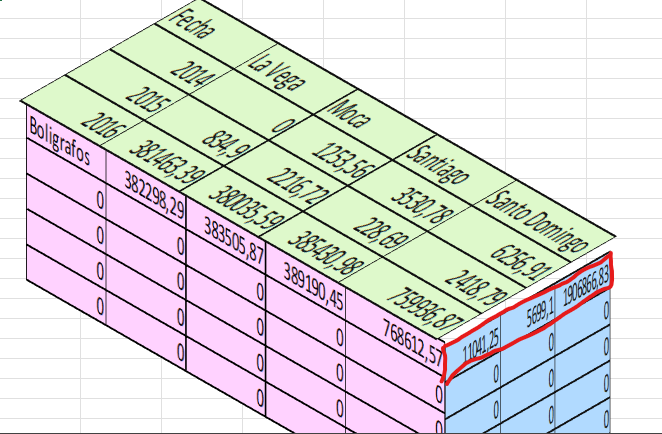 |
|:--:|
| *Figura 29: Consulta realizada sobre el cubo.* |

**Resultado:**

> Total acumulado de ventas de Bolígrafos entre 2014 y 2016: **$ 1.923.607,18**

---

### Pregunta 4

#### ¿Cómo varían las ventas de Grapas por año en la ciudad de Moca?

Para responder esta consulta se fijaron los siguientes filtros:

- Producto = Grapas
- Ciudad = Moca

Luego se observaron los valores registrados para cada año.

| 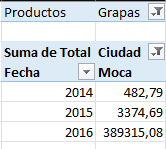 |
|:--:|
| *Figura 30: Consulta realizada sobre la tabla dinámica.* |

| 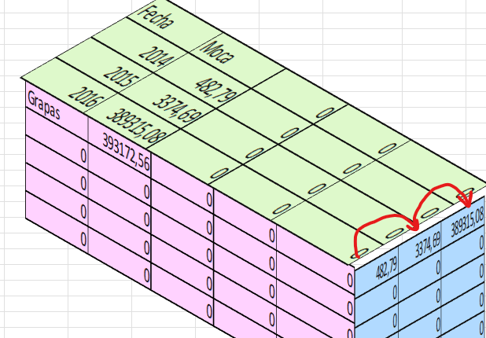 |
|:--:|
| *Figura 31: Consulta realizada sobre el cubo.* |

**Resultado:**

| Año | Ventas |
|------|---------|
| 2014 | 482,79 |
| 2015 | 3374,69|
| 2016 | 389315,08 |

---

### Pregunta 5

#### ¿Cuál fue el promedio anual de ventas de Archivadores en Santiago durante los años registrados?

Para resolver esta consulta se utilizaron los filtros:

- Producto = Archivadores
- Ciudad = Santiago

Posteriormente se calculó el promedio de ventas considerando todos los años disponibles.

| 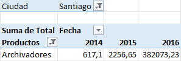 |
|:--:|
| *Figura 32: Consulta realizada sobre la tabla dinámica.* |

| 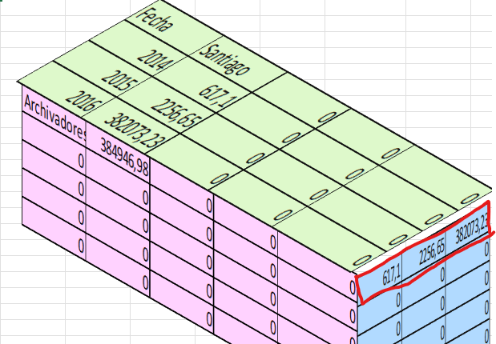 |
|:--:|
| *Figura 33: Consulta realizada sobre el cubo.* |

**Resultado:**

> Promedio anual de ventas de Archivadores en Santiago: **XXXX**
