# 2026A-ISWD743-practica4
### Fecha: 05/05/2026
### Práctica Modelo Conceptual Lógico Físico Estrella
  
</div>

[](https://github.com/andrea-m11)<br><br>
[](https://github.com/Andreina-P)<br><br>
[](https://github.com/JoseDA0721)<br><br>
[](https://github.com/JuanMateoQ)<br><br>
[](https://github.com/juansuarezb)<br><br>

>[!NOTE]
>
> Este repositorio contiene el desarrollo del trabajo grupal de la Práctica 4 de Business Intelligence, correspondiente al diseño e implementación de un modelo físico en esquema estrella y su análisis en Power Pivot.<br>
> Se implementa un proceso de normalización de datos utilizando PostgreSQL para estructurar la información en tablas de dimensiones y hechos, y posteriormente se realiza el análisis mediante Power Pivot.

---

>[!NOTE]
>
> Objetivos específicos:
> * Presentar el diagrama del modelo estrella en Power Pivot a partir del archivo products.csv.
> * Normalizar los datos del archivo Tabla_Desnormalizada_Ventas.csv en un esquema estrella.
> * Construir el modelo dimensional (tabla de hechos y dimensiones).
> * Generar consultas SQL para analizar ventas por categoría, cliente y producto.
> * Analizar métricas de negocio como ingresos, cantidades vendidas y comportamiento por mes.

---

## 1. Diagrama del modelo estrella en Power Pivot de `products.csv`

### Contexto

El modelo estrella fue implementado previamente en PostgreSQL, donde se normalizaron los datos del archivo `products.csv` en tres tablas: `dim_category`, `dim_subcategory` y `fact_products`. Las relaciones entre tablas fueron establecidas mediante claves foráneas (FK), garantizando integridad referencial.

Para la visualización en Power Pivot, los datos de estas tablas fueron exportados directamente desde PostgreSQL a Excel, replicando la misma estructura normalizada. Esto permite construir el diagrama del modelo estrella en Power Pivot manteniendo las relaciones `N:1` entre la tabla de hechos y las dimensiones, tal como fueron definidas en la base de datos.

---

### Paso 1 — Preparación de hojas en Excel

Se creó una hoja por cada tabla del modelo: `fact_products`, `dim_category` y `dim_subcategory`.

Dentro de PostgreSQL, se ejecutó una consulta `SELECT` para extraer los datos de cada tabla y se eligió la opción **Copy with headers** para copiar los resultados con encabezados.

| 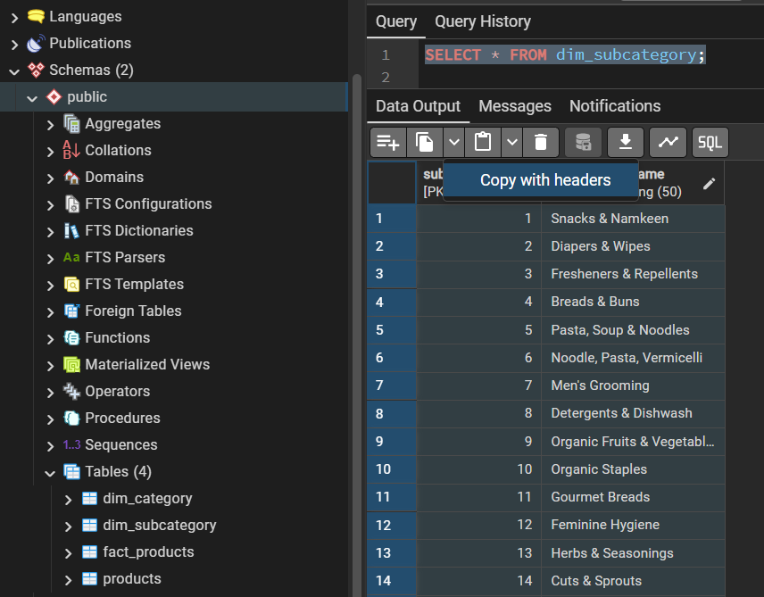 |
| :---: |
| *Figura 1: Consulta y selección de datos de la tabla dim_subcategory* |

---

### Paso 2 — Conversión a tabla de Excel

Una vez pegados los datos en la hoja correspondiente de Excel, se convirtió el rango en una tabla formal con **Ctrl + T**, marcando la opción **"La tabla tiene encabezados"**.

| 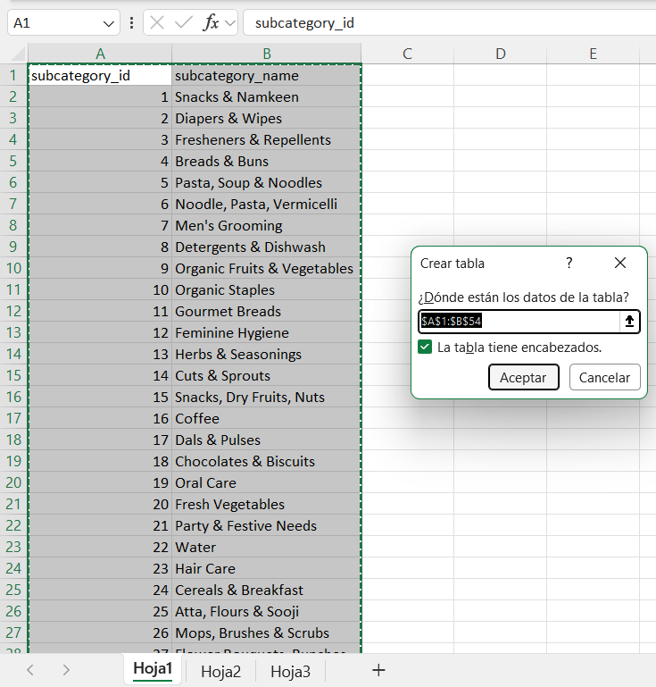 |
| :---: |
| *Figura 2: Creación de tabla dim_subcategory en Excel* |

Se asignó el nombre de la tabla desde la pestaña de diseño, en el caso del ejemplo `dim_subcategory`.

| 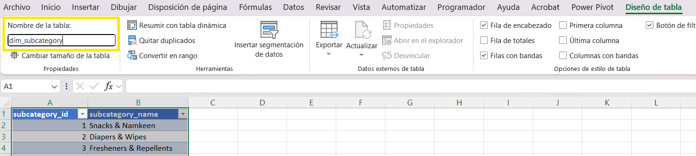 |
| :---: |
| *Figura 3: Asignación de nombre de tabla dim_subcategory* |

---

### Paso 3 — Repetición del proceso para todas las tablas

El proceso se repitió para cada tabla del modelo, asegurando que cada una tenga un nombre único y descriptivo para facilitar su identificación en Power Pivot.

| 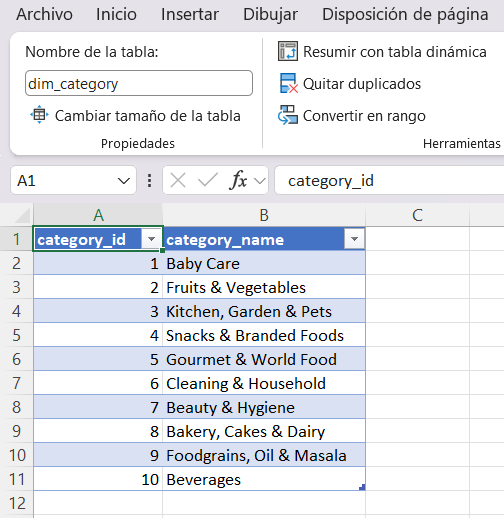 |
| :---: |
| *Figura 4: Creación de tabla dim_category* |

| 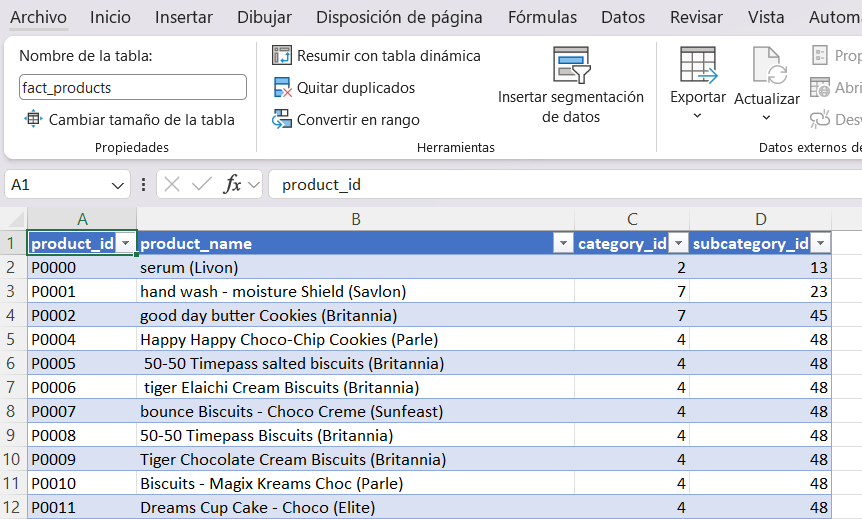 |
| :---: |
| *Figura 5: Creación de tabla fact_products* |

---

### Paso 4 — Carga en el modelo de datos de Power Pivot

En la ventana de Power Pivot, se seleccionó cada tabla y se hizo clic en **"Agregar al modelo de datos"** para cargarla en el modelo.

| 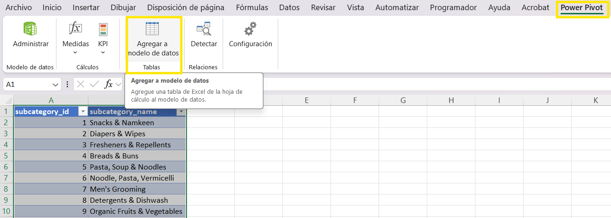 |
| :---: |
| *Figura 6: Proceso de carga de tablas en Power Pivot* |

El proceso se repitió para cada tabla, asegurando que todas estén disponibles en Power Pivot.

| 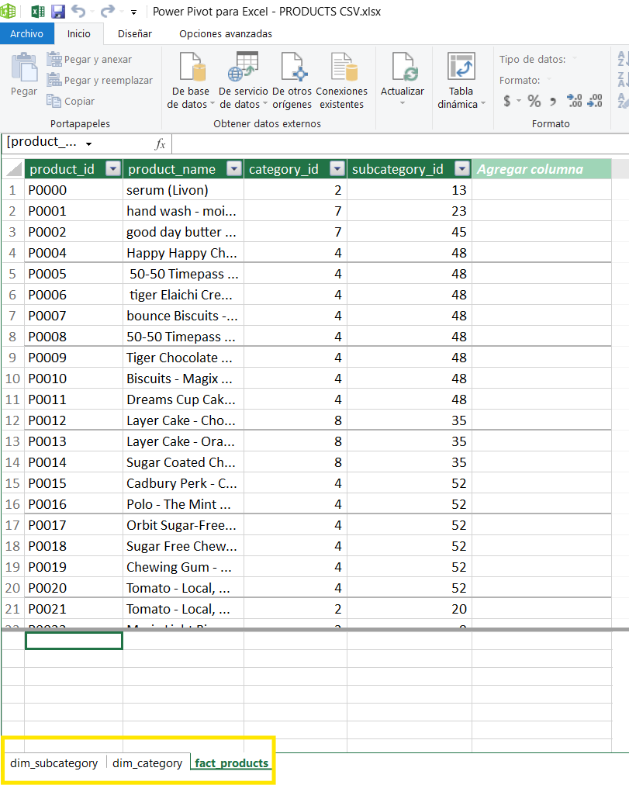 |
| :---: |
| *Figura 7: Tablas en el modelo de datos de Power Pivot* |

---

### Paso 5 — Construcción del modelo estrella

Finalmente, en la **vista de diagrama** de Power Pivot, se establecieron las relaciones entre tablas arrastrando las claves foráneas desde las tablas de dimensión hacia la tabla de hechos, construyendo así el modelo estrella.

| 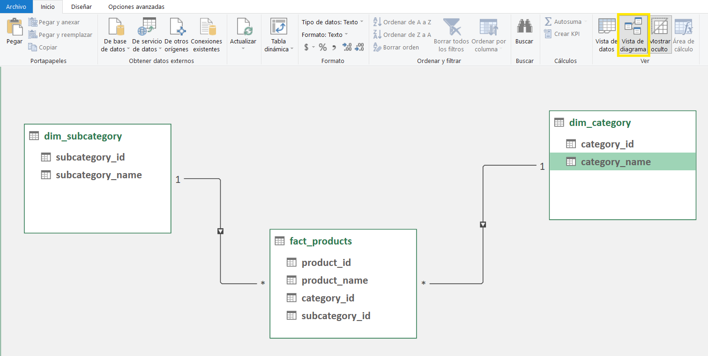 |
| :---: |
| *Figura 8: Modelo estrella de products.csv en Power Pivot* |

---

## 2. Diseño y diagrama del modelo estrella de `Tabla_Desnormalizada_Ventas.csv`

### Estructura del archivo original

El archivo tiene **100 filas** con **26 columnas** que mezclan información de cuatro entidades distintas:

| Entidad | Columnas |
|---|---|
| Product | ProductKey, ProductCode, ProductName, ListPrice, Color, Size, Category, Subcategory |
| Customer | CustomerKey, BirthDate, MaritalStatus, Gender, Income, Children, HomeOwner, Cars |
| Order Date | OrderDateKey, Order Date |
| Ship Date | ShipDateKey, Ship Date |
| Sales | OrderNumber, OrderLineNumber, Quantity, UnitPrice, ProductCost, SalesAmount |

**Problema:** Los datos del cliente `1010`, por ejemplo, se repiten exactamente en todas sus filas de compra. La normalización extrae cada entidad a su propia tabla.


### Decisiones de diseño

* **¿Por qué `id_sales` como clave primaria en `fact_sales`?**
Esto simplifica los JOINs, mejora el rendimiento y desacopla la identidad de la fila de los datos del negocio. `OrderNumber` y `OrderLineNumber` se conservan como columnas informativas.
<br>

* **¿Por qué dos tablas de fecha (`dim_order_date` y `dim_ship_date`)?**
Cada venta tiene dos fechas distintas: cuándo se realizó el pedido y cuándo se envió. Para esta práctica se optó por **dos tablas separadas**, lo que permite que ambas relaciones sean activas y simplifica tanto las consultas SQL como el modelo en Power Pivot.
<br>

### Modelo Estrella Final — Ventas

El modelo se compone de **1 tabla de hechos** y **4 dimensiones**:

```
    ┌─────────────────────┐                         ┌──────────────────────┐
    │    dim_product      │                         │   dim_order_date     │
    │─────────────────────│                         │──────────────────────│
    │ ProductKey (PK)     │                         │ OrderDateKey (PK)    │
    │ Product Code        │                         │ date                 │
    │ Product Name        │   ┌─────────────────┐   │ year                 │
    │ List Price          │   │   fact_sales    │   │ month                │
    │ Color               │   │─────────────────│   │ monthName            │
    │ Size                ├───┤ id_sales (PK)   ├───└──────────────────────┘
    │ Category            │   │                 │                          
    │ Subcategory         │   │ OrderNumber     │   ┌──────────────────────┐
    └─────────────────────┘   │ OrderLineNumber │   │   dim_ship_date      │
                              │ Quantity        │   │──────────────────────│
    ┌─────────────────────┐   │ UnitPrice       ├───┤ ShipDateKey (PK)     │
    │   dim_customer      │   │ ProductCost     │   │ date                 │
    │─────────────────────│   │ SalesAmount     │   │ year                 │
    │ CustomerKey (PK)    │   │                 │   │ month                │
    │ Birth Date          ├───┤ ProductKey (FK) │   │ monthName            │
    │ Marital Status      │   │ CustomerKey (FK)│   └──────────────────────┘
    │ Gender              │   │ OrderDateKey(FK)│
    │ Income              │   │ ShipDateKey (FK)│
    │ Children            │   └─────────────────┘
    │ Home Owner          │   
    │ Cars                │   
    └─────────────────────┘   
                          
```

<br>

### Diagrama en Power Pivot — Ventas
---
### Proceso de implementación:

#### Paso 1: Preparar las hojas como Tablas de Excel

Se crearon 5 hojas en el archivo Excel, cada una con los datos de una tabla del modelo. Para que Power Pivot las reconozca correctamente, cada hoja debe convertirse en una Tabla de Excel:

1. Se hace clic en cualquier celda con datos dentro de la hoja.
2. Presionar `Ctrl + T` → confirmar que tiene encabezados → OK.
3. En la pestaña **Diseño de tabla**, asignar el nombre exacto de la tabla (`dim_product`, `dim_customer`, etc.).

Se repitió este proceso para las 5 tablas.

| 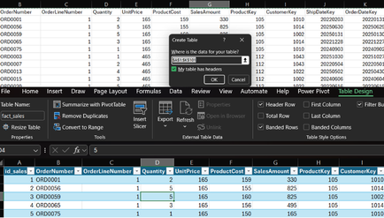 |
| :---: |
| *Figura 9: Conversión de datos a una tabla de Excel* |

#### Paso 2: Agregar las tablas al modelo de Power Pivot

Con cada tabla seleccionada, se fue a **Power Pivot → Agregar al modelo de datos**. Esto abre la ventana de Power Pivot y carga cada tabla como una pestaña independiente dentro del modelo.

| 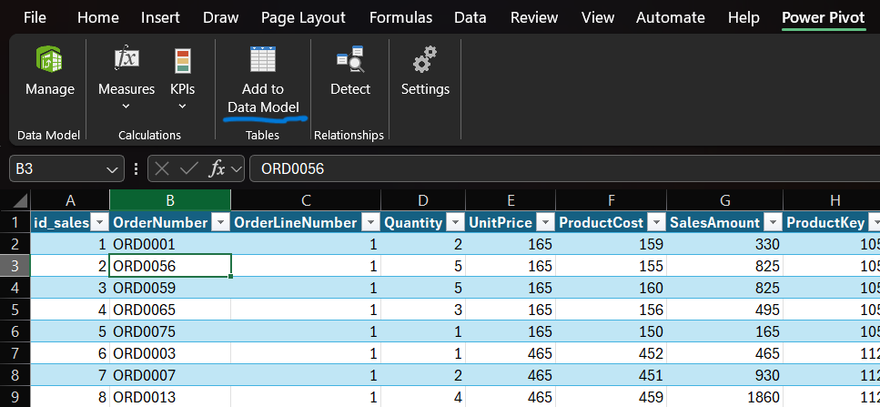 |
| :---: |
| *Figura 10: Agregar las tablas al modelo de datos* |

| 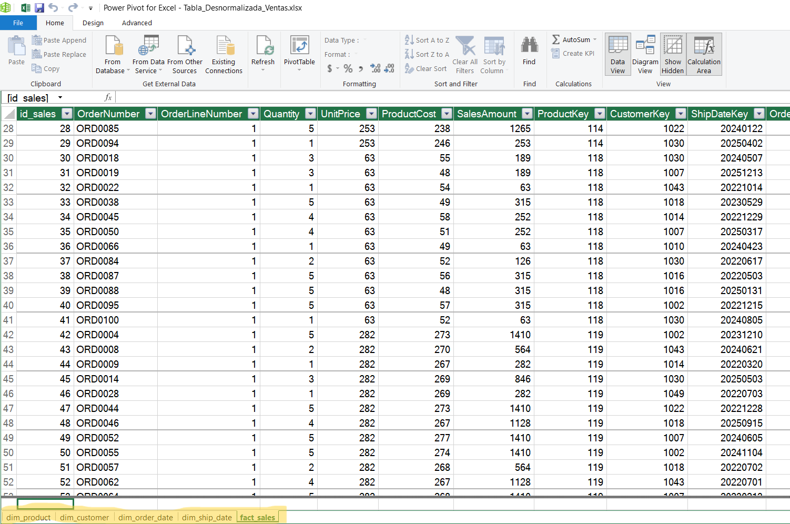 |
| :---: |
| *Figura 11: Cinco tablas en Power Pivot* |

#### Paso 3: Crear las relaciones en Vista de Diagrama

Dentro de Power Pivot se navegó a **Inicio → Vista de diagrama**. Las tablas aparecen como bloques flotantes. Se acomodaron manualmente con `fact_sales` al centro y las dimensiones alrededor.

Las relaciones se crean **arrastrando** desde la columna FK en `fact_sales` hacia la columna PK en cada dimensión:

Power Pivot muestra `1` del lado de la dimensión y `*` del lado de `fact_sales`, indicando la relación uno a muchos.

* **Resultado**: Diagrama del modelo en Power Pivot

| 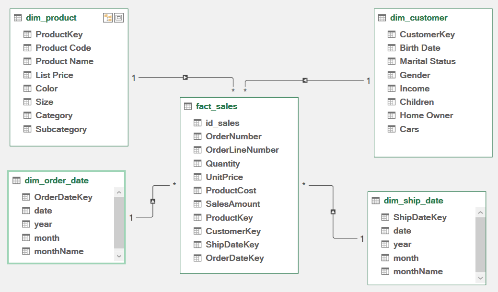 |
| :---: |
| *Figura 12: Diagrama del modelo estrella de Tabla_Desnormalizada_Ventas en Power Pivot* |

---
## 3. Implementación física del modelo estrella en PostgreSQL

Esta sección documenta el proceso de creación e inserción de datos en cada tabla 
del modelo estrella, ejecutado en **PostgreSQL** desde **DBeaver**.

---

### 3.1 Tabla desnormalizada — `ventas`

#### Objetivo
Antes de construir el modelo estrella, se crea la tabla `ventas` como fuente de datos 
plana. Esta tabla replica exactamente las 26 columnas del archivo 
`Tabla_Desnormalizada_Ventas.csv` y sirve como origen para poblar todas las dimensiones 
y la tabla de hechos.

```sql
CREATE TABLE ventas (
    ProductKey        INT,
    "Product Code"    VARCHAR(30),
    "Product Name"    VARCHAR(100),
    "List Price"      DECIMAL(10,2),
    Color             VARCHAR(30),
    Size              VARCHAR(20),
    Category          VARCHAR(50),
    Subcategory       VARCHAR(50),
    CustomerKey       INT,
    "Birth Date"      VARCHAR(20),
    "Marital Status"  VARCHAR(20),
    Gender            VARCHAR(10),
    Income            DECIMAL(12,2),
    Children          INT,
    "Home Owner"      VARCHAR(5),
    Cars              INT,
    OrderDateKey      INT,
    "Order Date"      VARCHAR(20),
    ShipDateKey       INT,
    "Ship Date"       VARCHAR(20),
    OrderNumber       VARCHAR(20)   NOT NULL,
    OrderLineNumber   INT           NOT NULL,
    Quantity          INT,
    UnitPrice         DECIMAL(10,2),
    ProductCost       DECIMAL(10,2),
    SalesAmount       DECIMAL(12,2),
    CONSTRAINT pk_ventas PRIMARY KEY (OrderNumber, OrderLineNumber)
);
```

> [!NOTE]
> Las columnas de fecha (`Birth Date`, `Order Date`, `Ship Date`) se definen como 
> `VARCHAR` inicialmente para evitar errores de tipo durante la importación del CSV. 
> Se convierten a `DATE` con `ALTER COLUMN` una vez cargados los datos.

#### Evidencia — Creación de la tabla `ventas`

| 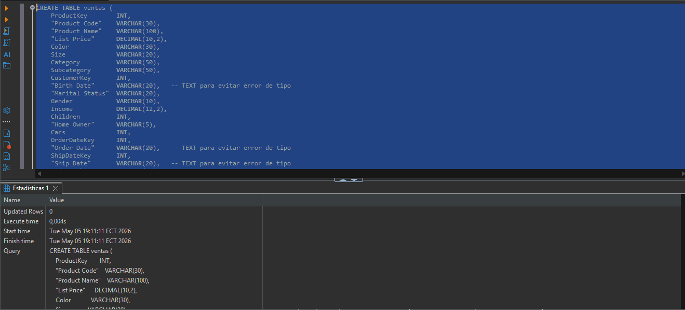 |
| :---: |
| *Figura 5: Script de creación de la tabla ventas ejecutado* |

#### Evidencia — Importación del CSV

| 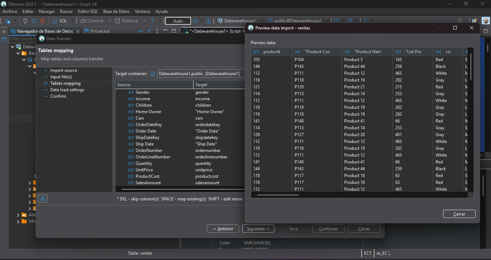 |
| :---: |
| *Figura 6: Importación del archivo CSV a la tabla ventas* |

#### Evidencia — Datos cargados en `ventas`

| 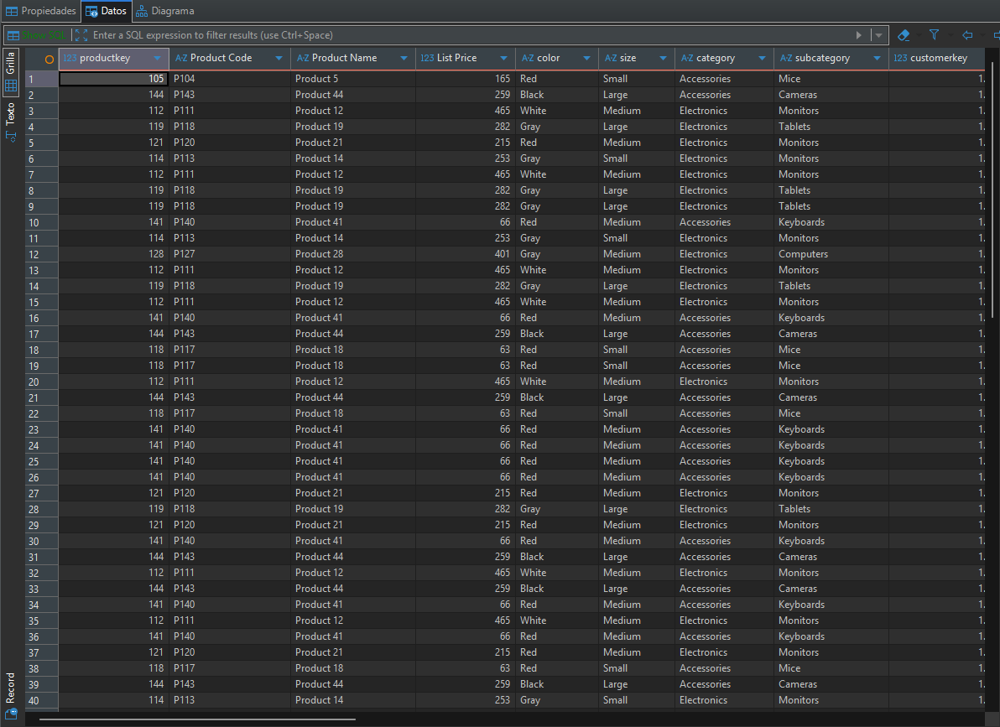 |
| :---: |
| *Figura 7: Registros cargados correctamente en la tabla ventas* |

---

### 3.2 Dimensión — `dim_product`

#### Objetivo
Extraer los atributos únicos de producto desde `ventas`. La clave sustituta 
`ProductKey` se genera automáticamente con `SERIAL`.

```sql
CREATE TABLE dim_product (
    ProductKey    SERIAL         NOT NULL,
    ProductCode   VARCHAR(30)    NOT NULL,
    ProductName   VARCHAR(100),
    ListPrice     DECIMAL(10,2),
    Color         VARCHAR(30),
    Size          VARCHAR(20),
    Category      VARCHAR(50),
    Subcategory   VARCHAR(50),
    CONSTRAINT pk_dim_product  PRIMARY KEY (ProductKey),
    CONSTRAINT uq_product_code UNIQUE (ProductCode)
);

INSERT INTO dim_product
    (ProductCode, ProductName, ListPrice, Color, Size, Category, Subcategory)
SELECT DISTINCT
    "Product Code", "Product Name", "List Price",
    Color, Size, Category, Subcategory
FROM ventas
WHERE "Product Code" IS NOT NULL;
```

#### Evidencia — Creación e inserción `dim_product`

| 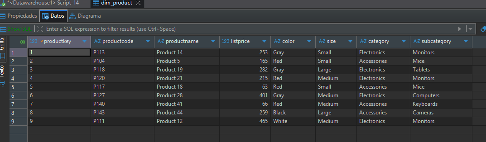 |
| :---: |
| *Figura 8: Registros cargados en dim_product* |

---

### 3.3 Dimensión — `dim_customer`

#### Objetivo
Extraer un registro único por cliente con sus atributos demográficos. 
Se usa `CustomerKey` del CSV como clave primaria natural.

```sql
CREATE TABLE dim_customer (
    CustomerKey    INT            NOT NULL,
    BirthDate      DATE,
    MaritalStatus  VARCHAR(20),
    Gender         VARCHAR(10),
    Income         DECIMAL(12,2),
    Children       INT,
    HomeOwner      VARCHAR(5),
    Cars           INT,
    CONSTRAINT pk_dim_customer PRIMARY KEY (CustomerKey)
);

INSERT INTO dim_customer
    (CustomerKey, BirthDate, MaritalStatus, Gender, Income, Children, HomeOwner, Cars)
SELECT DISTINCT
    CustomerKey,
    "Birth Date"::DATE,
    "Marital Status",
    Gender, Income, Children,
    "Home Owner", Cars
FROM ventas
WHERE CustomerKey IS NOT NULL;
```

#### Evidencia — Creación e inserción `dim_customer`

| 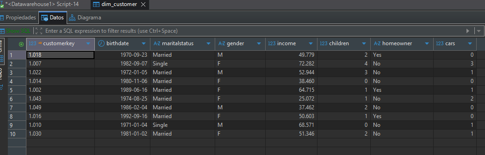 |
| :---: |
| *Figura 9: Registros cargados en dim_customer* |

---

### 3.4 Dimensión — `dim_order_date`

#### Objetivo
Construir una dimensión de tiempo para las fechas de orden, descomponiendo 
cada fecha en año, mes, nombre del mes, trimestre y día de la semana.

```sql
CREATE TABLE dim_order_date (
    OrderDateKey  INT          NOT NULL,
    date          DATE         NOT NULL,
    year          INT,
    month         INT,
    monthName     VARCHAR(20),
    quarter       INT,
    dayOfWeek     VARCHAR(15),
    CONSTRAINT pk_dim_order_date PRIMARY KEY (OrderDateKey)
);

INSERT INTO dim_order_date
    (OrderDateKey, date, year, month, monthName, quarter, dayOfWeek)
SELECT DISTINCT
    TO_CHAR("Order Date"::DATE, 'YYYYMMDD')::INT,
    "Order Date"::DATE,
    EXTRACT(YEAR    FROM "Order Date"::DATE)::INT,
    EXTRACT(MONTH   FROM "Order Date"::DATE)::INT,
    TO_CHAR("Order Date"::DATE, 'TMMonth'),
    EXTRACT(QUARTER FROM "Order Date"::DATE)::INT,
    TO_CHAR("Order Date"::DATE, 'TMDay')
FROM ventas
WHERE "Order Date" IS NOT NULL;
```

#### Evidencia — Creación e inserción `dim_order_date`
| 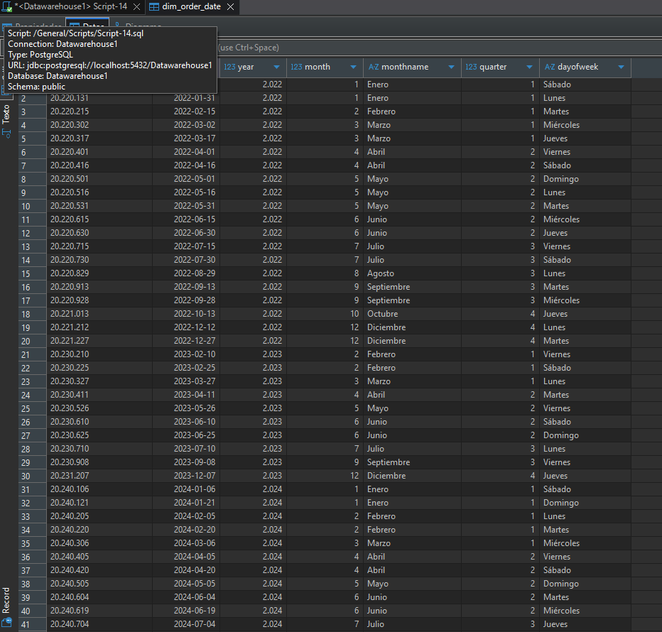 |
| :---: |
| *Figura 10: Registros cargados en dim_order_date* |

---

### 3.5 Dimensión — `dim_ship_date`

#### Objetivo
Idéntica en estructura a `dim_order_date` pero para las fechas de envío. 
Mantener dos tablas de fecha separadas permite que ambas relaciones con 
`fact_sales` sean activas simultáneamente en Power Pivot.

```sql
CREATE TABLE dim_ship_date (
    ShipDateKey   INT          NOT NULL,
    date          DATE         NOT NULL,
    year          INT,
    month         INT,
    monthName     VARCHAR(20),
    quarter       INT,
    dayOfWeek     VARCHAR(15),
    CONSTRAINT pk_dim_ship_date PRIMARY KEY (ShipDateKey)
);

INSERT INTO dim_ship_date
    (ShipDateKey, date, year, month, monthName, quarter, dayOfWeek)
SELECT DISTINCT
    TO_CHAR("Ship Date"::DATE, 'YYYYMMDD')::INT,
    "Ship Date"::DATE,
    EXTRACT(YEAR    FROM "Ship Date"::DATE)::INT,
    EXTRACT(MONTH   FROM "Ship Date"::DATE)::INT,
    TO_CHAR("Ship Date"::DATE, 'TMMonth'),
    EXTRACT(QUARTER FROM "Ship Date"::DATE)::INT,
    TO_CHAR("Ship Date"::DATE, 'TMDay')
FROM ventas
WHERE "Ship Date" IS NOT NULL;
```

#### Evidencia — Creación e inserción `dim_ship_date`

| 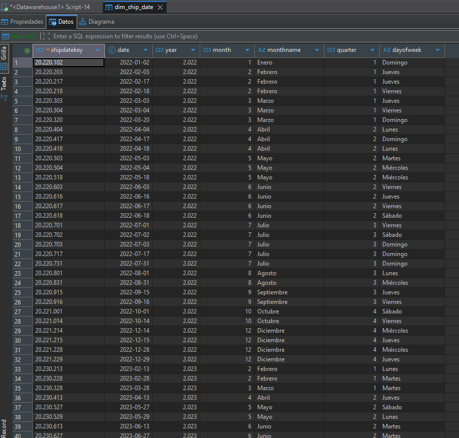 |
| :---: |
| *Figura 11: Registros cargados en dim_ship_date* |

---

### 3.6 Tabla de hechos — `fact_sales`

#### Objetivo
Centralizar las métricas de venta (`Quantity`, `UnitPrice`, `ProductCost`, 
`SalesAmount`) y las claves foráneas hacia las cuatro dimensiones. 
La clave primaria `id_sales` es generada automáticamente con `SERIAL`.

```sql
CREATE TABLE fact_sales (
    id_sales          SERIAL          NOT NULL,
    OrderNumber       VARCHAR(20)     NOT NULL,
    OrderLineNumber   INT             NOT NULL,
    ProductKey        INT             NOT NULL,
    CustomerKey       INT             NOT NULL,
    OrderDateKey      INT             NOT NULL,
    ShipDateKey       INT,
    Quantity          INT             NOT NULL DEFAULT 1,
    UnitPrice         DECIMAL(10,2)   NOT NULL,
    ProductCost       DECIMAL(10,2),
    SalesAmount       DECIMAL(12,2),
    CONSTRAINT pk_fact_sales    PRIMARY KEY (id_sales),
    CONSTRAINT fk_fs_product    FOREIGN KEY (ProductKey)
        REFERENCES dim_product   (ProductKey),
    CONSTRAINT fk_fs_customer   FOREIGN KEY (CustomerKey)
        REFERENCES dim_customer  (CustomerKey),
    CONSTRAINT fk_fs_orderdate  FOREIGN KEY (OrderDateKey)
        REFERENCES dim_order_date(OrderDateKey),
    CONSTRAINT fk_fs_shipdate   FOREIGN KEY (ShipDateKey)
        REFERENCES dim_ship_date (ShipDateKey)
);

INSERT INTO fact_sales
    (OrderNumber, OrderLineNumber,
     ProductKey, CustomerKey, OrderDateKey, ShipDateKey,
     Quantity, UnitPrice, ProductCost, SalesAmount)
SELECT
    v.OrderNumber,
    v.OrderLineNumber,
    dp.ProductKey,
    v.CustomerKey,
    TO_CHAR(v."Order Date"::DATE, 'YYYYMMDD')::INT,
    TO_CHAR(v."Ship Date"::DATE,  'YYYYMMDD')::INT,
    v.Quantity,
    v.UnitPrice,
    v.ProductCost,
    v.SalesAmount
FROM ventas v
INNER JOIN dim_product dp ON dp.ProductCode = v."Product Code";
```

#### Evidencia — Creación de `fact_sales`

#### Evidencia — Datos cargados en `fact_sales`

| 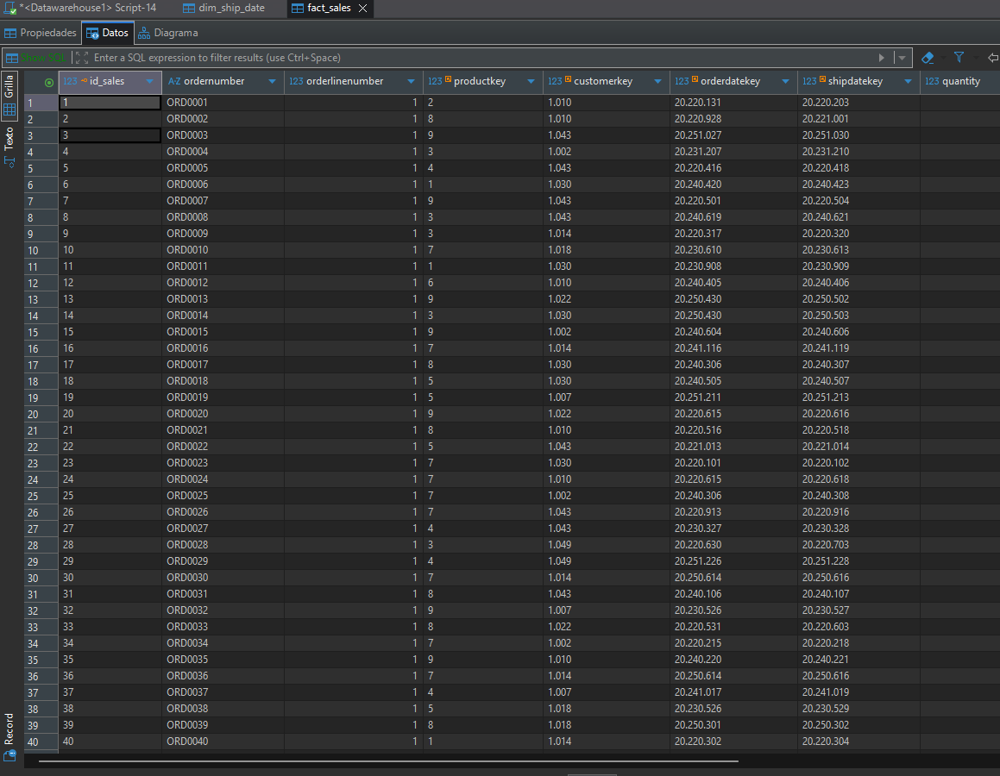 |
| :---: |
| *Figura 12: Registros cargados en fact_sales* |

---

### 3.7 Verificación del modelo completo

Para confirmar que todas las tablas fueron pobladas correctamente se ejecutó 
la siguiente consulta de conteo:

```sql
SELECT 'dim_product'    AS tabla, COUNT(*) AS registros FROM dim_product    UNION ALL
SELECT 'dim_customer',             COUNT(*)              FROM dim_customer   UNION ALL
SELECT 'dim_order_date',           COUNT(*)              FROM dim_order_date UNION ALL
SELECT 'dim_ship_date',            COUNT(*)              FROM dim_ship_date  UNION ALL
SELECT 'fact_sales',               COUNT(*)              FROM fact_sales;
```

#### Evidencia — Verificación de registros por tabla

| 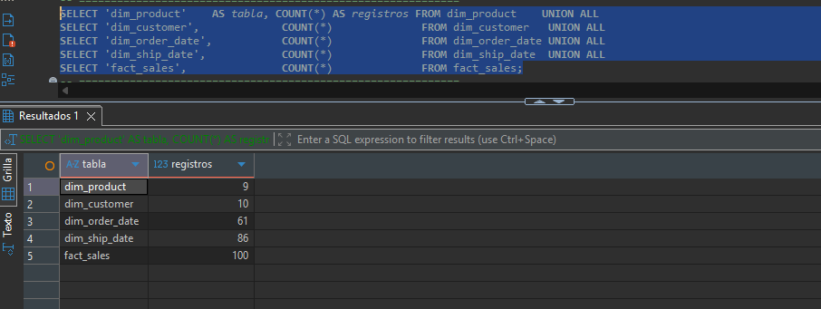 |
| :---: |
| *Figura 13: Conteo de registros por tabla del modelo estrella* |

---

## 4. Consultas SQL de Análisis

Las siguientes consultas permiten explorar el comportamiento de las ventas desde distintas 
perspectivas de negocio, cruzando `fact_sales` con las dimensiones del modelo estrella.

---

### Consulta 1 — Ventas por Categoría de Producto y Mes

#### Objetivo
Identificar cuántas ventas se realizaron, cuántas unidades se vendieron y cuánto ingreso 
se generó, agrupado por **categoría**, **subcategoría** y **mes**, permitiendo detectar 
estacionalidad y las categorías más rentables en cada período.

#### Tablas involucradas

| Tabla | Rol |
|---|---|
| `fact_sales` | Tabla de hechos — métricas de venta |
| `dim_product` | Dimensión — categoría y subcategoría |
| `dim_order_date` | Dimensión — año, mes y nombre del mes |

#### Columnas del resultado

| Columna | Descripción |
|---|---|
| `categoria` | Categoría del producto (Bikes, Accessories, etc.) |
| `subcategoria` | Subcategoría del producto |
| `anio` | Año de la orden |
| `mes_numero` | Número del mes (1–12) |
| `mes` | Nombre del mes |
| `cantidad_ventas` | Número de líneas de venta registradas |
| `unidades_vendidas` | Total de unidades despachadas |
| `ingreso_total` | Suma del monto de ventas (`SalesAmount`) |
| `ticket_promedio` | Valor promedio por transacción |

#### Script SQL

```sql
SELECT
    dp.Category                            AS categoria,
    dp.Subcategory                         AS subcategoria,
    od.year                                AS anio,
    od.month                               AS mes_numero,
    od.monthName                           AS mes,
    COUNT(fs.id_sales)                     AS cantidad_ventas,
    SUM(fs.Quantity)                       AS unidades_vendidas,
    SUM(fs.SalesAmount)                    AS ingreso_total,
    ROUND(AVG(fs.SalesAmount)::NUMERIC, 2) AS ticket_promedio
FROM fact_sales     fs
JOIN dim_product    dp ON dp.ProductKey   = fs.ProductKey
JOIN dim_order_date od ON od.OrderDateKey = fs.OrderDateKey
GROUP BY
    dp.Category,
    dp.Subcategory,
    od.year,
    od.month,
    od.monthName
ORDER BY
    od.year,
    od.month,
    ingreso_total DESC;
```

#### Evidencia — Resultados obtenidos

| 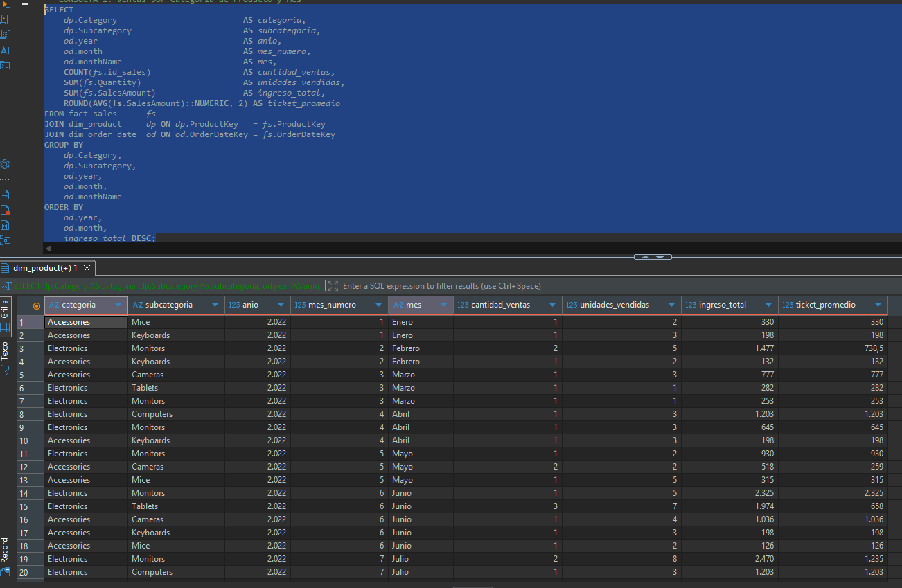 |
| :---: |
| *Figura 14: Resultados — ventas por categoría y mes* |


---

### Consulta 2 — Ingreso Total por Cliente y Género

#### Objetivo
Conocer el comportamiento de compra de cada cliente segmentado por **género** y 
**estado civil**, incluyendo el porcentaje que representa dentro de su grupo de género. 
Útil para estrategias de marketing segmentado.

#### Tablas involucradas

| Tabla | Rol |
|---|---|
| `fact_sales` | Tabla de hechos — métricas de compra |
| `dim_customer` | Dimensión — género, estado civil e ingreso anual |

#### Columnas del resultado

| Columna | Descripción |
|---|---|
| `cliente_id` | Identificador único del cliente |
| `genero` | Género del cliente (M / F) |
| `estado_civil` | Estado civil (Married / Single) |
| `ingreso_anual` | Ingreso anual declarado del cliente |
| `cantidad_compras` | Número de transacciones realizadas |
| `unidades_compradas` | Total de productos adquiridos |
| `total_ventas` | Suma total gastada por el cliente |
| `promedio_por_compra` | Gasto promedio por transacción |
| `pct_dentro_genero` | % que representa el cliente dentro de su género |

#### Script SQL

```sql
SELECT
    fs.CustomerKey                              AS cliente_id,
    dc.Gender                                   AS genero,
    dc.MaritalStatus                            AS estado_civil,
    dc.Income                                   AS ingreso_anual,
    COUNT(fs.id_sales)                          AS cantidad_compras,
    SUM(fs.Quantity)                            AS unidades_compradas,
    SUM(fs.SalesAmount)                         AS total_ventas,
    ROUND(AVG(fs.SalesAmount)::NUMERIC, 2)      AS promedio_por_compra,
    ROUND(
        SUM(fs.SalesAmount) * 100.0 /
        SUM(SUM(fs.SalesAmount)) OVER (PARTITION BY dc.Gender)
    , 2)                                        AS pct_dentro_genero
FROM fact_sales   fs
JOIN dim_customer dc ON dc.CustomerKey = fs.CustomerKey
GROUP BY
    fs.CustomerKey,
    dc.Gender,
    dc.MaritalStatus,
    dc.Income
ORDER BY
    dc.Gender,
    total_ventas DESC;
```

#### Detalle técnico — Función de ventana `OVER`

La columna `pct_dentro_genero` usa una **window function** para calcular el porcentaje 
de cada cliente respecto al total de su género, sin colapsar el detalle individual:

```sql
SUM(SUM(fs.SalesAmount)) OVER (PARTITION BY dc.Gender)
--  └─ suma del grupo ─┘        └── partición por género ──┘
```

> *"Del total comprado por todos los clientes del género M (o F), ¿qué porcentaje 
> corresponde a este cliente específico?"*


#### Evidencia — Resultados obtenidos

| 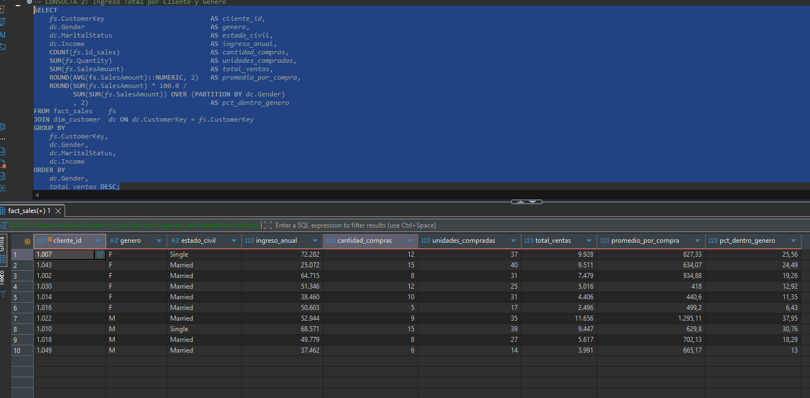 |
| :---: |
| *Figura 15: Resultados — ingreso por cliente y género* |

### Consulta 3 — Cantidad Total Vendida por Producto

#### Objetivo
Determinar el volumen total de ventas en unidades para cada producto del catálogo. Esto permite identificar rápidamente los artículos con mayor rotación e impacto en el inventario.

#### Tablas involucradas

| Tabla | Rol |
|---|---|
| `fact_sales` | Tabla de hechos — métricas de venta (cantidades) |
| `dim_product` | Dimensión — detalles y nombre del producto |

#### Columnas del resultado

| Columna | Descripción |
|---|---|
| `productname` | Nombre descriptivo del producto |
| `cantidad_total_vendida` | Suma de todas las unidades vendidas de ese producto |

#### Script SQL
```sql
SELECT 
    p.ProductName, 
    SUM(f.Quantity) AS cantidad_total_vendida
FROM 
    fact_sales f
JOIN 
    dim_product p ON f.ProductKey = p.ProductKey
GROUP BY 
    p.ProductName
ORDER BY 
    cantidad_total_vendida DESC;
```

#### Evidencia — Resultados obtenidos

|  |
| :---: |
| *Figura 16: Resultados — cantidad total vendida por producto* |

---

### Consulta 4 — Cantidad Enviada por Mes de Envío

#### Objetivo
Analizar el volumen de productos despachados agrupados por el mes en el que salieron de bodega (`ShipDateKey`). Esto facilita la comprensión de la carga operativa y la estacionalidad de los despachos mensuales, independientemente de cuándo se realizó la compra.

#### Tablas involucradas

| Tabla | Rol |
|---|---|
| `fact_sales` | Tabla de hechos — métricas de envío (cantidades) |
| `dim_ship_date` | Dimensión — detalles cronológicos de la fecha de envío |

#### Columnas del resultado

| Columna | Descripción |
|---|---|
| `mes_envio` | Nombre del mes en el que se realizó el envío |
| `cantidad_total_enviada` | Total de unidades despachadas durante ese mes |

#### Script SQL
```sql
SELECT 
    t.monthName AS mes_envio, 
    SUM(f.Quantity) AS cantidad_total_enviada
FROM 
    fact_sales f
JOIN 
    dim_ship_date t ON f.ShipDateKey = t.ShipDateKey
GROUP BY 
    t.monthName, 
    t.month
ORDER BY 
    t.month ASC;
```

#### Detalle técnico — Ordenamiento cronológico

En esta consulta se incluye la columna `t.month` (el mes numérico del 1 al 12) en la cláusula `GROUP BY` exclusivamente para poder utilizarla en el `ORDER BY`. De esta forma, el resultado se presenta en orden cronológico (Enero, Febrero, Marzo...) y no en orden alfabético por el nombre del mes.

#### Evidencia — Resultados obtenidos

|  |
| :---: |
| *Figura 17: Resultados — cantidad enviada por mes de envío* |
