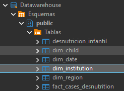

# 2026A-ISWD743-practica4
### Fecha: 05/05/2026
### Práctica Modelo Conceptual Lógico Físico Estrella
  
</div>

[](https://github.com/andrea-m11)<br><br>
[](https://github.com/Andreina-P)<br><br>
[](https://github.com/JoseDA0721)<br><br>
[](https://github.com/JuanMateoQ)<br><br>
[](https://github.com/juansuarezb)<br><br>

>[!NOTE]
>
> Este repositorio contiene el desarrollo del trabajo grupal de la Práctica 5 de Business Intelligence, correspondiente a la creacion de un datawarehouse para el análisis la desnutrición infantil en distintas regiones del país. 
Respondiendo las siguientes preguntas:
> * ¿Cuál es el tipo de desnutrición más común por región?
> * ¿Cómo varía la desnutrición por edad y género?
> * ¿Qué instituciones atienden más casos? <br>
---

>[!NOTE]
>
> Objetivos específicos:
> * Diseñar el diagrama del modelo estrella en Power Pivot
> * Crear tabla de hechos y dimensionales en PostgreSQL
> * Realizar el proceso de ETL en Pentaho
> * Generar consultas SQL para responder las preguntas.
> * 

---

## 1. Modelo Estrella: Diseño e creacion de tablas en PostgreSQL

Para la practica se desarrollo el siguiente concepto de modelo estrella que permita responder las preguntas solicitas.

|  |
| :---: |
| *Figura 1: Diagrama del modelo estrella* |

---
### Tabla de Hechos — `fact_cases_desnutrition`

La tabla de hechos es el núcleo del modelo. Almacena **un registro por cada evaluación nutricional** realizada a un niño/niña, con las métricas cuantitativas del evento y las claves foráneas que conectan con cada dimensión.

Se eligió como tabla de hechos porque concentra los eventos medibles del problema: el peso, la talla y el diagnóstico nutricional son métricas que varían por caso y que se deben analizar desde múltiples ángulos (tiempo, niño, institución). Las claves foráneas `date_id`, `child_id` e `institution_id` son los ejes de análisis; `weight_kg`, `height_cm` y `nutritional_status` son las métricas del evento.

---

### Dimensión — `dim_date`

Contiene los atributos de tiempo descompuestos desde la fecha de evaluación. Se crea como dimensión independiente porque permite analizar los casos en distintas granularidades temporales (día, mes, año) sin recalcular esos valores en cada consulta. Separar el tiempo en una dimensión es una práctica estándar en cualquier Data Warehouse ya que los atributos de fecha son reutilizables por múltiples tablas de hechos.

---

### Dimensión — `dim_child`

Describe las características del niño o niña evaluado. Se crea como dimensión porque el perfil del paciente (sexo y edad) es un eje de análisis fundamental para el problema de desnutrición infantil. Se añade el atributo `age_group` calculado a partir de `age_months` usando los **tramos estándar de la OMS** para menores de 5 años (0-11, 12-23, 24-35, 36-47, 48-59 meses), lo que permite segmentar directamente sin aplicar lógica condicional en cada consulta.

---

### Dimensión — `dim_institution`

Describe el centro de atención médica donde se realizó la evaluación.

---

### Dimensión — `dim_region`

Describe la región geográfica donde fue atendido cada caso.

---

### Implementación en PostgreSQL
Para la implementacion se creara una base de datos con el nombre "Datawarehouse"
#### Tabla RAW — datos originales

Se crea primero una tabla que replica exactamente la estructura del CSV fuente. Su propósito es preservar los datos sin transformación como punto de entrada del proceso ETL.

```sql
CREATE TABLE desnutricion_infantil (
    child_id            VARCHAR(10),
    gender              CHAR(1),
    age_months          SMALLINT,
    weight_kg           NUMERIC(5,2),
    height_cm           NUMERIC(5,1),
    nutritional_status  VARCHAR(20),
    region              VARCHAR(50),
    institution         VARCHAR(50),
    date_measured       DATE
);
```
---

#### Dimensiones y tabla de hechos

```sql
CREATE TABLE dim_date (
    date_id       SERIAL     PRIMARY KEY,
    date_measured DATE       NOT NULL UNIQUE,
    year          SMALLINT   NOT NULL,
    month         SMALLINT   NOT NULL CHECK (month BETWEEN 1 AND 12),
    day           SMALLINT   NOT NULL CHECK (day   BETWEEN 1 AND 31)
);

CREATE TABLE dim_child (
    child_id    VARCHAR(10) PRIMARY KEY,
    gender      CHAR(1)     NOT NULL CHECK (gender IN ('M','F')),
    age_months  SMALLINT    NOT NULL CHECK (age_months BETWEEN 0 AND 59),
    age_group   VARCHAR(10) NOT NULL
                CHECK (age_group IN ('0-11','12-23','24-35','36-47','48-59'))
);

CREATE TABLE dim_institution (
    institution_id  SERIAL        PRIMARY KEY,
    institution     VARCHAR(100)  NOT NULL UNIQUE
);

CREATE TABLE dim_region (
    region_id  SERIAL       PRIMARY KEY,
    region     VARCHAR(50)  NOT NULL UNIQUE
);

CREATE TABLE fact_cases_desnutrition (
    id_case            SERIAL         PRIMARY KEY,
    date_id            INT            NOT NULL
                                      REFERENCES dim_date(date_id),
    child_id           VARCHAR(10)    NOT NULL
                                      REFERENCES dim_child(child_id),
    region_id		   INT            NOT NULL 
    								  REFERENCES dim_region(region_id),
    institution_id     INT            NOT NULL
                                      REFERENCES dim_institution(institution_id),
    weight_kg          NUMERIC(5,2)   NOT NULL  CHECK (weight_kg > 0),
    height_cm          NUMERIC(5,1)   NOT NULL  CHECK (height_cm > 0),
    nutritional_status VARCHAR(20)    NOT NULL
                                      CHECK (nutritional_status IN (
                                          'Aguda','Cronica','Global'
                                      ))
);
```

|  |
| :---: |
| *Figura 2: Tablas creadas en PostgreSQL* |

---
