<div align="center">


<br clear="all"/>

<h1><strong>Escuela Politécnica Nacional</strong></h1>

### Facultad de Ingeniería de Sistemas

**Business Intelligence (ISWD743) · GR2SW_2026-1**

**TAREA MOLAP**

---

**Fecha:** <br/>
19 de Junio, 2026

**Integrantes:** <br/>
Andrea Chicaiza <br/>
Andreina Pallo <br/>
Jose Arias <br/>
Juan Mateo Quisilema <br/>
Juan Suarez

</div>

---

> [!NOTE]
>
> Este repositorio contiene el desarrollo del trabajo grupal de la práctica MOLAP, cuyo objetivo es construir un Data Warehouse sobre datos de atención médica, implementar un modelo estrella en PostgreSQL y ejecutar consultas analíticas OLAP sobre una vista materializada.

---

> [!NOTE]
>
> Objetivos específicos:
> * Diseñar e implementar un modelo estrella en PostgreSQL que represente las visitas médicas mediante dimensiones y una tabla de hechos.
> * Construir una vista materializada que consolide el modelo estrella para optimizar el procesamiento analítico.
> * Desarrollar consultas MOLAP sobre la vista materializada para responder preguntas de negocio sobre costos, emergencias y diagnósticos.

---

<h2><strong>Índice</strong></h2>

- [Desarrollo](#desarrollo)
- [1. Introducción](#1-introducción)
- [2. Descripción del Dataset](#2-descripción-del-dataset)
  - [2.1 Correcciones de Calidad de Datos](#21-correcciones-de-calidad-de-datos)
- [3. Diseño del Modelo Estrella](#3-diseño-del-modelo-estrella)
  - [3.1 Decisiones de Modelado](#31-decisiones-de-modelado)
  - [3.2 Diagrama del Modelo Estrella](#32-diagrama-del-modelo-estrella)
  - [3.3 Descripción de Tablas](#33-descripción-de-tablas)
- [4. Implementación en PostgreSQL](#4-implementación-en-postgresql)
  - [4.1 Base de Datos y Tabla Staging](#41-base-de-datos-y-tabla-staging)
  - [4.2 Tablas Dimensión](#42-tablas-dimensión)
  - [4.3 Tabla de Hechos y Carga ETL](#43-tabla-de-hechos-y-carga-etl)
- [5. Vista Materializada MOLAP](#5-vista-materializada-molap)
- [6. Consultas MOLAP y Preguntas de Negocio](#6-consultas-molap-y-preguntas-de-negocio)
  - [6.1 Q1 — Costo Total por Especialidad, Ciudad y Mes](#61-q1--costo-total-por-especialidad-ciudad-y-mes)
  - [6.2 Q2 — Emergencias por Ciudad, Mes y Género](#62-q2--emergencias-por-ciudad-mes-y-género)
  - [6.3 Q3 — Costo Promedio por Diagnóstico, Seguro y Ciudad](#63-q3--costo-promedio-por-diagnóstico-seguro-y-ciudad)
- [7. Conclusiones](#7-conclusiones)
- [Referencias Bibliográficas](#referencias-bibliográficas)
- [Declaración de Porcentaje de Uso de IA](#declaración-de-porcentaje-de-uso-de-ia)

[Referencias Bibliográficas](#referencias-bibliográficas)

[Declaración de Porcentaje de Uso de IA](#declaración-de-porcentaje-de-uso-de-ia)

---

## Desarrollo

---

## 1. Introducción

El procesamiento analítico en línea (OLAP) es una tecnología de software que permite analizar datos empresariales desde diferentes puntos de vista. Las organizaciones recopilan y almacenan datos de múltiples fuentes y OLAP los combina y agrupa en categorías para proporcionar información procesable para la planificación estratégica. A diferencia de las consultas analíticas sobre bases de datos relacionales, que resultan lentas porque el sistema debe recorrer múltiples tablas, los sistemas OLAP calculan previamente e integran los datos para que los analistas puedan generar informes más rápido y cuando sea necesario [[1]](#referencias).

En el modelado de datos OLAP, los datos multidimensionales se representan como un esquema en estrella, compuesto por una tabla de hechos con valores numéricos relacionados con un proceso de negocio y varias tablas de dimensiones que describen los atributos de dicha tabla. El tipo MOLAP (*Multidimensional OLAP*) almacena los datos calculados previamente en un hipercubo, lo que permite un análisis especialmente rápido [[1]](#referencias). Para optimizar el acceso a estos datos, se emplean vistas materializadas: tablas de datos pre-calculadas que combinan información de varias tablas existentes para una recuperación más rápida, sin necesidad de recalcular la consulta cada vez que se ejecuta [[2]](#referencias).

Esta práctica implementa un flujo completo desde la carga de datos en staging hasta la ejecución de consultas MOLAP sobre una vista materializada en PostgreSQL, aplicado a un dataset de visitas médicas hospitalarias en Ecuador.

**Herramientas utilizadas:**


<div align="center">

| Etapa | Herramienta | Rol en la práctica |
| :---: | :---: | :--- |
| **Fuente de Datos** |  `salud.csv` | Dataset fuente con 100 registros de visitas médicas. |
| **Almacenamiento** |  PostgreSQL | Motor de base de datos relacional para staging, dimensiones, tabla de hechos y vista materializada (Data Warehouse). |
| **Procesamiento** |  SQL (DDL + DML) | Lenguaje estructurado para la creación de tablas, carga de datos, transformaciones e inserción de dimensiones. |

*Tabla 1: Lista de Herramientas que se utilizaron en la práctica*

</div>

---

## 2. Descripción del Dataset

El dataset fuente es el archivo 'salud.csv', que contiene 100 registros de visitas médicas realizadas en hospitales de cinco ciudades del Ecuador durante el primer trimestre de 2023 (enero–marzo). Cada fila representa una visita médica individual con sus atributos clínicos, administrativos y financieros.

La Tabla 2 resume las 18 columnas del dataset con su nombre, tipo de dato inferido y descripción.

<div align="center">

| # | Columna | Tipo | Descripción |
|:---:|:---:|:---:|:---|
| 1 | `visit_id` | INTEGER | Identificador único de la visita |
| 2 | `visit_date` | TEXT (M/D/YYYY) | Fecha de la visita en formato mes/día/año |
| 3 | `patient_id` | INTEGER | Identificador del paciente |
| 4 | `patient_age` | INTEGER | Edad del paciente al momento de la visita |
| 5 | `patient_gender` | CHAR(1) | Género del paciente |
| 6 | `city` | VARCHAR | Ciudad del hospital |
| 7 | `hospital_department` | VARCHAR | Departamento clínico del hospital |
| 8 | `doctor_id` | INTEGER | Identificador del médico tratante |
| 9 | `specialty` | VARCHAR | Especialidad médica de la visita |
| 10 | `diagnosis_group` | VARCHAR | Grupo diagnóstico de la visita |
| 11 | `procedure_type` | VARCHAR | Tipo de procedimiento realizado |
| 12 | `insurance_type` | VARCHAR | Tipo de seguro del paciente |
| 13 | `is_emergency` | SMALLINT | Indicador de emergencia (0/1) |
| 14 | `length_of_stay_days` | INTEGER | Días de hospitalización |
| 15 | `cost_medicine` | NUMERIC(10,2) | Costo de medicamentos en USD |
| 16 | `cost_procedure` | NUMERIC(10,2) | Costo del procedimiento en USD |
| 17 | `total_cost` | NUMERIC(10,2) | Costo total = cost_medicine + cost_procedure |
| 18 | `outcome` | VARCHAR | Resultado clínico de la visita |

*Tabla 2: Descripción de columnas del dataset salud.csv*

</div>

---

### 2.1 Correcciones de Calidad de Datos

Durante el análisis del dataset se identificaron problemas de calidad que fueron corregidos en la etapa ETL.

En 'patient_gender' se detectaron 2 pacientes con género distinto registrado en visitas diferentes. El paciente 142 aparecia como F en la visita 24 y como M en la visita 35. Mientras que el paciente 260 aparecia como M en la visita 78 y como F en la visita 93, como se observa en la Figura 1. 


| 
|:--:|
|*Figura 1: Errores identificados en la columna 'patient_gender'* | 

Como regla ETL, se conservó el género de la primera visita registrada por 'visit_id' ascendente, es decir, se mantuvo 'F' para el paciente 142 y 'M' para el paciente 260.

---

## 3. Diseño del Modelo Estrella

### 3.1 Decisiones de Modelado

### 3.2 Diagrama del Modelo Estrella

### 3.3 Descripción de Tablas

---

## 4. Implementación en PostgreSQL

La implementación sigue el flujo definido en el diseño: primero se crea la base de datos y la tabla de staging para recibir el CSV sin transformaciones, luego se construyen las dimensiones extrayendo valores únicos desde el staging, y finalmente se crea y carga la tabla de hechos mediante JOINs con las ocho dimensiones.

---

### 4.1 Base de Datos y Tabla Staging

Se crea la base de datos dentro de PostgreSQL con el nombre `dbSalud`, como se observa en la siguiente figura.


| 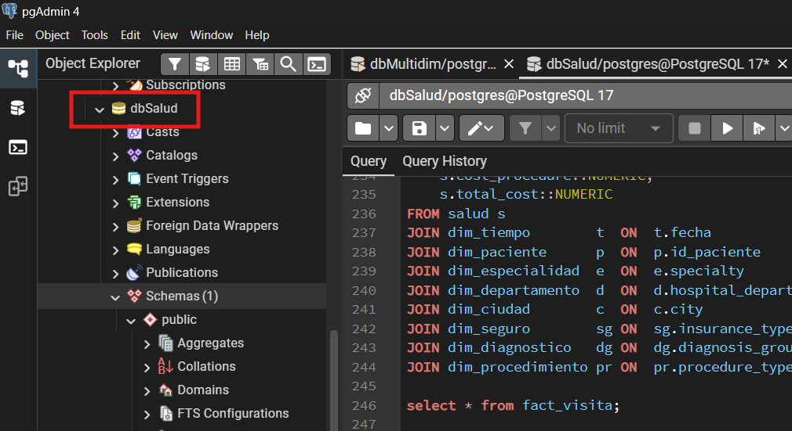 |
|:--:|
| *Figura 3: Base de datos `dbSalud` creada en pgAdmin* |

---

**Corrección previa del CSV**

Antes de crear la tabla staging se corrigió una inconsistencia de calidad de datos detectada en el archivo `salud.csv`. Dos pacientes tenían géneros distintos registrados en visitas diferentes:

- `patient_id = 142`: visita 24 → F, visita 35 → M
- `patient_id = 260`: visita 78 → M, visita 93 → F

Se corrigió directamente en el CSV dejando un único género por paciente, como se mencionó en la sección 2 de este informe:

- `patient_id = 142`: F
- `patient_id = 260`: M

---

**Tabla staging**

Se crea la tabla `salud` como área de staging. Contiene todos los datos del CSV. Los tipos de dato se definen con precisión desde esta etapa según el análisis del archivo fuente. La única excepción es `visit_date`, que se almacena como `VARCHAR(10)` porque el formato del CSV (`M/D/YYYY`) no es compatible con el tipo `DATE` de PostgreSQL durante la importación; la conversión se realiza en el ETL con `TO_DATE()`. La siguiente tabla detalla la justificación de cada tipo asignado.

| Columna | Tipo PostgreSQL | Justificación |
|---|---|---|
| `visit_id` | `INTEGER` | Enteros 1–100 |
| `visit_date` | `VARCHAR(10)` | Formato M/D/YYYY, máx. 10 caracteres, se convierte a DATE en el ETL |
| `patient_id` | `INTEGER` | Enteros 12–310 |
| `patient_age` | `SMALLINT` | Enteros 4–82 |
| `patient_gender` | `CHAR(1)` | Un solo carácter: F o M |
| `city` | `VARCHAR(15)` | Máximo 9 caracteres |
| `hospital_department` | `VARCHAR(20)` | Máximo 16 caracteres |
| `doctor_id` | `SMALLINT` | Enteros 6–60 |
| `specialty` | `VARCHAR(20)` | Máximo 16 caracteres |
| `diagnosis_group` | `VARCHAR(20)` | Máximo 12 caracteres |
| `procedure_type` | `VARCHAR(20)` | Máximo 15 caracteres |
| `insurance_type` | `VARCHAR(15)` | Máximo 10 caracteres |
| `is_emergency` | `SMALLINT` | Valores 0 o 1 |
| `length_of_stay_days` | `SMALLINT` | Enteros 0–9 |
| `cost_medicine` | `NUMERIC(8,2)` | Rango 12.00–150.00 |
| `cost_procedure` | `NUMERIC(8,2)` | Rango 120.00–4800.00 |
| `total_cost` | `NUMERIC(8,2)` | Rango 135.50–4930.00 |
| `outcome` | `VARCHAR(15)` | Máximo 10 caracteres |

| *Tabla 3: Tipos de datos definidos para la tabla staging `salud`* |
| :--- |

```sql
CREATE TABLE salud (
    visit_id             INTEGER,
    visit_date           VARCHAR(10),
    patient_id           INTEGER,
    patient_age          SMALLINT,
    patient_gender       CHAR(1),
    city                 VARCHAR(15),
    hospital_department  VARCHAR(20),
    doctor_id            SMALLINT,
    specialty            VARCHAR(20),
    diagnosis_group      VARCHAR(20),
    procedure_type       VARCHAR(20),
    insurance_type       VARCHAR(15),
    is_emergency         SMALLINT,
    length_of_stay_days  SMALLINT,
    cost_medicine        NUMERIC(8,2),
    cost_procedure       NUMERIC(8,2),
    total_cost           NUMERIC(8,2),
    outcome              VARCHAR(15)
);
```

Una vez creada la tabla, se importó el archivo `salud.csv` mediante la función `Import/Export Data` de pgAdmin con las siguientes configuraciones: formato CSV, encabezado activado, delimitador coma y codificación UTF-8. La siguiente figura muestra los datos cargados en la tabla de staging.

| 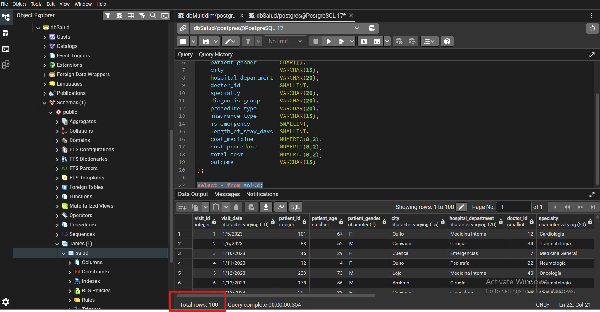 |
|:--:|
| *Figura 4: Datos cargados en la tabla staging `salud`* |

---

### 4.2 Tablas Dimensión

Una vez cargada la tabla de staging, se crean las ocho tablas dimensión del modelo estrella y se poblan extrayendo valores únicos desde `salud`. Este proceso constituye el ETL: se extraen los datos del staging, se transforman aplicando `DISTINCT` y convirtiendo la fecha con `TO_DATE()`, y se cargan en cada dimensión con sus tipos definitivos.

---

**Dimensión de tiempo**

```sql
CREATE TABLE dim_tiempo (
    id_tiempo  SERIAL    PRIMARY KEY,
    fecha      DATE      NOT NULL UNIQUE,
    anio       SMALLINT  NOT NULL,
    mes        SMALLINT  NOT NULL,
    dia        SMALLINT  NOT NULL
);
```

```sql
INSERT INTO dim_tiempo (fecha, anio, mes, dia)
SELECT DISTINCT
    TO_DATE(visit_date, 'MM/DD/YYYY')                               AS fecha,
    EXTRACT(YEAR  FROM TO_DATE(visit_date, 'MM/DD/YYYY'))::SMALLINT AS anio,
    EXTRACT(MONTH FROM TO_DATE(visit_date, 'MM/DD/YYYY'))::SMALLINT AS mes,
    EXTRACT(DAY   FROM TO_DATE(visit_date, 'MM/DD/YYYY'))::SMALLINT AS dia
FROM salud
ORDER BY fecha;
```

| 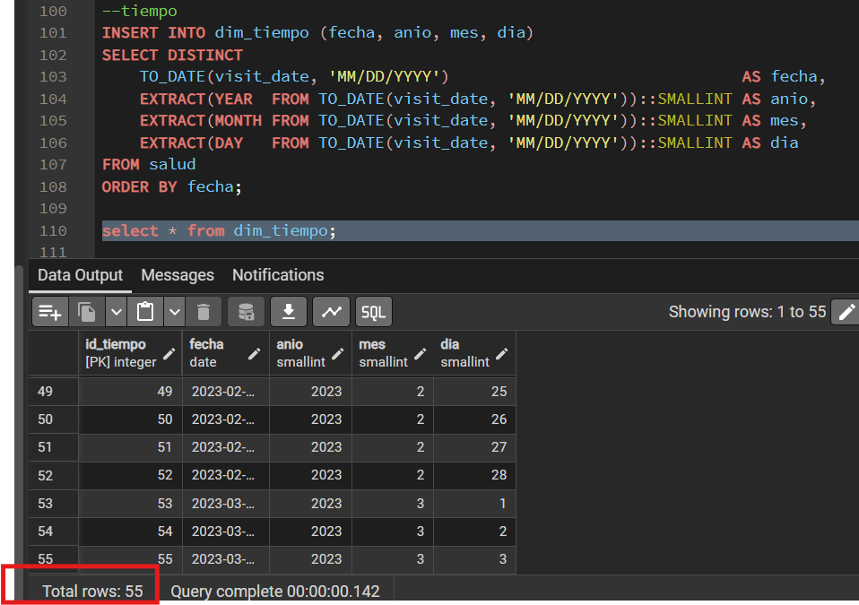 |
|:--:|
| *Figura 5: Contenido de `dim_tiempo` con 55 fechas únicas convertidas a tipo DATE* |

---

**Dimensión de paciente**

```sql
CREATE TABLE dim_paciente (
    id_paciente    INTEGER  PRIMARY KEY,
    patient_gender CHAR(1)  NOT NULL
);
```

```sql
INSERT INTO dim_paciente (id_paciente, patient_gender)
SELECT DISTINCT patient_id, patient_gender
FROM salud
ORDER BY patient_id;
```

| 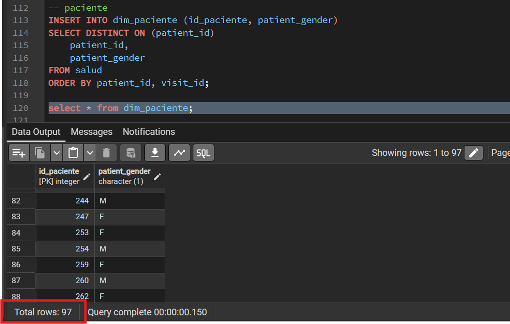 |
|:--:|
| *Figura 6: Contenido de `dim_paciente` con 97 pacientes únicos* |

---

**Dimensión de especialidad**

```sql
CREATE TABLE dim_especialidad (
    id_especialidad  SERIAL       PRIMARY KEY,
    specialty        VARCHAR(20)  NOT NULL UNIQUE
);
```

```sql
INSERT INTO dim_especialidad (specialty)
SELECT DISTINCT specialty FROM salud ORDER BY specialty;
```

| 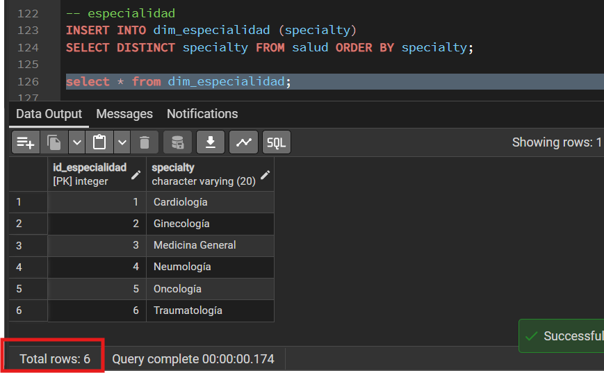 |
|:--:|
| *Figura 7: Contenido de `dim_especialidad` con 6 especialidades médicas* |

---

**Dimensión de departamento**

```sql
CREATE TABLE dim_departamento (
    id_departamento     SERIAL       PRIMARY KEY,
    hospital_department VARCHAR(20)  NOT NULL UNIQUE
);
```

```sql
INSERT INTO dim_departamento (hospital_department)
SELECT DISTINCT hospital_department FROM salud ORDER BY hospital_department;
```

| 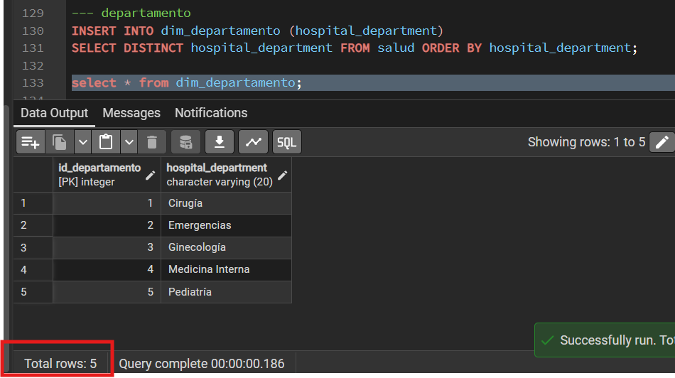 |
|:--:|
| *Figura 8: Contenido de `dim_departamento` con 5 departamentos hospitalarios* |

---

**Dimensión de ciudad**

```sql
CREATE TABLE dim_ciudad (
    id_ciudad  SERIAL       PRIMARY KEY,
    city       VARCHAR(15)  NOT NULL UNIQUE
);
```

```sql
INSERT INTO dim_ciudad (city)
SELECT DISTINCT city FROM salud ORDER BY city;
```

| 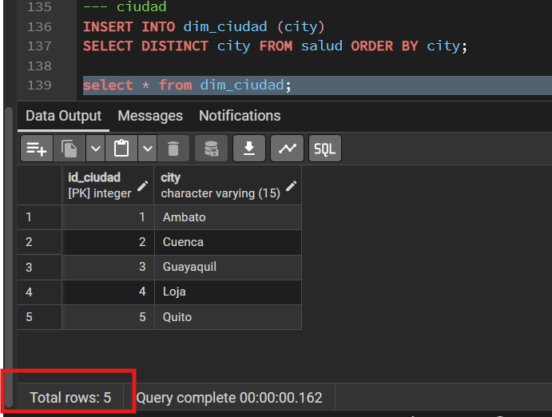 |
|:--:|
| *Figura 9: Contenido de `dim_ciudad` con 5 ciudades* |

---

**Dimensión de seguro**

```sql
CREATE TABLE dim_seguro (
    id_seguro      SERIAL       PRIMARY KEY,
    insurance_type VARCHAR(15)  NOT NULL UNIQUE
);
```

```sql
INSERT INTO dim_seguro (insurance_type)
SELECT DISTINCT insurance_type FROM salud ORDER BY insurance_type;
```

| 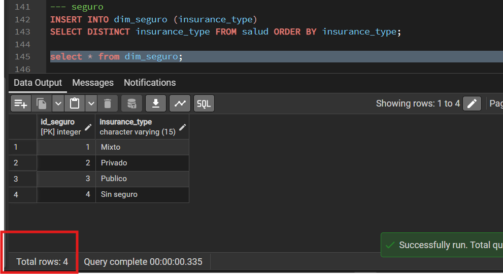 |
|:--:|
| *Figura 10: Contenido de `dim_seguro` con 4 tipos de cobertura* |

---

**Dimensión de diagnóstico**

```sql
CREATE TABLE dim_diagnostico (
    id_diagnostico  SERIAL       PRIMARY KEY,
    diagnosis_group VARCHAR(20)  NOT NULL UNIQUE
);
```

```sql
INSERT INTO dim_diagnostico (diagnosis_group)
SELECT DISTINCT diagnosis_group FROM salud ORDER BY diagnosis_group;
```

| 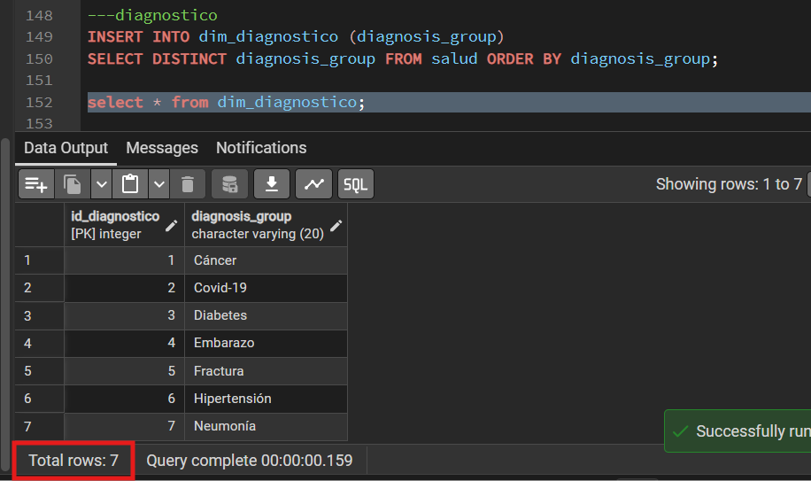 |
|:--:|
| *Figura 11: Contenido de `dim_diagnostico` con 7 grupos diagnósticos* |

---

**Dimensión de procedimiento**

```sql
CREATE TABLE dim_procedimiento (
    id_procedimiento  SERIAL       PRIMARY KEY,
    procedure_type    VARCHAR(20)  NOT NULL UNIQUE
);
```

```sql
INSERT INTO dim_procedimiento (procedure_type)
SELECT DISTINCT procedure_type FROM salud ORDER BY procedure_type;
```

| 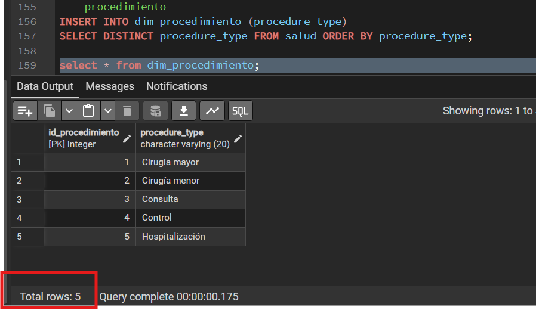 |
|:--:|
| *Figura 12: Contenido de `dim_procedimiento` con 5 tipos de procedimiento* |

---

| Dimensión | Registros |
|---|---|
| `dim_tiempo` | 55 |
| `dim_paciente` | 97 |
| `dim_especialidad` | 6 |
| `dim_departamento` | 5 |
| `dim_ciudad` | 5 |
| `dim_seguro` | 4 |
| `dim_diagnostico` | 7 |
| `dim_procedimiento` | 5 |

| *Tabla 4: Conteo de registros esperados por tabla dimensión* |
| :--- |

---

### 4.3 Tabla de Hechos y Carga ETL

La tabla `fact_visita` es el núcleo del modelo estrella. Contiene una fila por cada visita médica del dataset con las 8 claves foráneas hacia las dimensiones, 4 atributos degenerados y 4 medidas. Su clave primaria es `visit_id`, que proviene directamente del CSV y es única en los 100 registros, por lo que no requiere un surrogate key adicional.

```sql
CREATE TABLE fact_visita (
    visit_id              INTEGER       PRIMARY KEY,
    id_tiempo             INTEGER       NOT NULL REFERENCES dim_tiempo(id_tiempo),
    id_paciente           INTEGER       NOT NULL REFERENCES dim_paciente(id_paciente),
    id_especialidad       INTEGER       NOT NULL REFERENCES dim_especialidad(id_especialidad),
    id_departamento       INTEGER       NOT NULL REFERENCES dim_departamento(id_departamento),
    id_ciudad             INTEGER       NOT NULL REFERENCES dim_ciudad(id_ciudad),
    id_seguro             INTEGER       NOT NULL REFERENCES dim_seguro(id_seguro),
    id_diagnostico        INTEGER       NOT NULL REFERENCES dim_diagnostico(id_diagnostico),
    id_procedimiento      INTEGER       NOT NULL REFERENCES dim_procedimiento(id_procedimiento),
    doctor_id             SMALLINT      NOT NULL,
    patient_age           SMALLINT      NOT NULL,
    is_emergency          SMALLINT      NOT NULL,
    outcome               VARCHAR(15)   NOT NULL,
    length_of_stay_days   SMALLINT      NOT NULL,
    cost_medicine         NUMERIC(8,2)  NOT NULL,
    cost_procedure        NUMERIC(8,2)  NOT NULL,
    total_cost            NUMERIC(8,2)  NOT NULL
);
```

La siguiente figura muestra la estructura de `fact_visita` con sus respectivas columnas.

| 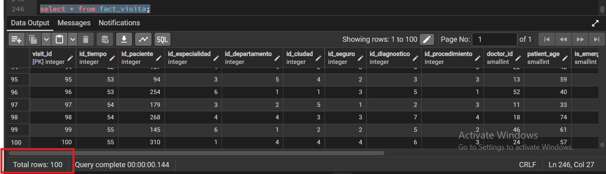 |
|:--:|
| *Figura 13: Estructura de la tabla `fact_visita` con claves foráneas y medidas* |

---

**Carga ETL desde staging**

Se pobla `fact_visita` vinculando cada registro del staging con los surrogate keys de las dimensiones mediante ocho JOINs. Los campos numéricos se castean a sus tipos definitivos.

```sql
INSERT INTO fact_visita (
    visit_id, id_tiempo, id_paciente, id_especialidad,
    id_departamento, id_ciudad, id_seguro, id_diagnostico,
    id_procedimiento, doctor_id, patient_age, is_emergency,
    outcome, length_of_stay_days, cost_medicine, cost_procedure, total_cost
)
SELECT
    s.visit_id::INTEGER,
    t.id_tiempo,
    p.id_paciente,
    e.id_especialidad,
    d.id_departamento,
    c.id_ciudad,
    sg.id_seguro,
    dg.id_diagnostico,
    pr.id_procedimiento,
    s.doctor_id::SMALLINT,
    s.patient_age::SMALLINT,
    s.is_emergency::SMALLINT,
    s.outcome,
    s.length_of_stay_days::SMALLINT,
    s.cost_medicine::NUMERIC,
    s.cost_procedure::NUMERIC,
    s.total_cost::NUMERIC
FROM salud s
JOIN dim_tiempo        t  ON t.fecha                = TO_DATE(s.visit_date, 'MM/DD/YYYY')
JOIN dim_paciente      p  ON p.id_paciente          = s.patient_id::INTEGER
JOIN dim_especialidad  e  ON e.specialty            = s.specialty
JOIN dim_departamento  d  ON d.hospital_department  = s.hospital_department
JOIN dim_ciudad        c  ON c.city                 = s.city
JOIN dim_seguro        sg ON sg.insurance_type      = s.insurance_type
JOIN dim_diagnostico   dg ON dg.diagnosis_group     = s.diagnosis_group
JOIN dim_procedimiento pr ON pr.procedure_type      = s.procedure_type;
```

---

**Verificación del modelo realizado en postgresql**

| 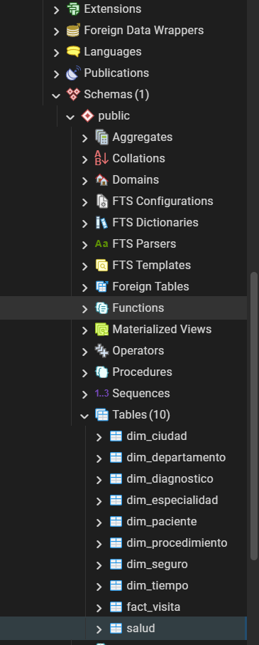 |
|:--:|
| *Figura 14: Verificación del modelo estrella mediante `fact_visita` y las dimensiones* |


---

## 5. Vista Materializada MOLAP

---

## 6. Consultas MOLAP y Preguntas de Negocio

## 6.1 Q1 — Costo total por especialidad, ciudad y mes

### Enunciado

¿Cuál es el costo total de atención médica agrupado por especialidad, ciudad y mes?

### Consulta SQL

```sql
SELECT
    specialty AS especialidad,
    city AS ciudad,
    mes,
    SUM(total_cost) AS costo_total
FROM mv_visitas
GROUP BY specialty, city, mes
ORDER BY costo_total DESC;
```

### Resultado obtenido

| 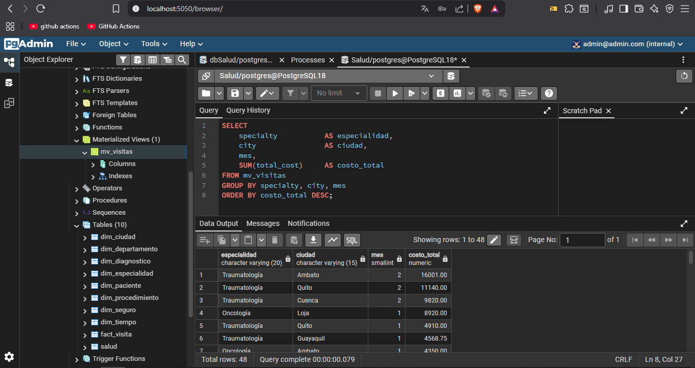 |
|:--:|
| *Figura 15. Resultado de la consulta Q1* |

### Interpretación

A partir de la agregación de los costos médicos por especialidad, ciudad y mes, se identificó la combinación que presenta el mayor costo acumulado de atención. Esta información permite reconocer áreas médicas y ubicaciones geográficas que concentran una mayor demanda de recursos económicos.

### Operación OLAP aplicada

**Roll-Up**

Se realiza una agregación de los datos mediante la función `SUM(total_cost)`, consolidando la información por especialidad, ciudad y mes para obtener una visión resumida del comportamiento de los costos.

---

## 6.2 Q2 — Emergencias por ciudad, mes y género

### Enunciado

¿Cuántas atenciones de emergencia se registraron por ciudad, mes y género?

### Consulta SQL

```sql
SELECT
    city AS ciudad,
    mes,
    patient_gender AS genero,
    SUM(is_emergency) AS total_emergencias
FROM mv_visitas
WHERE is_emergency = 1
GROUP BY city, mes, patient_gender
ORDER BY total_emergencias DESC;
```

### Resultado obtenido

| 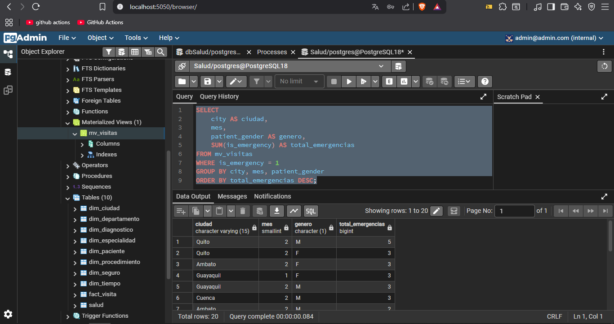 |
|:--:|
| *Figura 16. Resultado de la consulta Q2* |

### Interpretación

Al analizar únicamente los registros clasificados como emergencias, se identifican las ciudades, meses y grupos de género con mayor cantidad de atenciones urgentes. Esto facilita la evaluación de la demanda hospitalaria y la planificación de recursos médicos.

### Operación OLAP aplicada

**Slice + Roll-Up**

- Slice: se fija la dimensión emergencia mediante la condición `WHERE is_emergency = 1`.
- Roll-Up: posteriormente se agregan los registros utilizando `SUM(is_emergency)` agrupados por ciudad, mes y género.

---

## 6.3 Q3 — Costo promedio por diagnóstico, seguro y ciudad

### Enunciado

¿Cuál es el costo promedio de atención médica según diagnóstico, tipo de seguro y ciudad?

### Consulta SQL

```sql
SELECT
    diagnosis_group AS diagnostico,
    insurance_type AS tipo_seguro,
    city AS ciudad,
    ROUND(AVG(total_cost), 2) AS costo_promedio
FROM mv_visitas
GROUP BY diagnosis_group, insurance_type, city
ORDER BY costo_promedio DESC;
```

### Resultado obtenido

| 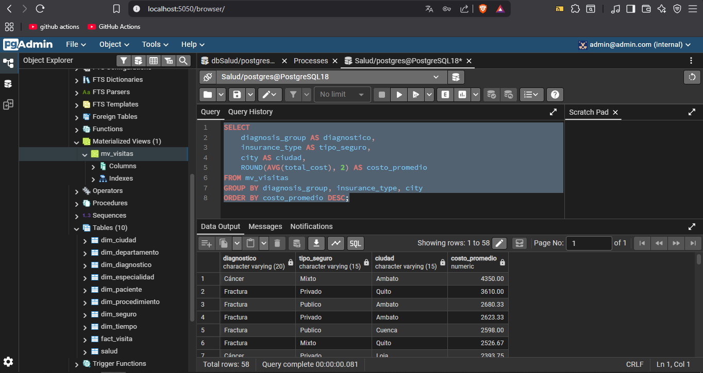 |
|:--:|
| *Figura 17. Resultado de la consulta Q3* |

### Interpretación

El análisis permite identificar qué combinaciones de diagnóstico, tipo de seguro y ciudad presentan mayores costos promedio de atención médica. Esta información puede ser utilizada para evaluar patrones de gasto y apoyar la toma de decisiones en gestión hospitalaria.

### Operación OLAP aplicada

**Dice**

La consulta analiza simultáneamente múltiples dimensiones (diagnóstico, seguro y ciudad), obteniendo un subconjunto multidimensional de información y calculando el costo promedio para cada combinación.

---

## 7. Conclusiones

---

## Referencias Bibliográficas
<a name="referencias"></a>

[1] Amazon Web Services, "¿Qué es el procesamiento analítico en línea (OLAP)?," AWS, 2024. [En línea]. Disponible en: https://aws.amazon.com/es/what-is/olap/. [Accedido: 19-jun-2026].

[2] Amazon Web Services, "¿Qué es una vista materializada?," AWS, 2024. [En línea]. Disponible en: https://aws.amazon.com/es/what-is/materialized-view/. [Accedido: 19-jun-2026].

---

## Declaración de Porcentaje de Uso de IA
