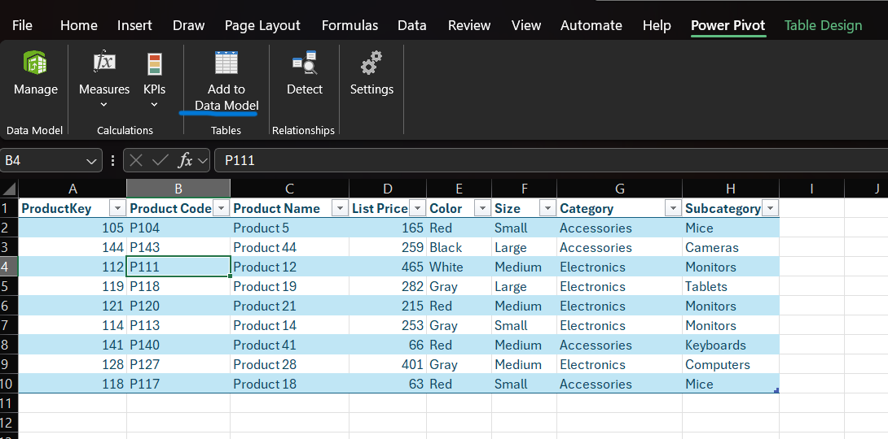
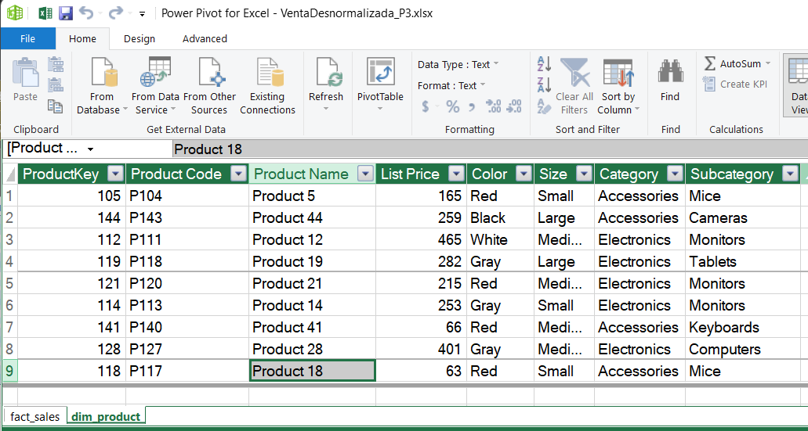
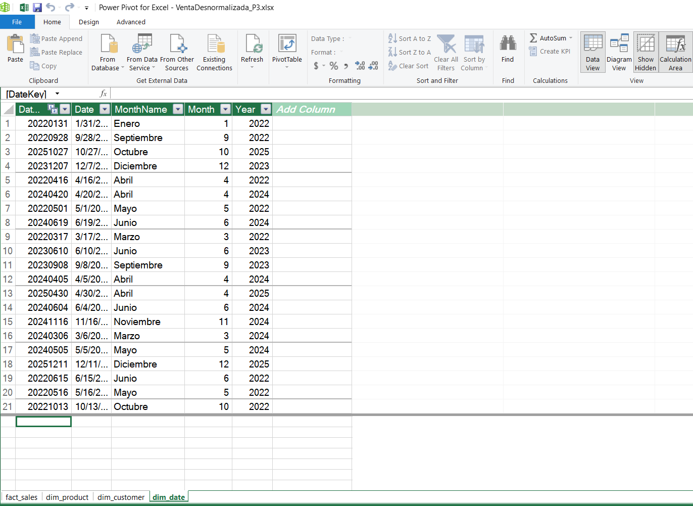
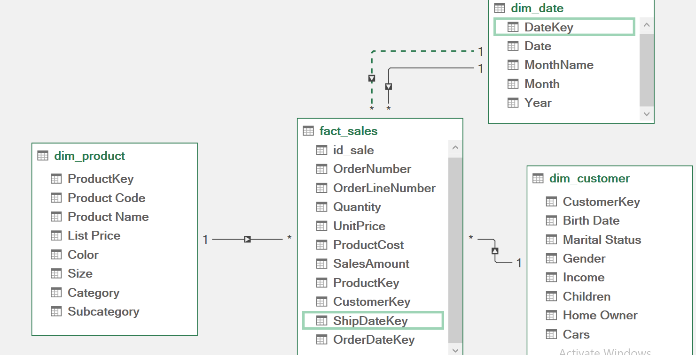
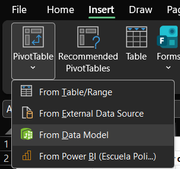
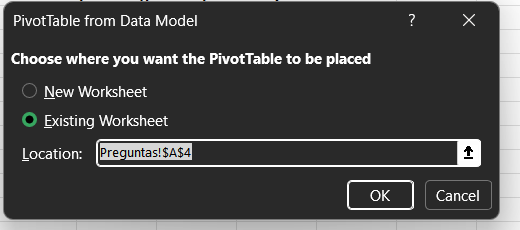
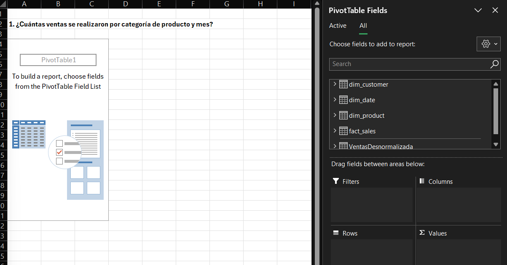
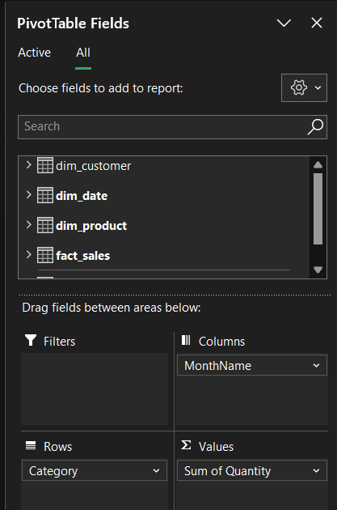
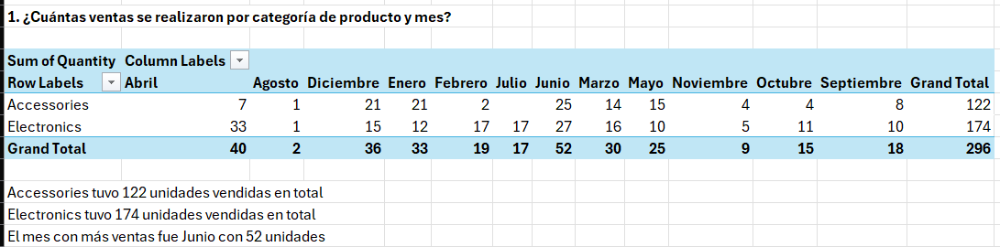

# 2026A-ISWD743-practica3
### Fecha: 08/05/2026
### Práctica Modelo estrella
  

  
  
  
  
  

>[!NOTE]
>
> Este repositorio contiene el desarrollo del trabajo grupal de la Práctica 3 de Business Intelligence, en la que se implementa un modelo de datos tipo esquema estrella utilizando Microsoft Excel y Power Pivot. A partir de tablas de hechos y dimensiones relacionadas, se construyen tablas dinámicas que permiten responder preguntas comerciales clave sobre el rendimiento de ventas por producto, cliente, fecha y categoría.

---

>[!NOTE]
>
> Objetivos específicos:
> * Diseñar el esquema estrella identificando la tabla de hechos y las dimensiones del modelo de ventas.
> * Configurar Power Pivot en Excel para gestionar el modelo de datos relacional.
> * Establecer relaciones entre tablas mediante claves primarias y foráneas en Power Pivot.
> * Construir tablas dinámicas que respondan las preguntas comerciales clave de la empresa.
> * Interpretar los resultados obtenidos para apoyar la toma de decisiones sobre ventas y clientes.

---

---

## 1. Esquema estrella — identificación de tabla de hechos y dimensiones

### Diagrama del esquema estrella 

|  |
| :---: |
| *Figura 1: Esquema estrella* |

### Tabla de hechos — `fact_sales`

La tabla de hechos es `fact_sales`. Se identificó como tabla de hechos porque:

- Contiene las **métricas cuantitativas** que el negocio desea analizar: `Quantity`,
  `UnitPrice`, `ProductCost` y `SalesAmount`.
- Almacena las **claves foráneas (FK)** que la conectan con cada dimensión.
- Cada fila representa **un evento de venta** ocurrido en un momento específico,
  para un producto y cliente determinados.
- No describe "quién es" o "qué es" algo, sino **cuánto, cuándo y cuánto costó**.

---

### Dimensiones identificadas
---
#### `dim_product` — ¿Qué se vendió? 

Agrupa los atributos descriptivos del producto. Es una dimensión porque sus datos **no cambian con cada venta**. El nombre, color, categoría y precio de lista de un producto son constantes independientemente de cuántas veces se venda.

---

#### `dim_customer` — ¿Quién compró?

Contiene el perfil demográfico de cada cliente. Es una dimensión porque los datos
del cliente (género, edad, estado civil) son **atributos que describen a una
persona**, no métricas de una transacción.

---

#### `dim_date` — ¿Cuándo ocurrió la venta o el envío?

Agrupa los atributos temporales necesarios para analizar las ventas según fechas. 
Incluye información como día, mes, nombre del mes y año, lo que permite realizar análisis temporales sobre las transacciones. Es una dimensión porque la fecha representa un contexto de tiempo y no una métrica de negocio. En este modelo, `dim_date` representa tanto la fecha en que se realizó el pedido como la fecha en que fue enviado.

---
---

## 2.

---
---

## 3. Carga de tablas al modelo de datos

Con las 4 tablas formateadas y nombradas, se procedió a cargarlas al modelo de datos de Power Pivot. Este paso es fundamental para poder crear relaciones entre tablas y construir las tablas dinámicas.

Por cada tabla se repitió el siguiente proceso:

1. Clic en cualquier celda dentro de la tabla
2. Ir a la pestaña **Power Pivot** en la cinta superior
3. Clic en **Add to Data Model**

|  |
| :---: |
| *Figura 8: Opción Add to Data Model en la pestaña Power Pivot* |

Al abrir Power Pivot (**Power Pivot → Manage**) se verificó que las tablas se fueran cargando correctamente. A continuación se muestra `dim_product` como segunda tabla cargada:

|  |
| :---: |
| *Figura 9: Tabla dim_product cargada en el modelo de Power Pivot* |

Se fue repitiendo el mismo proceso tabla por tabla hasta completar la carga de las 4. En la figura 10 se puede observar `dim_date` como última tabla cargada, y en las pestañas inferiores se confirma la presencia de todas las tablas del modelo (`fact_sales`, `dim_product`, `dim_customer` y `dim_date`):

|  |
| :---: |
| *Figura 10: Todas las tablas cargadas en el modelo de Power Pivot, visualizando dim_date como última incorporada* |

Una vez cargadas todas las tablas, se procedió a crear las relaciones entre ellas en la vista de diagrama de Power Pivot, obteniendo el siguiente modelo estrella, igual al que se realizó al inicio:

|  |
| :---: |
| *Figura 11: Modelo estrella completo con todas las relaciones establecidas en Power Pivot* |

Cabe recalcar que la relación entre `dim_date` y `fact_sales` se estableció de forma doble:
- `DateKey` → `OrderDateKey`: relación **activa** (línea sólida), utilizada por defecto en las tablas dinámicas para analizar ventas por fecha de orden.
- `DateKey` → `ShipDateKey`: relación **inactiva** (línea punteada), disponible para análisis por fecha de envío cuando se requiera.

Power Pivot solo permite una relación activa entre dos tablas, por lo que la relación con `ShipDateKey` queda inactiva y debe activarse explícitamente mediante DAX cuando sea necesario.

---
---

## 4 — Creación de tablas dinámicas para las preguntas
---
### Pregunta 1

* **¿Cuántas ventas se realizaron por categoría de producto y mes?**

Para responder esta pregunta se creó una tabla dinámica conectada al modelo de datos de Power Pivot. El proceso fue el siguiente:

1. En una hoja nueva llamada `Preguntas`, ir a **Insert → PivotTable → From Data Model**

|  |
| :---: |
| *Figura 12: Selección de PivotTable From Data Model* |

2. Seleccionar **Existing Worksheet** con ubicación en este caso  `Preguntas!$A$4` → **OK**

|  |
| :---: |
| *Figura 13: Configuración de ubicación de la tabla dinámica* |

3. En el panel **PivotTable Fields** se visualizan las 4 tablas del modelo disponibles

|  |
| :---: |
| *Figura 14: Panel PivotTable Fields con las tablas del modelo de datos* |

4. Se arrastraron los campos a las siguientes áreas:

| Área | Campo | Tabla origen |
|---|---|---|
| **Rows** | `Category` | `dim_product` |
| **Columns** | `MonthName` | `dim_date` |
| **Values** | `Quantity` | `fact_sales` |

|  |
| :---: |
| *Figura 15: Campos configurados en el panel PivotTable Fields* |

---

### Resultado — Pregunta 1

|  |
| :---: |
| *Figura 16: Tabla dinámica con ventas por categoría de producto y mes* |

**Interpretación de resultados:**

- La categoría **Electronics** registró el mayor volumen de ventas con **174 unidades** en total.
- La categoría **Accessories** vendió **122 unidades** en total.
- El mes con mayor cantidad de ventas fue **Junio** con **52 unidades** entre ambas categorías.
- El mes con menor actividad fue **Agosto** con únicamente **2 unidades** vendidas.

---
### Pregunta 2

* **¿Cuál es el ingreso total (ventas) por cliente y género?**