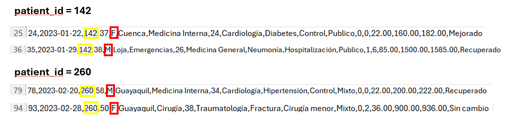

Escuela Politécnica Nacional

### Facultad de Ingeniería de Sistemas

**Business Intelligence (ISWD743) · GR2SW_2026-1**

**TAREA MOLAP**

---

**Fecha:**  
19 de Junio, 2026

**Integrantes:**  
Andrea Chicaiza  
Andreina Pallo  
Jose Arias  
Juan Mateo Quisilema  
Juan Suarez

---

> [!NOTE]
>
> Este repositorio contiene el desarrollo del trabajo grupal de la práctica MOLAP, cuyo objetivo es construir un Data Warehouse sobre datos de atención médica, implementar un modelo estrella en PostgreSQL y ejecutar consultas analíticas OLAP sobre una vista materializada.

---

> [!NOTE]
>
> Objetivos específicos:
> * Diseñar e implementar un modelo estrella en PostgreSQL que represente las visitas médicas mediante dimensiones y una tabla de hechos.
> * Construir una vista materializada que consolide el modelo estrella para optimizar el procesamiento analítico.
> * Desarrollar consultas MOLAP sobre la vista materializada para responder preguntas de negocio sobre costos, emergencias y diagnósticos.

---

<h2><strong>Índice</strong></h2>

- [Desarrollo](#desarrollo)
- [1. Introducción](#1-introducción)
- [2. Descripción del Dataset](#2-descripción-del-dataset)
  - [2.1 Correcciones de Calidad de Datos](#21-correcciones-de-calidad-de-datos)
- [3. Diseño del Modelo Estrella](#3-diseño-del-modelo-estrella)
  - [3.1 Decisiones de Modelado](#31-decisiones-de-modelado)
  - [3.2 Diagrama del Modelo Estrella](#32-diagrama-del-modelo-estrella)
  - [3.3 Descripción de Tablas](#33-descripción-de-tablas)
- [4. Implementación en PostgreSQL](#4-implementación-en-postgresql)
  - [4.1 Base de Datos y Tabla Staging](#41-base-de-datos-y-tabla-staging)
  - [4.2 Tablas Dimensión](#42-tablas-dimensión)
  - [4.3 Tabla de Hechos y Carga ETL](#43-tabla-de-hechos-y-carga-etl)
- [5. Vista Materializada MOLAP](#5-vista-materializada-molap)
- [6. Consultas MOLAP y Preguntas de Negocio](#6-consultas-molap-y-preguntas-de-negocio)
  - [6.1 Q1 — Costo Total por Especialidad, Ciudad y Mes](#61-q1--costo-total-por-especialidad-ciudad-y-mes)
  - [6.2 Q2 — Emergencias por Ciudad, Mes y Género](#62-q2--emergencias-por-ciudad-mes-y-género)
  - [6.3 Q3 — Costo Promedio por Diagnóstico, Seguro y Ciudad](#63-q3--costo-promedio-por-diagnóstico-seguro-y-ciudad)
- [7. Conclusiones](#7-conclusiones)
- [Referencias Bibliográficas](#referencias-bibliográficas)
- [Declaración de Porcentaje de Uso de IA](#declaración-de-porcentaje-de-uso-de-ia)

[Referencias Bibliográficas](#referencias-bibliográficas)

[Declaración de Porcentaje de Uso de IA](#declaración-de-porcentaje-de-uso-de-ia)

---

## Desarrollo

---

## 1. Introducción

El procesamiento analítico en línea (OLAP) es una tecnología de software que permite analizar datos empresariales desde diferentes puntos de vista. Las organizaciones recopilan y almacenan datos de múltiples fuentes y OLAP los combina y agrupa en categorías para proporcionar información procesable para la planificación estratégica. A diferencia de las consultas analíticas sobre bases de datos relacionales, que resultan lentas porque el sistema debe recorrer múltiples tablas, los sistemas OLAP calculan previamente e integran los datos para que los analistas puedan generar informes más rápido y cuando sea necesario [[1]](#referencias).

En el modelado de datos OLAP, los datos multidimensionales se representan como un esquema en estrella, compuesto por una tabla de hechos con valores numéricos relacionados con un proceso de negocio y varias tablas de dimensiones que describen los atributos de dicha tabla. El tipo MOLAP (*Multidimensional OLAP*) almacena los datos calculados previamente en un hipercubo, lo que permite un análisis especialmente rápido [[1]](#referencias). Para optimizar el acceso a estos datos, se emplean vistas materializadas: tablas de datos pre-calculadas que combinan información de varias tablas existentes para una recuperación más rápida, sin necesidad de recalcular la consulta cada vez que se ejecuta [[2]](#referencias).

Esta práctica implementa un flujo completo desde la carga de datos en staging hasta la ejecución de consultas MOLAP sobre una vista materializada en PostgreSQL, aplicado a un dataset de visitas médicas hospitalarias en Ecuador.

**Herramientas utilizadas:**
| *Tabla 1: Lista de Herramientas que se utilizaron en la práctica* |
| :--- |

| Etapa | Herramienta | Rol en la práctica |
| :--- | :--- | :--- |
| **Fuente de Datos** |  `salud.csv` | Dataset fuente con 100 registros de visitas médicas. |
| **Almacenamiento** |  PostgreSQL | Motor de base de datos relacional para staging, dimensiones, tabla de hechos y vista materializada (Data Warehouse). |
| **Procesamiento** |  SQL (DDL + DML) | Lenguaje estructurado para la creación de tablas, carga de datos, transformaciones e inserción de dimensiones. |

---

## 2. Descripción del Dataset

El dataset fuente es el archivo 'salud.csv', que contiene 100 registros de visitas médicas realizadas en hospitales de cinco ciudades del Ecuador durante el primer trimestre de 2023 (enero–marzo). Cada fila representa una visita médica individual con sus atributos clínicos, administrativos y financieros.

La Tabla 2 resume las 18 columnas del dataset con su nombre, tipo de dato inferido y descripción.

| *Tabla 2: Descripción de columnas del dataset salud.csv* |
| :--- |

| # | Columna | Tipo | Descripción |
|---|---|---|---|
| 1 | `visit_id` | INTEGER | Identificador único de la visita |
| 2 | `visit_date` | TEXT (M/D/YYYY) | Fecha de la visita en formato mes/día/año |
| 3 | `patient_id` | INTEGER | Identificador del paciente |
| 4 | `patient_age` | INTEGER | Edad del paciente al momento de la visita |
| 5 | `patient_gender` | CHAR(1) | Género del paciente |
| 6 | `city` | VARCHAR | Ciudad del hospital |
| 7 | `hospital_department` | VARCHAR | Departamento clínico del hospital |
| 8 | `doctor_id` | INTEGER | Identificador del médico tratante |
| 9 | `specialty` | VARCHAR | Especialidad médica de la visita |
| 10 | `diagnosis_group` | VARCHAR | Grupo diagnóstico de la visita |
| 11 | `procedure_type` | VARCHAR | Tipo de procedimiento realizado |
| 12 | `insurance_type` | VARCHAR | Tipo de seguro del paciente |
| 13 | `is_emergency` | SMALLINT | Indicador de emergencia (0/1) |
| 14 | `length_of_stay_days` | INTEGER | Días de hospitalización |
| 15 | `cost_medicine` | NUMERIC(10,2) | Costo de medicamentos en USD |
| 16 | `cost_procedure` | NUMERIC(10,2) | Costo del procedimiento en USD |
| 17 | `total_cost` | NUMERIC(10,2) | Costo total = cost_medicine + cost_procedure |
| 18 | `outcome` | VARCHAR | Resultado clínico de la visita |

### 2.1 Correcciones de Calidad de Datos

Durante el análisis del dataset se identificaron problemas de calidad que fueron corregidos en la etapa ETL.

En 'patient_gender' se detectaron 2 pacientes con género distinto registrado en visitas diferentes. El paciente 142 aparecia como F en la visita 24 y como M en la visita 35. Mientras que el paciente 260 aparecia como M en la visita 78 y como F en la visita 93, como se observa en la Figura 1. 

| 
|:--:|
|*Figura 1: Errores identificados en la columna 'patient_gender'* | 

Como regla ETL, se conservó el género de la primera visita registrada por 'visit_id' ascendente, es decir, se mantuvo 'F' para el paciente 142 y 'M' para el paciente 260.

---

## 3. Diseño del Modelo Estrella

### 3.1 Decisiones de Modelado

### 3.2 Diagrama del Modelo Estrella

### 3.3 Descripción de Tablas

---

## 4. Implementación en PostgreSQL

### 4.1 Base de Datos y Tabla Staging

### 4.2 Tablas Dimensión

### 4.3 Tabla de Hechos y Carga ETL

---

## 5. Vista Materializada MOLAP

---

## 6. Consultas MOLAP y Preguntas de Negocio

### 6.1 Q1 — Costo Total por Especialidad, Ciudad y Mes

### 6.2 Q2 — Emergencias por Ciudad, Mes y Género

### 6.3 Q3 — Costo Promedio por Diagnóstico, Seguro y Ciudad

---

## 7. Conclusiones

---

## Referencias Bibliográficas

[1] Amazon Web Services, "¿Qué es el procesamiento analítico en línea (OLAP)?," AWS, 2024. [En línea]. Disponible en: https://aws.amazon.com/es/what-is/olap/. [Accedido: 19-jun-2026].

[2] Amazon Web Services, "¿Qué es una vista materializada?," AWS, 2024. [En línea]. Disponible en: https://aws.amazon.com/es/what-is/materialized-view/. [Accedido: 19-jun-2026].

---

## Declaración de Porcentaje de Uso de IA